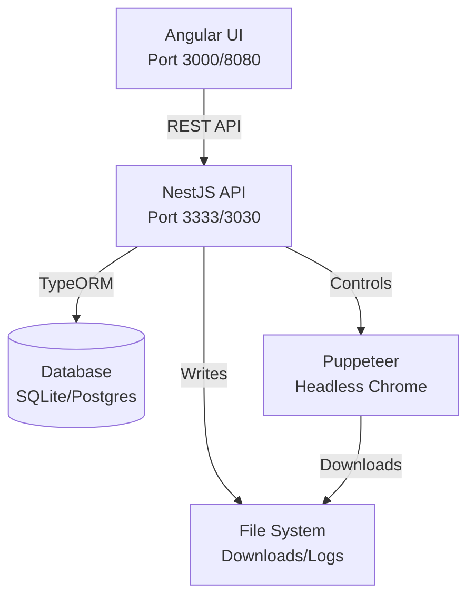
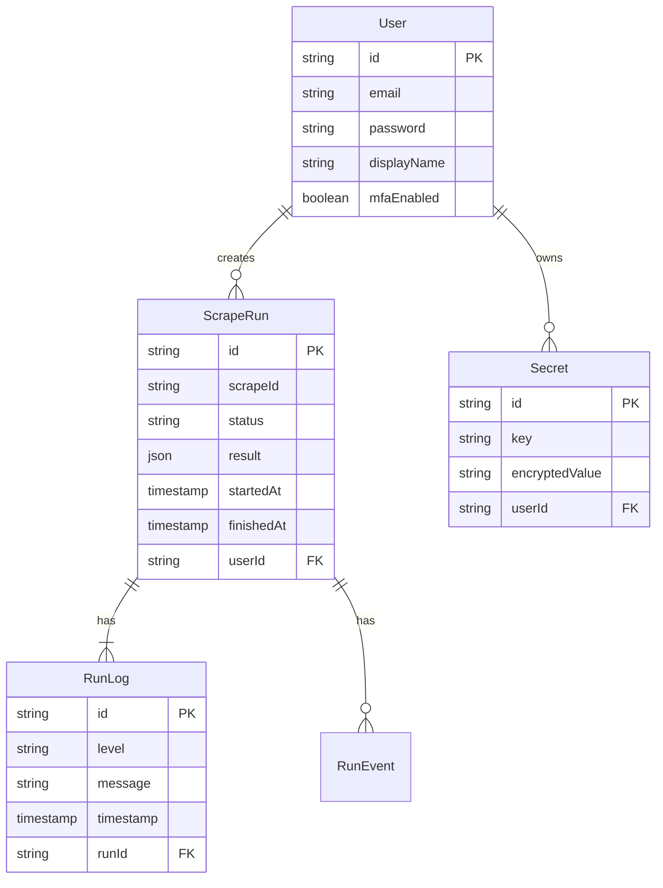
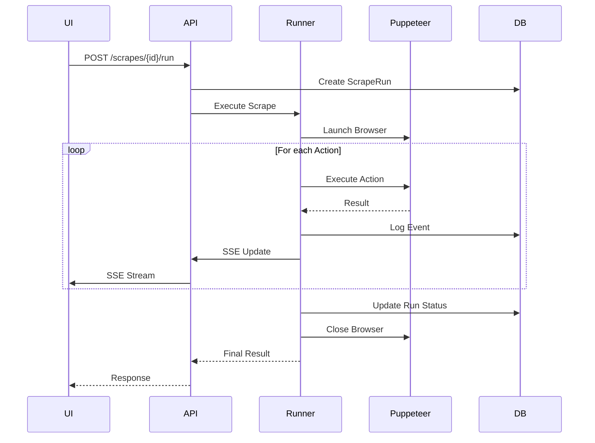
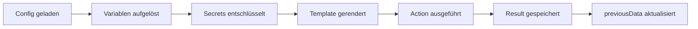
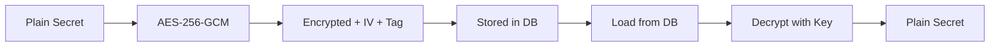
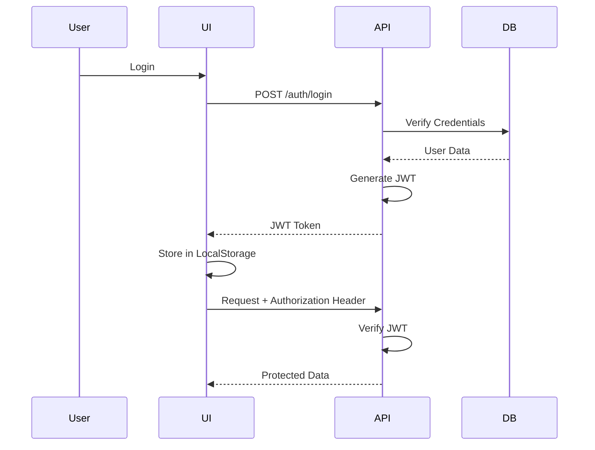

# Architektur

Verstehe wie Scrape Dojo aufgebaut ist und wie die Komponenten zusammenarbeiten.

## System-Übersicht



## Komponenten

### 1. Frontend (Angular)

**Zweck**: Benutzeroberfläche zum Verwalten und Überwachen von Scrapes

**Features**:
- 📋 Scrape-Übersicht und Management
- 🚀 Scrape-Ausführung mit Live-Monitoring
- 📊 Run-Historie und Logs
- 🔐 Secrets & Variablen Management
- 👤 User Management (wenn Auth aktiviert)

**Technologien**:
- Angular 21
- Angular Material
- Monaco Editor (für Config-Bearbeitung)
- Server-Sent Events (SSE) für Live-Updates

### 2. Backend (NestJS)

**Zweck**: API-Server und Scrape-Engine

**Module**:

```text
api/
├── scrapes/          # Scrape Management
├── runner/           # Execution Engine
├── actions/          # Action Implementations
├── auth/             # Authentication & Authorization
├── secrets/          # Secrets Management
├── database/         # Database Entities
└── sse/             # Server-Sent Events
```

**Technologien**:
- NestJS Framework
- TypeORM (Database)
- Puppeteer (Browser Control)
- Handlebars (Templating)
- JSONata (Transformations)
- Passport (Authentication)

### 3. Shared Library

**Zweck**: Gemeinsame Types und Interfaces

```text
libs/shared/
├── types/
│   ├── scrape.types.ts
│   ├── action.types.ts
│   └── auth.types.ts
└── utils/
```

Beide Apps (UI & API) nutzen dieselben Types → Type-Safety! ✨

## Datenbankschema

### Entities



### Unterstützte Datenbanken

- ✅ SQLite (Standard, gut für Development)
- ✅ PostgreSQL (Empfohlen für Production)
- ✅ MySQL/MariaDB
- ✅ MSSQL

## Request Flow

### Scrape-Ausführung



## Datenfluss

### Action Execution



### Template Rendering

Jedes Action-Param wird durch Handlebars geparst:

```javascript
// Input
"{{secrets.email}}"

// Prozess
1. Secrets aus DB laden
2. Verschlüsselung aufheben
3. Template rendern
4. Ergebnis verwenden

// Output
"user@example.com"
```

## Sicherheit

### Secrets Encryption



**Wichtig**: 
- 🔑 Encryption Key = `SCRAPE_DOJO_ENCRYPTION_KEY`
- ⚠️ Key ändern = Secrets unbrauchbar
- 🔒 Key nie committen!

### Authentication Flow



## File System Layout

```text
scrape-dojo/
├── apps/
│   ├── api/              # Backend
│   │   ├── src/
│   │   └── dist/         # Build output
│   ├── ui/               # Frontend
│   │   ├── src/
│   │   └── dist/         # Build output
│   └── docs/             # Documentation
│
├── config/
│   ├── scrapes.schema.json
│   └── sites/            # Scrape configs
│       ├── amazon.jsonc
│       └── ...
│
├── data/                 # Database files (SQLite)
├── downloads/            # Downloaded files
├── logs/                 # Application logs
└── browser-data/         # Puppeteer cache
```

## Performance Optimierungen

### Browser Management

- **Browser-Pooling**: Wiederverwendung von Browser-Instanzen
- **Headless Mode**: Kein GUI = schneller
- **Resource Limiting**: Memory & CPU Grenzen

### Caching

- **Static Assets**: UI-Assets werden gecached
- **API Responses**: Conditional requests
- **Browser Cache**: Browser-Daten persistent

## Skalierung

### Horizontal Scaling

Mehrere API-Instanzen parallel:

```yaml
# docker-compose.scale.yml
services:
  api:
    deploy:
      replicas: 3
```

**Beachte**:
- Shared Database notwendig
- Shared File System für Downloads
- Load Balancer vor API

### Limits

Aktuelle Empfehlungen:

| Resource | Dev | Production |
|----------|-----|------------|
| RAM | 2GB | 4GB+ |
| CPU | 2 Cores | 4+ Cores |
| Disk | 5GB | 20GB+ |
| Concurrent Scrapes | 1-2 | 3-5 |

## Nächste Schritte

- 🔐 [Authentication](../advanced/authentication) - Auth konfigurieren
- ⚙️ [Environment Variables](../advanced/environment-variables) - Alle Settings
- 💻 [Project Structure](../developer/project-structure) - Code-Organisation
