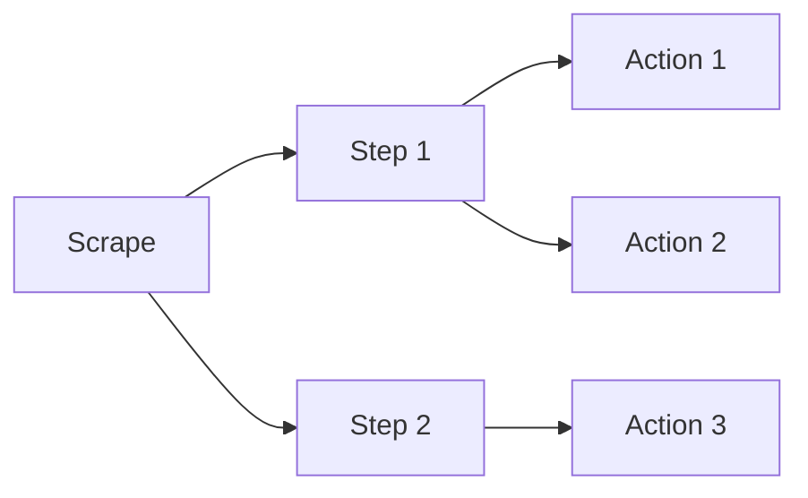

# Deine erste Scrape

Lass uns gemeinsam deine erste Scrape-Konfiguration erstellen! 🚀

## Grundkonzepte

Bevor wir loslegen, hier die wichtigsten Konzepte:

- **Scrape**: Eine komplette Workflow-Definition
- **Step**: Ein logischer Abschnitt (z.B. "Login", "Daten extrahieren")  
- **Action**: Eine einzelne Aktion (z.B. "navigate", "click", "extract")



## Minimales Beispiel

Erstelle eine neue Datei unter `config/sites/example.jsonc`:

```json
{
  "$schema": "../scrapes.schema.json",
  "scrapes": [
    {
      "id": "my-first-scrape",
      "metadata": {
        "description": "Meine erste Scrape",
        "version": "1.0.0"
      },
      "steps": [
        {
          "name": "Get Title",
          "actions": [
            {
              "name": "Navigate",
              "action": "navigate",
              "params": {
                "url": "https://example.com"
              }
            },
            {
              "name": "Extract Title",
              "action": "extract",
              "params": {
                "selector": "h1"
              }
            }
          ]
        }
      ]
    }
  ]
}
```

:::tip Schema Unterstützung
💡 Die `$schema`-Zeile aktiviert IntelliSense in deinem Editor! Du bekommst automatisch Code-Vervollständigung und Validierung.
:::

## Was passiert hier?

1. 🌐 **Navigate**: Öffne example.com
2. 📋 **Extract Title**: Extrahiere den Text des `<h1>`-Tags
3. 💾 Das Ergebnis wird automatisch gespeichert

## Scrape ausführen

### Via UI

1. Öffne http://localhost:3000
2. Gehe zu "Scrapes"
3. Wähle "my-first-scrape"
4. Klicke "Run"
5. Beobachte die Ausführung in Echtzeit! 👀

### Via API

```bash
curl -X POST http://localhost:3333/api/scrapes/my-first-scrape/run
```

## Ergebnis analysieren

Die UI zeigt dir:

- ✅ Status (Success/Failed)
- 📊 Alle extrahierten Daten
- 📝 Detaillierte Logs
- ⏱️ Ausführungszeit
- 📸 Screenshots (falls aktiviert)

## Nächster Schritt: Daten nutzen

Lass uns das Ergebnis weiterverwenden:

```json
{
  "actions": [
    {
      "name": "GetTitle",
      "action": "extract",
      "params": {
        "selector": "h1"
      }
    },
    {
      "name": "LogTitle",
      "action": "logger",
      "params": {
        "message": "Found title: {{previousData.GetTitle}}"
      }
    }
  ]
}
```

Was ist neu?

- ✨ `{{previousData.GetTitle}}` - greift auf das Ergebnis von "GetTitle" zu
- 📝 `logger` - gibt eine Nachricht in die Logs aus

:::info Data Flow
Jede Action speichert ihr Ergebnis unter `previousData.<ActionName>`. Mehr dazu in [Data Flow](../user-guide/data-flow).
:::

## Erweiterte Beispiele

### Mehrere Elemente extrahieren

```json
{
  "name": "GetProducts",
  "action": "extract",
  "params": {
    "selector": ".product",
    "extractAll": true,
    "properties": {
      "name": ".product-name",
      "price": ".product-price"
    }
  }
}
```

Dies extrahiert alle Produkte mit Name und Preis! 🎯

### Mit Secrets arbeiten

```json
{
  "name": "EnterPassword",
  "action": "type",
  "params": {
    "selector": "#password",
    "text": "{{secrets.myPassword}}"
  }
}
```

Mehr zu Secrets in [Secrets & Variablen](../user-guide/secrets-variables).

## Nächste Schritte

- 📚 [Scrape-Konfiguration](../user-guide/scrape-configuration) - Alle Details
- 🔄 [Data Flow](../user-guide/data-flow) - Daten zwischen Actions teilen
- 🎨 [Actions Übersicht](../user-guide/actions-overview) - Was ist alles möglich?
- 💡 [Beispiele](../examples/simple-scrape) - Lerne von Beispielen
