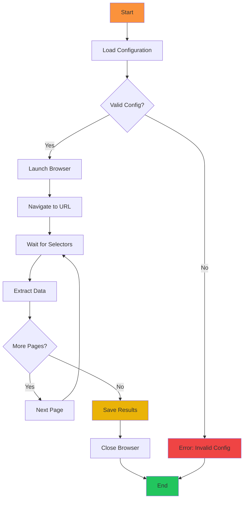
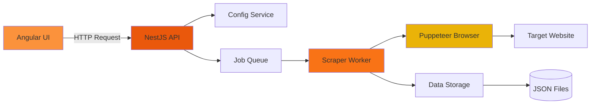
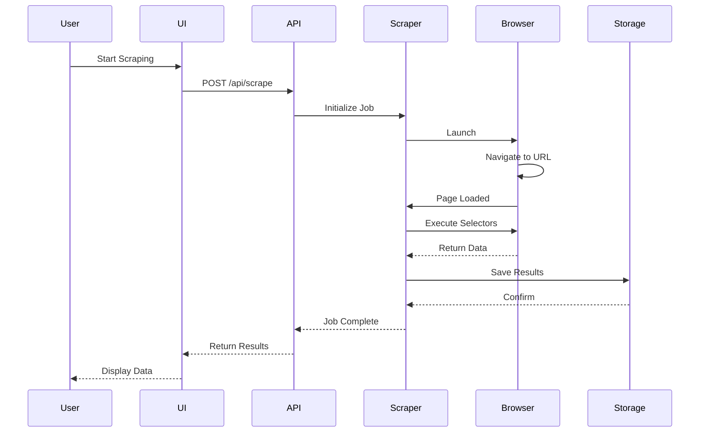
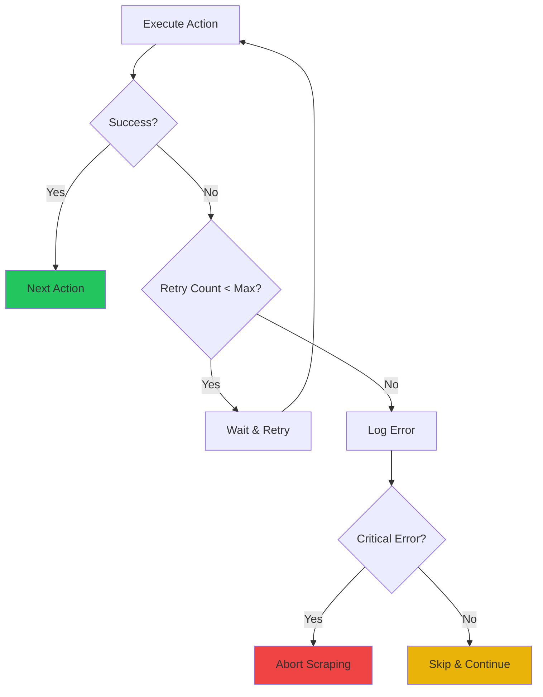
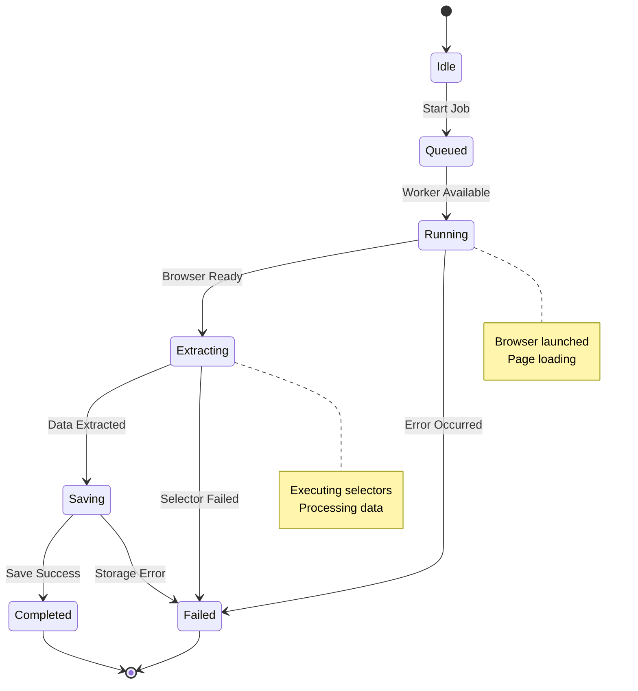

# Scraping Workflow Visualisierung

Mit Mermaid-Diagrammen können Sie Ihre Scraping-Workflows visuell darstellen.

## Basis Scraping Flow

## Scraper Architektur

## Daten-Pipeline

## Fehlerbehandlung

## Status-Diagramm

## Nächste Schritte

Diese Diagramme helfen Ihnen, die Scraping-Logik zu verstehen und zu planen. Passen Sie sie an Ihre eigenen Workflows an!
