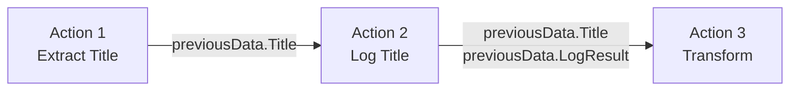

# Data Flow

Das Herzstück von Scrape Dojo! Verstehe, wie Daten zwischen Actions fließen und weiterverwendet werden.

## Grundkonzept

Jede Action kann:
1. ✅ Daten **empfangen** (von vorherigen Actions)
2. ✅ Daten **verarbeiten**
3. ✅ Daten **speichern** (für nachfolgende Actions)



## previousData

**Das Gedächtnis deiner Scrape!** Jede Action speichert ihr Ergebnis hier.

### Struktur

```javascript
previousData = {
  ActionName1: <result>,
  ActionName2: <result>,
  ActionName3: <result>
}
```

### Beispiel

```json
{
  "actions": [
    {
      "name": "GetTitle",
      "action": "extract",
      "params": {
        "selector": "h1"
      }
    },
    // previousData = { GetTitle: "Example Domain" }
    
    {
      "name": "GetDescription",
      "action": "extract",
      "params": {
        "selector": "p"
      }
    },
    // previousData = {
    //   GetTitle: "Example Domain",
    //   GetDescription: "This domain is for use in examples"
    // }
    
    {
      "name": "CombineData",
      "action": "logger",
      "params": {
        "message": "Title: {{previousData.GetTitle}}, Desc: {{previousData.GetDescription}}"
      }
    }
  ]
}
```

### Zugriff via Handlebars

```handlebars
{{previousData.ActionName}}              # String/Number
{{previousData.ActionName.property}}     # Object property
{{previousData.ActionName.[0]}}          # Array element
```

## currentData

**Loop-Kontext!** Nur innerhalb von Loops verfügbar.

### Struktur

```javascript
currentData = {
  LoopName: {
    value: <current item>,
    index: <current index>
  }
}
```

### Beispiel

```json
{
  "name": "ProcessOrders",
  "action": "loop",
  "params": {
    "items": "{{previousData.OrderList}}"
  },
  "actions": [
    {
      "name": "LogOrder",
      "action": "logger",
      "params": {
        "message": "Order #{{currentData.ProcessOrders.index}}: {{currentData.ProcessOrders.value.id}}"
      }
    }
  ]
}
```

**Was passiert?**

| Iteration | currentData.ProcessOrders |
|-----------|---------------------------|
| 1 | `{ value: {id: 123, ...}, index: 0 }` |
| 2 | `{ value: {id: 456, ...}, index: 1 }` |
| 3 | `{ value: {id: 789, ...}, index: 2 }` |

:::tip Loop-Namen
Der Loop-Name (`ProcessOrders`) wird zum Key in `currentData`. Wähle beschreibende Namen!
:::

## Kombinierter Zugriff

Du kannst `previousData` UND `currentData` zusammen nutzen:

```json
{
  "name": "DownloadInvoices",
  "action": "loop",
  "params": {
    "items": "{{previousData.InvoiceList}}"
  },
  "actions": [
    {
      "name": "Download",
      "action": "download",
      "params": {
        "url": "{{currentData.DownloadInvoices.value.url}}",
        "filename": "invoice-{{variables.year}}-{{currentData.DownloadInvoices.index}}.pdf"
      }
    }
  ]
}
```

**Zugriff auf**:
- `previousData.InvoiceList` - Alle Invoices
- `currentData.DownloadInvoices.value` - Aktuelle Invoice
- `variables.year` - Workflow-Variable

## Verschachtelte Loops

Auch bei verschachtelten Loops funktioniert es:

```json
{
  "name": "OuterLoop",
  "action": "loop",
  "params": {
    "items": "{{previousData.Categories}}"
  },
  "actions": [
    {
      "name": "InnerLoop",
      "action": "loop",
      "params": {
        "items": "{{currentData.OuterLoop.value.products}}"
      },
      "actions": [
        {
          "name": "LogProduct",
          "action": "logger",
          "params": {
            "message": "Category {{currentData.OuterLoop.index}}, Product {{currentData.InnerLoop.index}}: {{currentData.InnerLoop.value.name}}"
          }
        }
      ]
    }
  ]
}
```

## Data Types

### Primitives

```json
// String
previousData.Title = "Example"

// Number
previousData.Price = 42.99

// Boolean
previousData.IsAvailable = true

// Null
previousData.NoResult = null
```

### Objects

```json
previousData.Product = {
  "name": "Widget",
  "price": 19.99,
  "stock": 42
}

// Zugriff
"{{previousData.Product.name}}"   // "Widget"
"{{previousData.Product.price}}"  // 19.99
```

### Arrays

```json
previousData.Products = [
  { "name": "Widget A", "price": 10 },
  { "name": "Widget B", "price": 20 }
]

// Zugriff
"{{previousData.Products.[0].name}}"     // "Widget A"
"{{previousData.Products.[1].price}}"    // 20

// In Loops
{
  "action": "loop",
  "params": {
    "items": "{{previousData.Products}}"
  }
}
```

## Result Transformation

Manchmal musst du Daten transformieren:

### Mit JSONata

```json
{
  "name": "TransformData",
  "action": "transform",
  "params": {
    "data": "{{previousData.RawProducts}}",
    "expression": "$map($, function($v) { {'name': $v.title, 'cost': $number($v.price)} })"
  }
}
```

**Vorher**:
```json
[
  {"title": "Product A", "price": "10.99"},
  {"title": "Product B", "price": "20.50"}
]
```

**Nachher**:
```json
[
  {"name": "Product A", "cost": 10.99},
  {"name": "Product B", "cost": 20.50}
]
```

### Mit Handlebars Helpers

```json
{
  "action": "logger",
  "params": {
    "message": "Total: {{multiply previousData.Price 1.19}}€"
  }
}
```

Siehe [Templating](./templating) für alle Helpers.

## Best Practices

### ✅ DO

```json
// Beschreibende Action-Namen
"name": "ExtractProductPrice"
"name": "CalculateTotalCost"
"name": "ValidateUserInput"

// Daten weitergeben
{
  "name": "ProcessedData",
  "action": "transform",
  "params": {
    "data": "{{previousData.RawData}}",
    "expression": "..."
  }
}
```

### ❌ DON'T

```json
// Generische Namen
"name": "Action1"
"name": "Extract"
"name": "Data"

// Daten nicht nutzen
{
  "name": "ExtractPrice",
  "action": "extract",
  "params": {...}
}
// Ergebnis wird nie verwendet!
```

## Debugging

### Data Inspection

Nutze den Logger, um Daten zu inspizieren:

```json
{
  "name": "DebugData",
  "action": "logger",
  "params": {
    "level": "debug",
    "message": "Current data: {{json previousData}}"
  }
}
```

Der `json` Helper serialisiert das gesamte Objekt!

### In der UI

Die UI zeigt dir:
- 📊 `previousData` nach jedem Action
- 🔍 Vollständige Datenstruktur
- 📝 Logs mit Kontext

## Scoping Rules

### Verfügbarkeit

| Kontext | previousData | currentData | variables | secrets |
|---------|--------------|-------------|-----------|---------|
| Normal | ✅ | ❌ | ✅ | ✅ |
| In Loop | ✅ | ✅ | ✅ | ✅ |
| In Condition | ✅ | Depends | ✅ | ✅ |

### Priorität

Wenn Namen kollidieren:

1. 🥇 `currentData` (innerhalb Loop)
2. 🥈 `previousData`
3. 🥉 `variables`
4. 🏅 `secrets`

## Performance

### Memory Management

- ⚡ `previousData` wird pro Scrape-Run gespeichert
- 💾 Große Datenmengen → RAM-Verbrauch
- 🧹 Cleanup nach Run-Ende

### Tipps

```json
// ✅ Gut - Nur benötigte Daten extrahieren
{
  "name": "GetPrice",
  "action": "extract",
  "params": {
    "selector": ".price",
    "attribute": "textContent"
  }
}

// ❌ Schlecht - Zu viele Daten
{
  "name": "GetEverything",
  "action": "extract",
  "params": {
    "selector": "body",
    "extractAll": true
  }
}
```

## Nächste Schritte

- 🔁 [Loops](./loops) - Iteration über Daten
- 🎯 [Templating](./templating) - Handlebars im Detail
- 🔧 [Transformations](./transformations) - JSONata Power
- 🎨 [Actions](./actions-overview) - Was Actions zurückgeben
