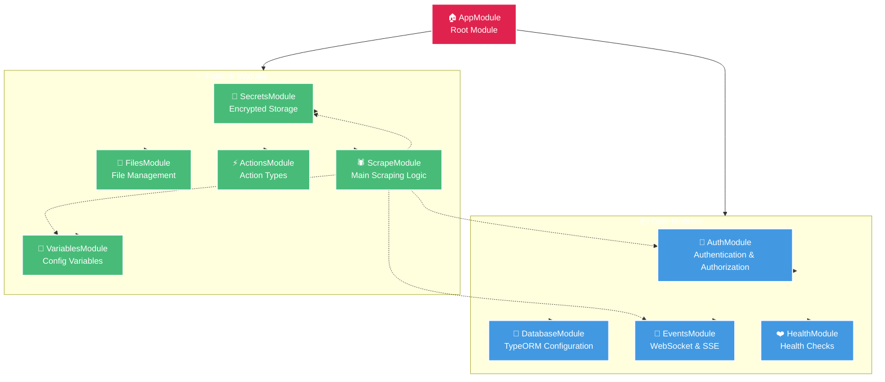
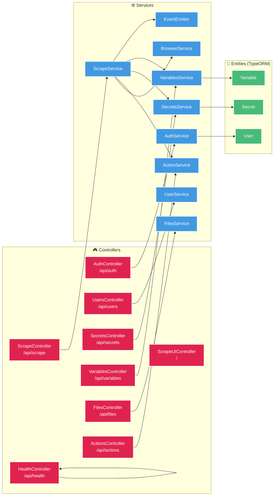
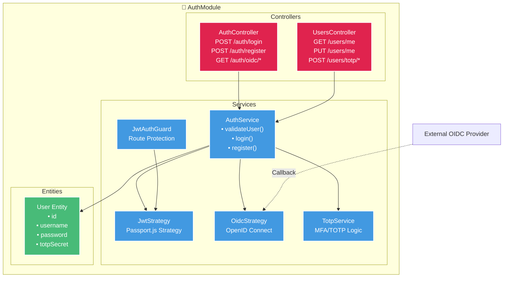
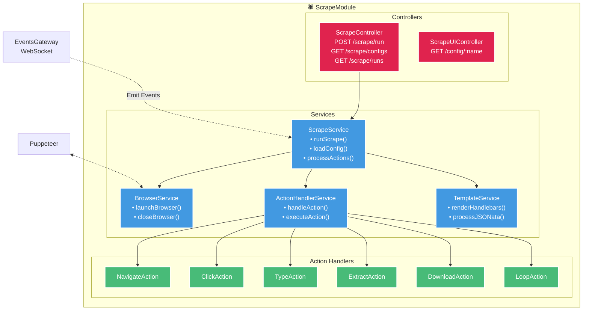
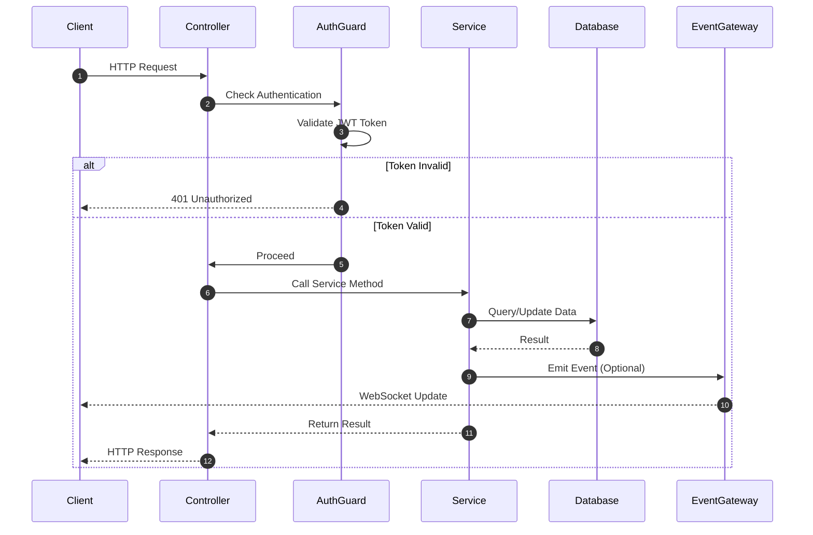
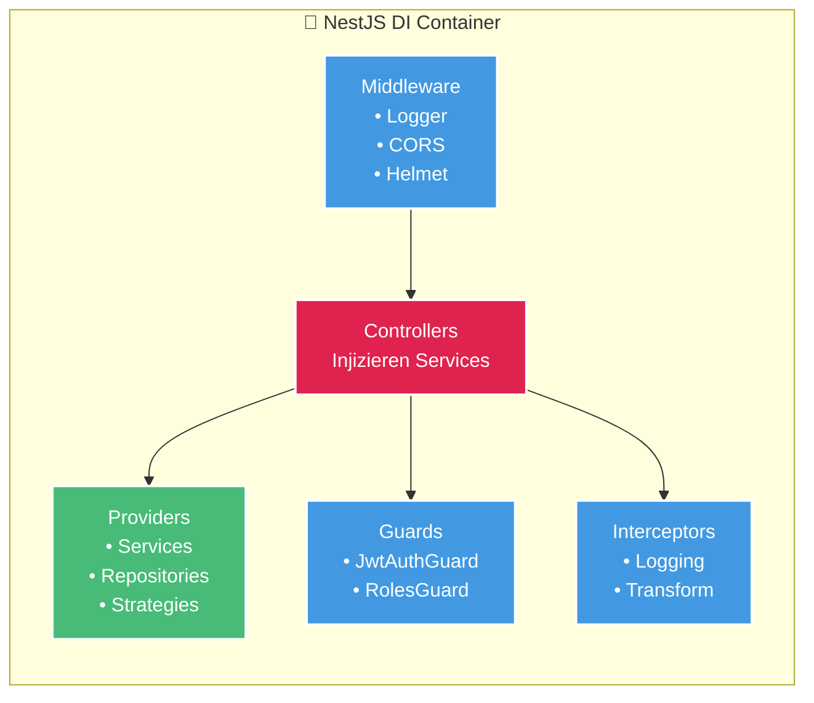

# API Module Structure

Die Scrape Dojo API ist eine NestJS-Anwendung mit einer modularen Architektur. Jedes Modul ist für einen spezifischen Funktionsbereich verantwortlich.

## Module-Übersicht



## Controller & Services



## AuthModule Details



## ScrapeModule Details



## Request Flow



## Dependency Injection



## Modul-Konfiguration

### AppModule
```typescript
@Module({
  imports: [
    ConfigModule.forRoot(),
    DatabaseModule,
    AuthModule,
    ScrapeModule,
    EventsModule,
    SecretsModule,
    VariablesModule,
    FilesModule,
    HealthModule
  ],
})
export class AppModule {}
```

### AuthModule
```typescript
@Module({
  imports: [
    TypeOrmModule.forFeature([User]),
    PassportModule,
    JwtModule.registerAsync({...}),
  ],
  controllers: [AuthController, UsersController],
  providers: [
    AuthService,
    JwtStrategy,
    OidcStrategy,
    TotpService
  ],
  exports: [AuthService]
})
export class AuthModule {}
```

### ScrapeModule
```typescript
@Module({
  imports: [
    EventsModule,
    SecretsModule,
    VariablesModule
  ],
  controllers: [
    ScrapeController,
    ScrapeUIController
  ],
  providers: [
    ScrapeService,
    BrowserService,
    ActionHandlerService,
    TemplateService
  ]
})
export class ScrapeModule {}
```

## Wichtige Schnittstellen

### AuthService
- `validateUser(username, password)` - Benutzer-Validierung
- `login(user)` - JWT Token generieren
- `register(dto)` - Neuen Benutzer anlegen

### ScrapeService
- `runScrape(configName, options)` - Scrape ausführen
- `loadConfig(name)` - Konfiguration laden
- `processActions(actions, context)` - Actions abarbeiten

### BrowserService  
- `launchBrowser(options)` - Puppeteer Browser starten
- `createPage()` - Neue Browser-Seite erstellen
- `closeBrowser()` - Browser schließen

### EventsGateway
- `emitLog(message)` - Log-Event senden
- `emitStatus(status)` - Status-Event senden
- `emitProgress(progress)` - Progress-Event senden

## Weiterführende Links

- [Scrape Workflow](/architecture/scrape-workflow) - Detaillierter Ablauf einer Scrape-Ausführung
- [Authentication Flow](/architecture/authentication) - Authentifizierungs-Prozess
- [API Reference](/api/endpoints) - Alle REST-Endpunkte
