# Authentication Flow

Scrape Dojo unterstützt mehrere Authentifizierungsmethoden: lokale JWT-basierte Authentifizierung, OpenID Connect (OIDC/SSO) und Multi-Faktor-Authentifizierung (MFA/TOTP).

## Authentifizierungs-Übersicht

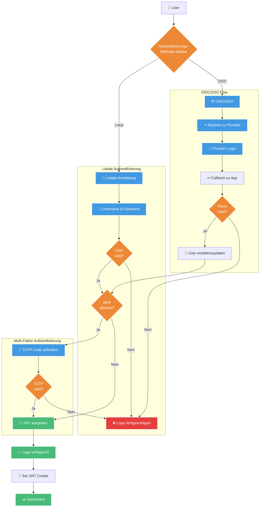

## Lokale Authentifizierung (JWT)

### Login-Flow

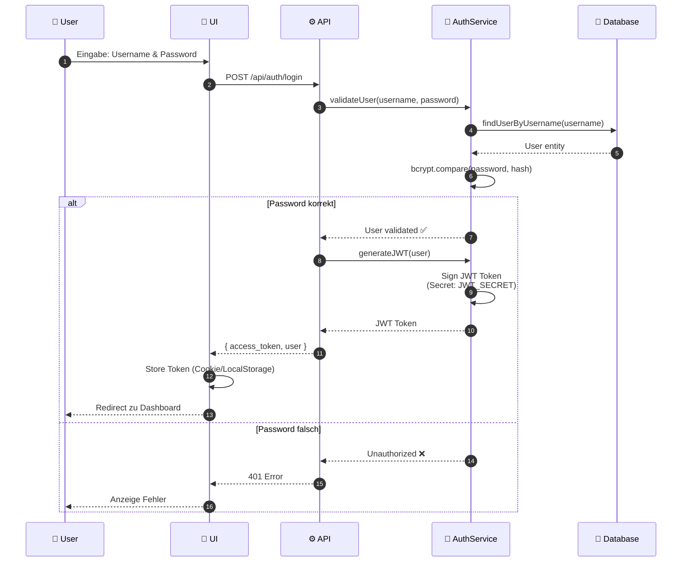

### JWT Token Structure

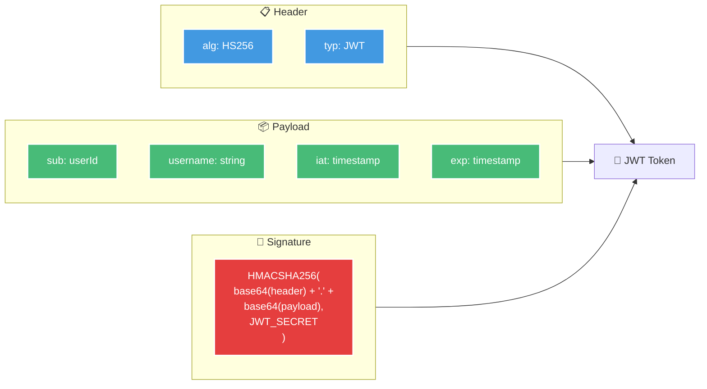

### Request Authentication

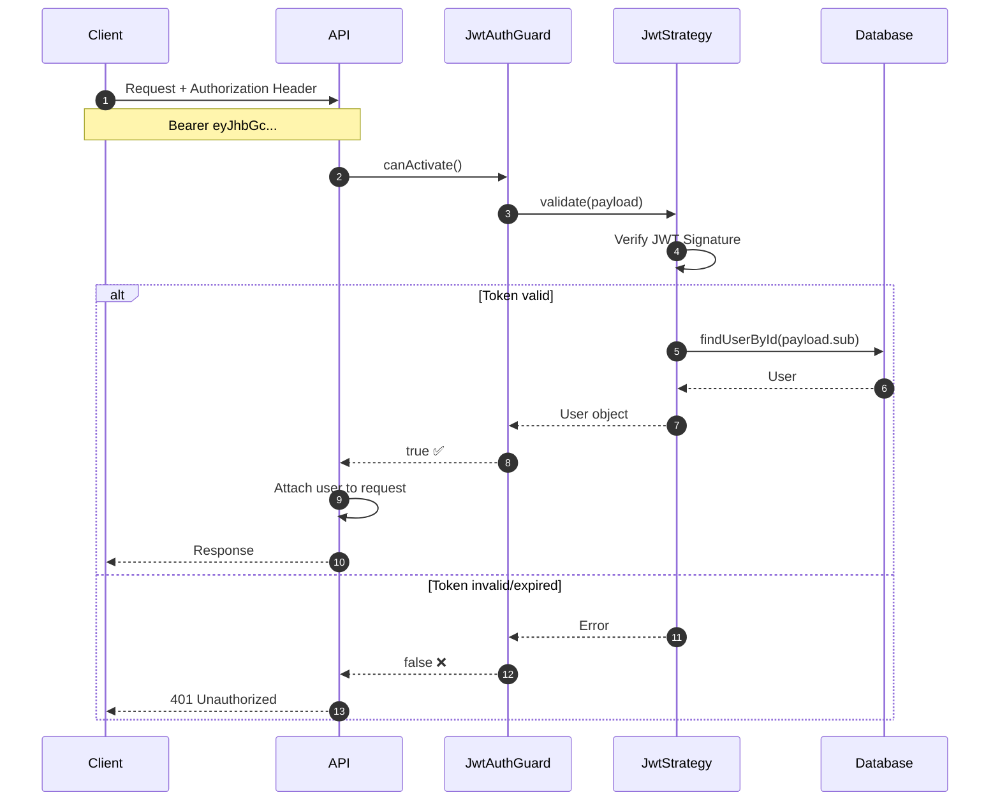

## OIDC/SSO Authentifizierung

### OIDC Authorization Code Flow

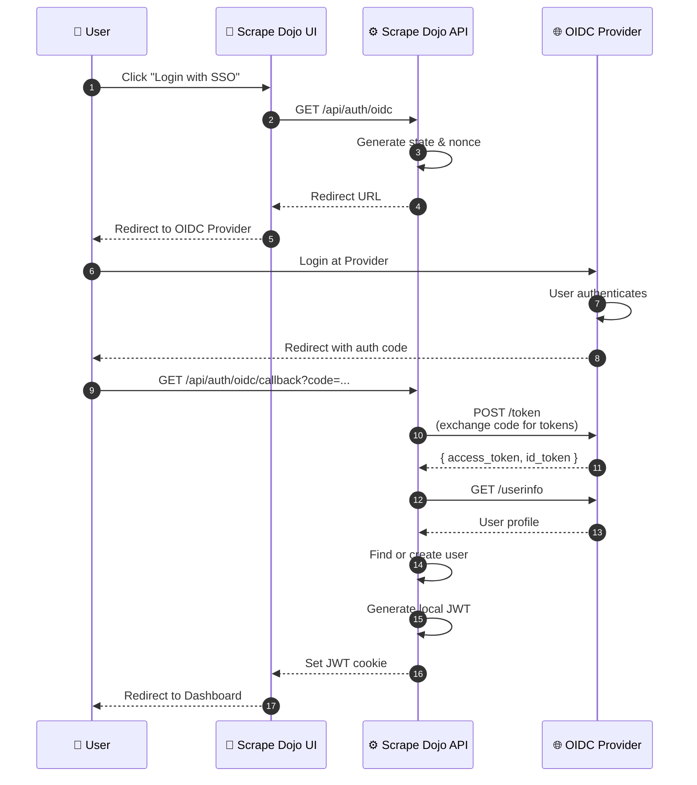

### OIDC Configuration

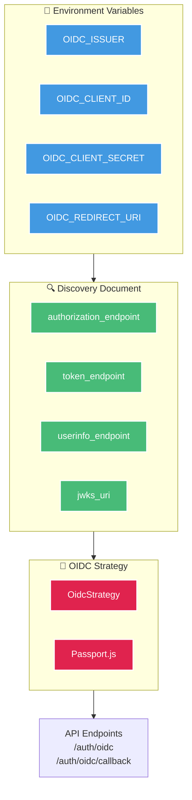

## Multi-Faktor Authentifizierung (MFA/TOTP)

### MFA Setup Flow

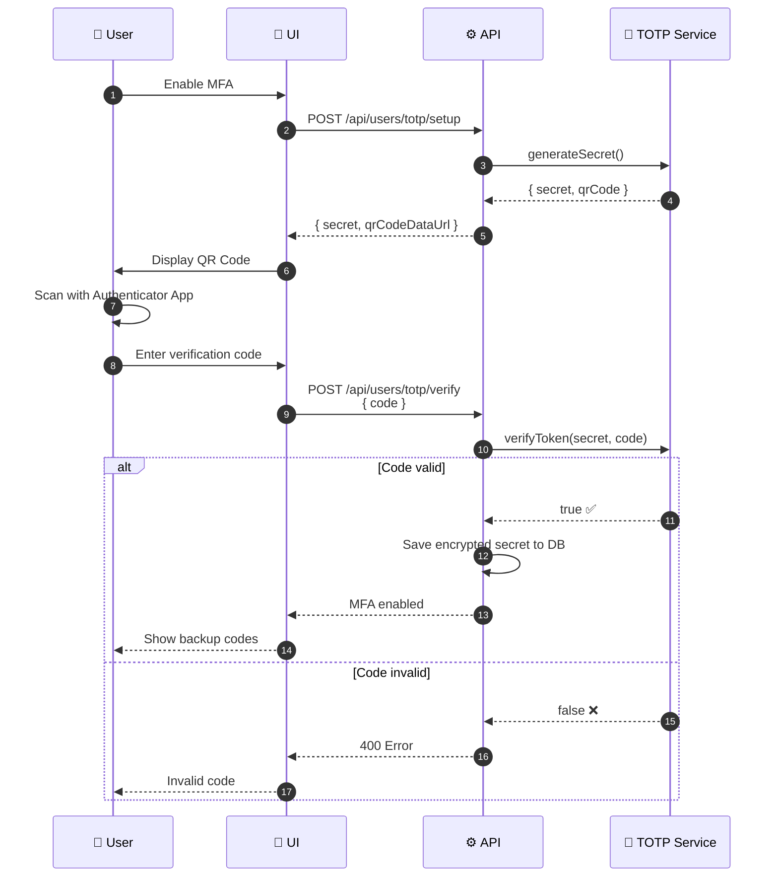

### MFA Login Flow

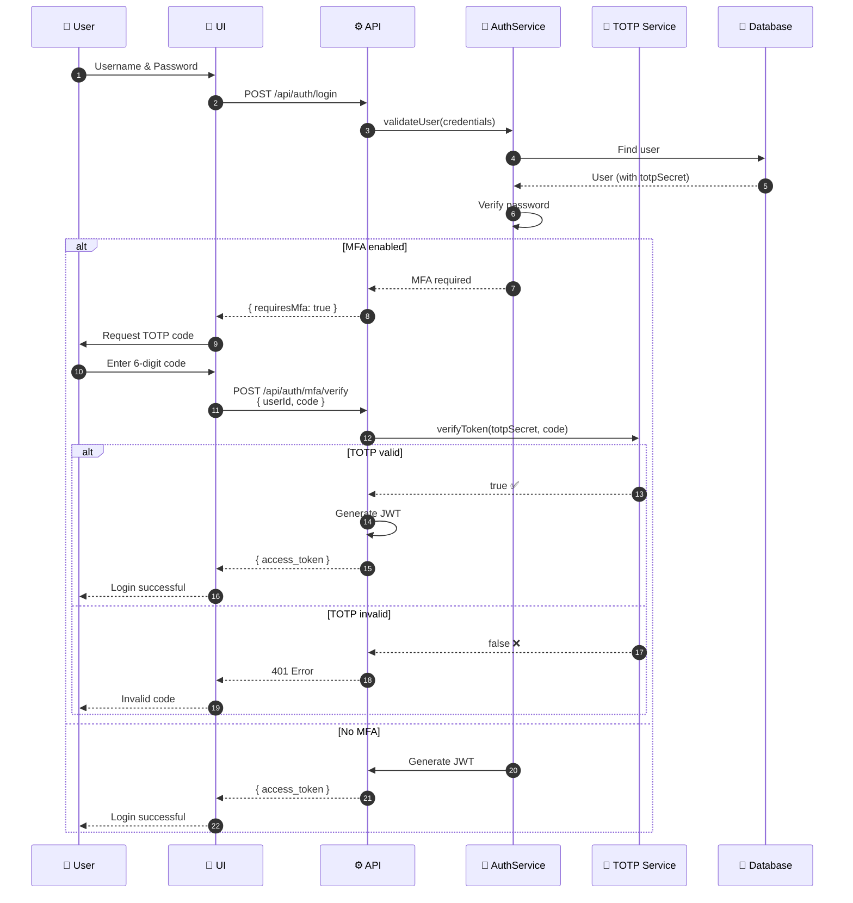

### TOTP Algorithm

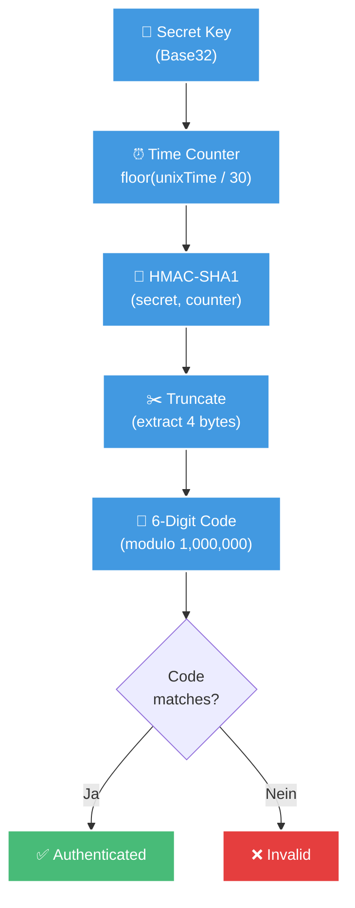

## User Management

### Registrierung

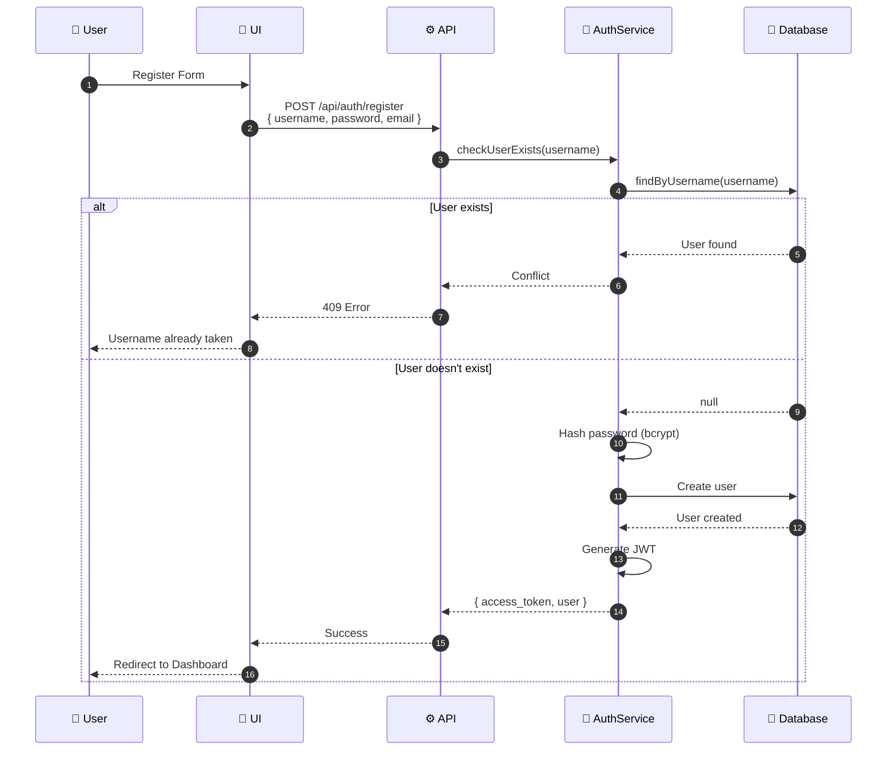

### User Profile

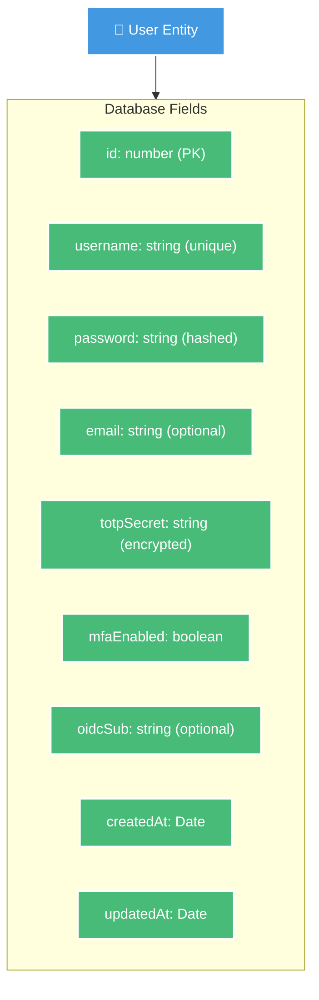

## Sicherheits-Features

### Password Security

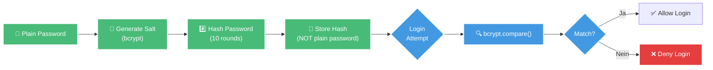

### Secret Encryption

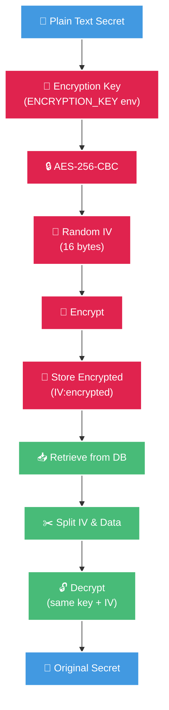

## Environment Variables

### Erforderliche Konfiguration

```bash
# JWT Configuration
JWT_SECRET=your-super-secret-jwt-key
JWT_EXPIRES_IN=7d

# Optional: OIDC Configuration
OIDC_ENABLED=true
OIDC_ISSUER=https://your-idp.com
OIDC_CLIENT_ID=scrape-dojo
OIDC_CLIENT_SECRET=your-client-secret
OIDC_REDIRECT_URI=http://localhost:3000/api/auth/oidc/callback

# Encryption
ENCRYPTION_KEY=32-byte-hex-key-for-secrets
```

### Konfigurations-Flow

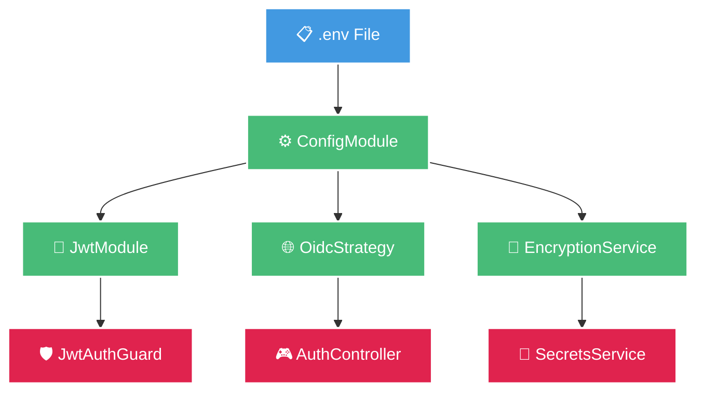

## Best Practices

### ✅ Do's
- Verwende starke JWT Secrets (mindestens 32 Zeichen)
- Aktiviere MFA für erhöhte Sicherheit
- Rotiere TOTP Secrets bei Verdacht auf Kompromittierung
- Nutze HTTPS in Produktion
- Setze angemessene Token-Ablaufzeiten

### ❌ Don'ts
- Speichere Passwörter im Klartext
- Teile JWT Secrets in Code-Repositories
- Verwende schwache Passwörter
- Deaktiviere CORS-Protection
- Logge sensitive Daten

## Weiterführende Links

- [API Endpoints](/api/auth-endpoints) - Authentifizierungs-API Referenz
- [User Guide](/user-guide/authentication) - Benutzer-Anleitung für Auth
- [Security Guide](/security/best-practices) - Sicherheits-Best-Practices
- [OIDC Configuration](/configuration/oidc) - OIDC/SSO Einrichtung
