# Deployment Guide

Scrape Dojo kann auf verschiedene Arten bereitgestellt werden. Dieser Leitfaden zeigt Docker-basierte Deployments sowie manuelle Setups.

## Deployment-Übersicht

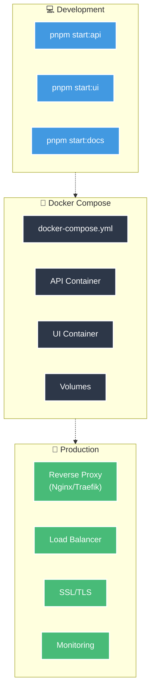

## Docker Compose Setup

### Architektur

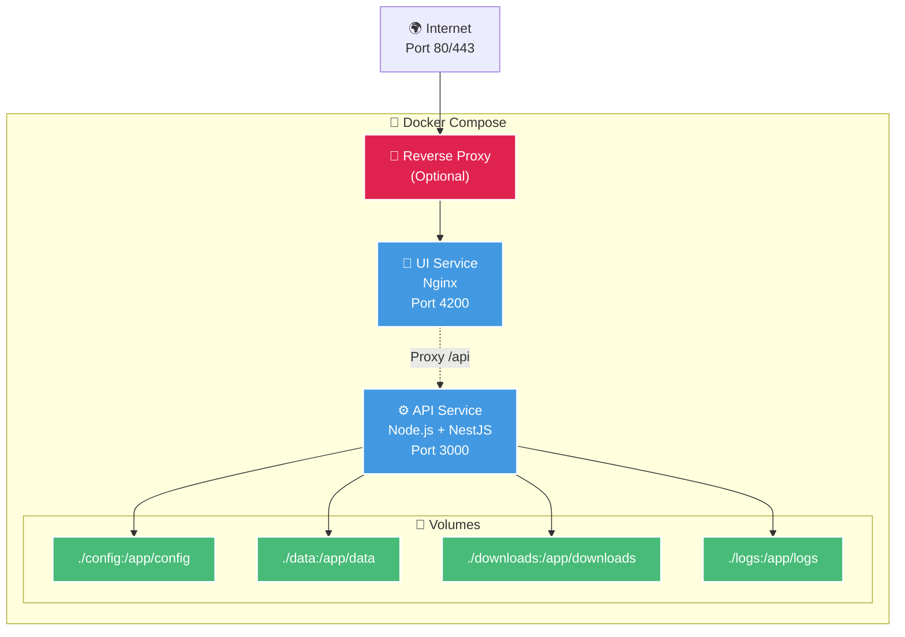

### docker-compose.yml

```yaml
version: '3.8'

services:
  api:
    build:
      context: .
      dockerfile: apps/api/Dockerfile
    container_name: scrape-dojo-api
    ports:
      - "3000:3000"
    environment:
      - NODE_ENV=production
      - SCRAPE_DOJO_PORT=3000
      - JWT_SECRET=${JWT_SECRET}
      - ENCRYPTION_KEY=${ENCRYPTION_KEY}
    volumes:
      - ./config:/app/config:ro
      - ./data:/app/data
      - ./downloads:/app/downloads
      - ./logs:/app/logs
    restart: unless-stopped
    healthcheck:
      test: ["CMD", "curl", "-f", "http://localhost:3000/api/health"]
      interval: 30s
      timeout: 10s
      retries: 3
      start_period: 40s

  ui:
    build:
      context: .
      dockerfile: apps/ui/Dockerfile
    container_name: scrape-dojo-ui
    ports:
      - "4200:80"
    depends_on:
      - api
    restart: unless-stopped

volumes:
  data:
  downloads:
  logs:
```

### Container Lifecycle

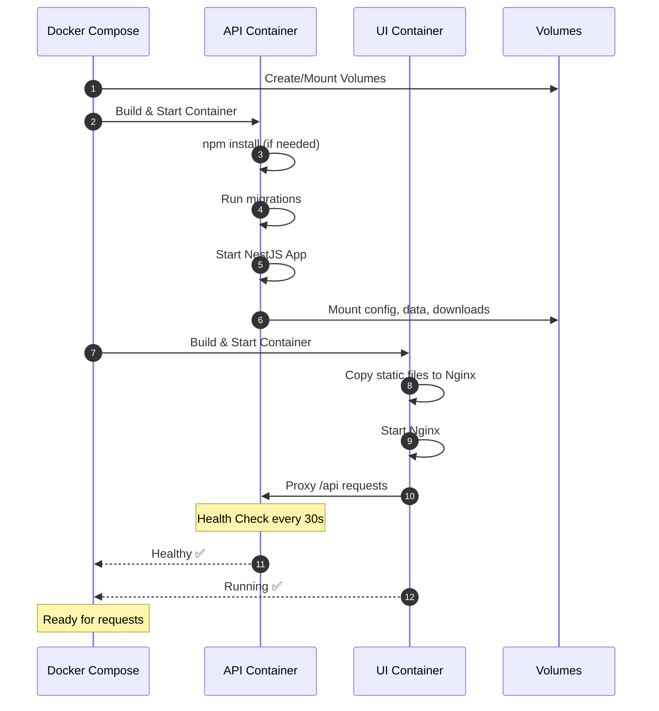

## Production Deployment

### Mit Reverse Proxy (Nginx)

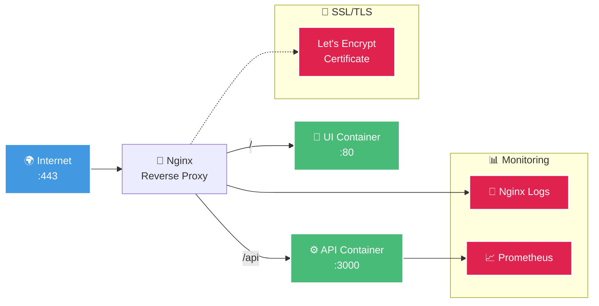

### Nginx Configuration

```nginx
upstream api {
    server api:3000;
}

upstream ui {
    server ui:80;
}

server {
    listen 80;
    server_name scrape-dojo.example.com;
    
    # Redirect HTTP to HTTPS
    return 301 https://$server_name$request_uri;
}

server {
    listen 443 ssl http2;
    server_name scrape-dojo.example.com;

    # SSL Configuration
    ssl_certificate /etc/letsencrypt/live/scrape-dojo.example.com/fullchain.pem;
    ssl_certificate_key /etc/letsencrypt/live/scrape-dojo.example.com/privkey.pem;
    ssl_protocols TLSv1.2 TLSv1.3;

    # API Proxy
    location /api {
        proxy_pass http://api;
        proxy_http_version 1.1;
        proxy_set_header Upgrade $http_upgrade;
        proxy_set_header Connection 'upgrade';
        proxy_set_header Host $host;
        proxy_cache_bypass $http_upgrade;
        proxy_set_header X-Real-IP $remote_addr;
        proxy_set_header X-Forwarded-For $proxy_add_x_forwarded_for;
        proxy_set_header X-Forwarded-Proto $scheme;
    }

    # WebSocket Support
    location /socket.io {
        proxy_pass http://api;
        proxy_http_version 1.1;
        proxy_set_header Upgrade $http_upgrade;
        proxy_set_header Connection "upgrade";
    }

    # UI Static Files
    location / {
        proxy_pass http://ui;
        proxy_set_header Host $host;
        proxy_set_header X-Real-IP $remote_addr;
    }
}
```

## High Availability Setup

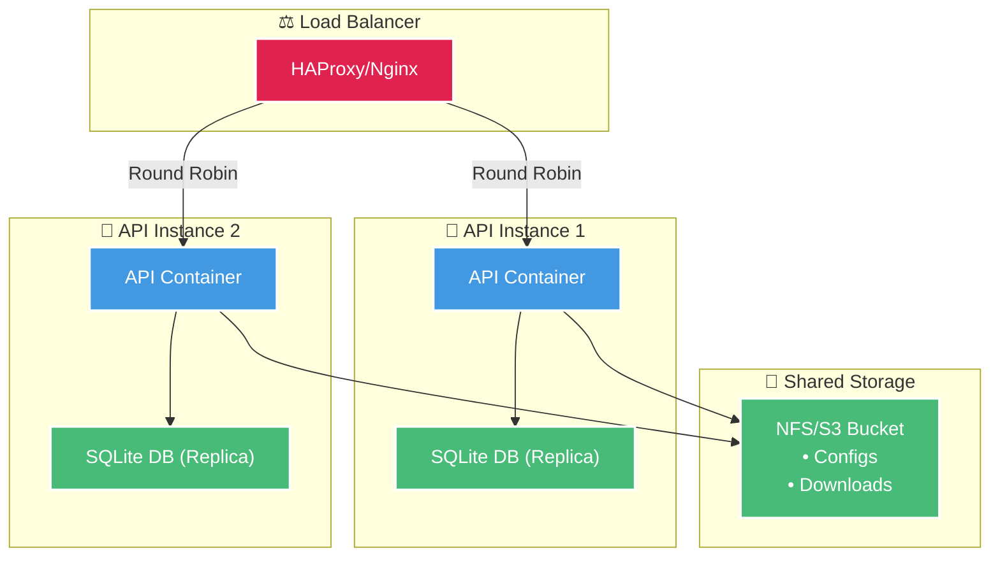

## Environment Management

### Environment-spezifische Konfiguration

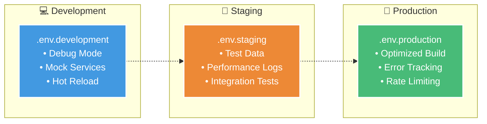

### Wichtige Environment Variables

```bash
# Server Configuration
NODE_ENV=production
SCRAPE_DOJO_PORT=3000

# Security
JWT_SECRET=your-production-jwt-secret
JWT_EXPIRES_IN=7d
ENCRYPTION_KEY=your-32-byte-hex-encryption-key

# Database
DATABASE_PATH=./data/scrape-dojo.db

# Puppeteer
PUPPETEER_HEADLESS=true
PUPPETEER_ARGS=--no-sandbox,--disable-setuid-sandbox

# Rate Limiting
RATE_LIMIT_TTL=60
RATE_LIMIT_MAX=100

# CORS
CORS_ORIGIN=https://your-domain.com

# Logging
LOG_LEVEL=info
LOG_FILE=./logs/app.log
```

## CI/CD Pipeline

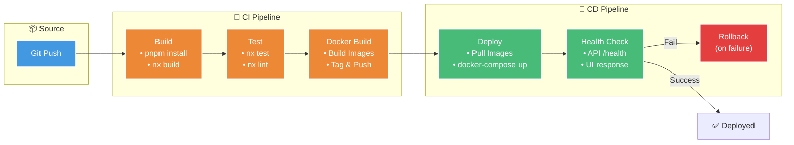

### GitHub Actions Beispiel

```yaml
name: Build and Deploy

on:
  push:
    branches: [main]

jobs:
  build:
    runs-on: ubuntu-latest
    steps:
      - uses: actions/checkout@v3
      
      - uses: pnpm/action-setup@v2
        with:
          version: 8
      
      - name: Install dependencies
        run: pnpm install
      
      - name: Build
        run: pnpm build
      
      - name: Test
        run: pnpm test
      
      - name: Build Docker images
        run: |
          docker build -f apps/api/Dockerfile -t scrape-dojo-api .
          docker build -f apps/ui/Dockerfile -t scrape-dojo-ui .
      
      - name: Deploy
        run: |
          docker-compose -f docker-compose.prod.yml up -d
```

## Monitoring & Logging

### Monitoring-Architektur

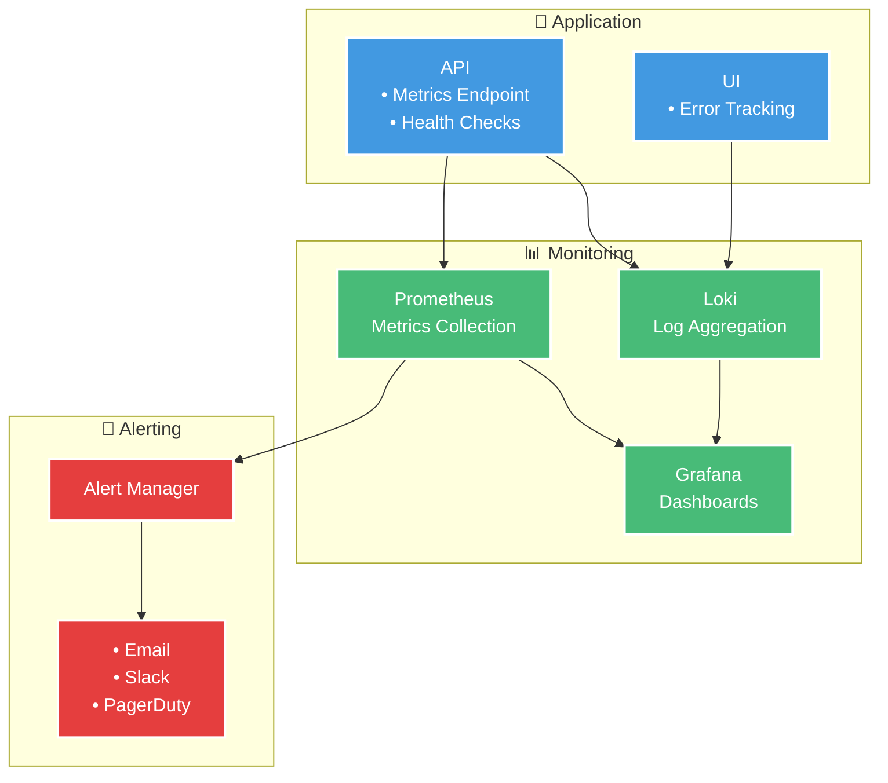

### Log-Flow

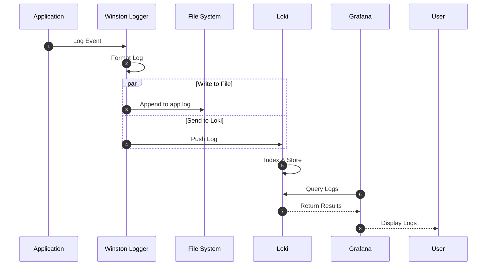

## Backup & Recovery

### Backup-Strategie

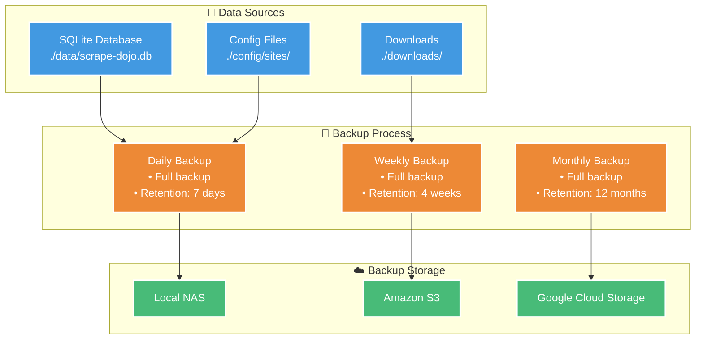

### Backup Script

```bash
#!/bin/bash
# backup.sh

BACKUP_DIR="/backup/scrape-dojo/$(date +%Y-%m-%d)"
mkdir -p "$BACKUP_DIR"

# Backup Database
cp ./data/scrape-dojo.db "$BACKUP_DIR/"

# Backup Config
tar -czf "$BACKUP_DIR/config.tar.gz" ./config/

# Backup Downloads (optional)
# tar -czf "$BACKUP_DIR/downloads.tar.gz" ./downloads/

# Upload to S3
aws s3 sync "$BACKUP_DIR" s3://my-bucket/scrape-dojo-backup/

echo "Backup completed: $BACKUP_DIR"
```

## Scaling Considerations

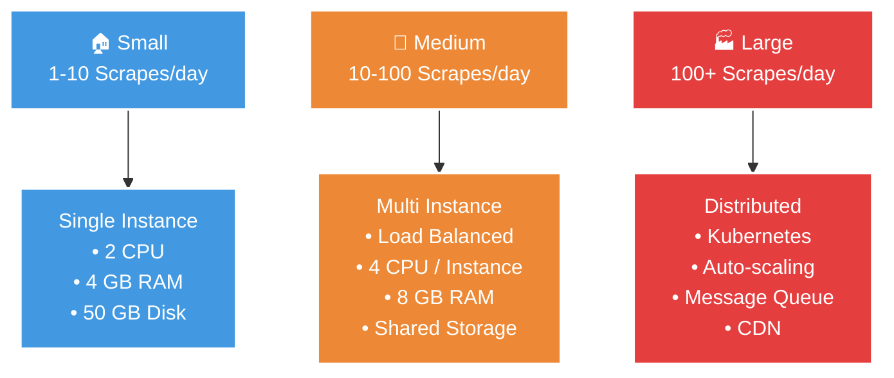

## Troubleshooting

### Common Issues

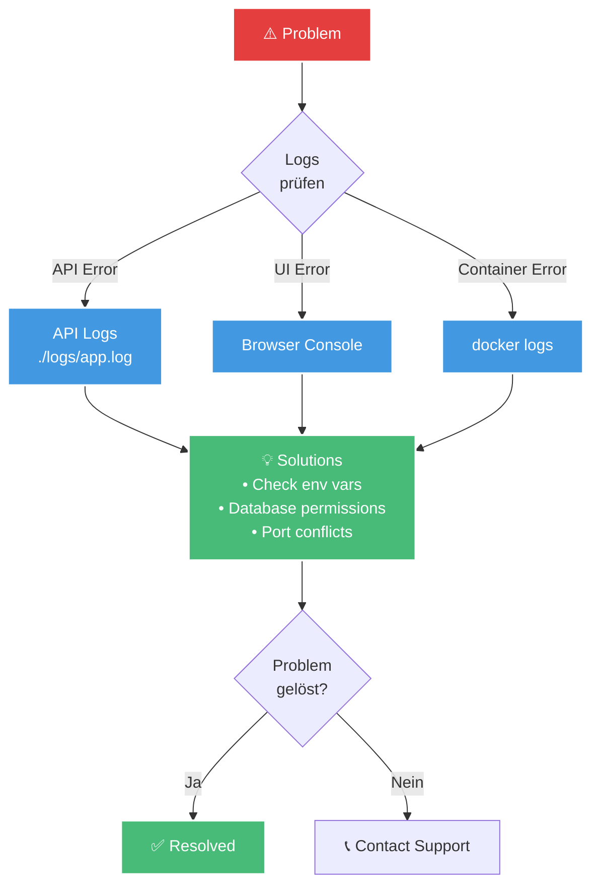

## Best Practices

### ✅ Do's
- Verwende Docker für konsistente Deployments
- Implementiere Health Checks
- Aktiviere HTTPS in Produktion
- Setze Rate Limiting
- Führe regelmäßige Backups durch
- Überwache Logs und Metriken

### ❌ Don'ts
- Hardcode Secrets in Code/Dockerfiles
- Verwende `latest` Tags in Produktion
- Ignoriere Security Updates
- Deploye ohne Tests
- Betreibe ohne Monitoring

## Weiterführende Links

- [Docker Documentation](https://docs.docker.com/)
- [Nginx Configuration](/deployment/nginx)
- [Monitoring Setup](/deployment/monitoring)
- [Backup Strategy](/deployment/backup)
