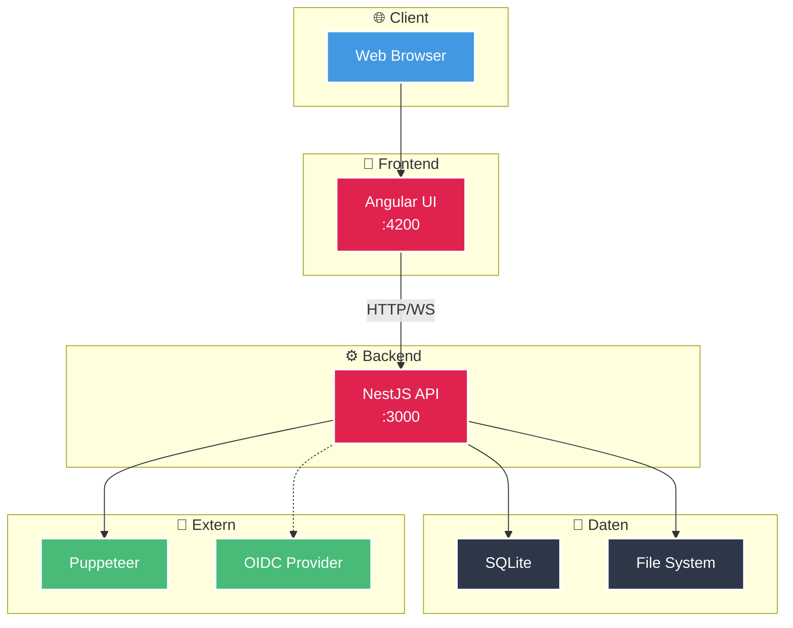

# Architektur-Dokumentation

Diese Sektion enthält detaillierte Informationen über die technische Architektur von Scrape Dojo.

## Inhaltsverzeichnis

### High-Level Übersicht
- [Architektur-Übersicht](/de/architecture/overview/) - System-Architektur, Technologie-Stack und Komponenten

### Backend
- [API Module Structure](/de/architecture/api-modules/) - NestJS Module, Controller und Services

### Core Funktionen
- [Scrape Workflow](/de/architecture/scrape-workflow/) - Detaillierter Ablauf einer Scrape-Ausführung
- [Authentication Flow](/de/architecture/authentication/) - JWT, OIDC/SSO und MFA/TOTP

### Operations
- [Deployment Guide](/de/architecture/deployment/) - Docker-Setup und Produktionsumgebung

## Architektur auf einen Blick

## Weiterführende Links

Für detaillierte Informationen zu spezifischen Themen, besuche die entsprechenden Unterseiten.
