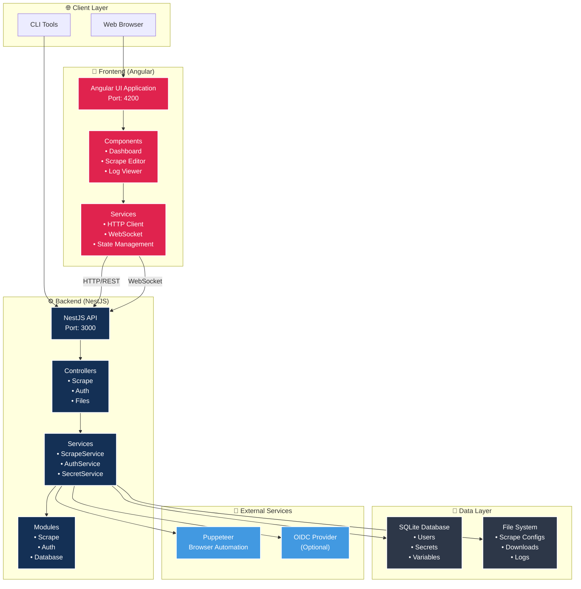
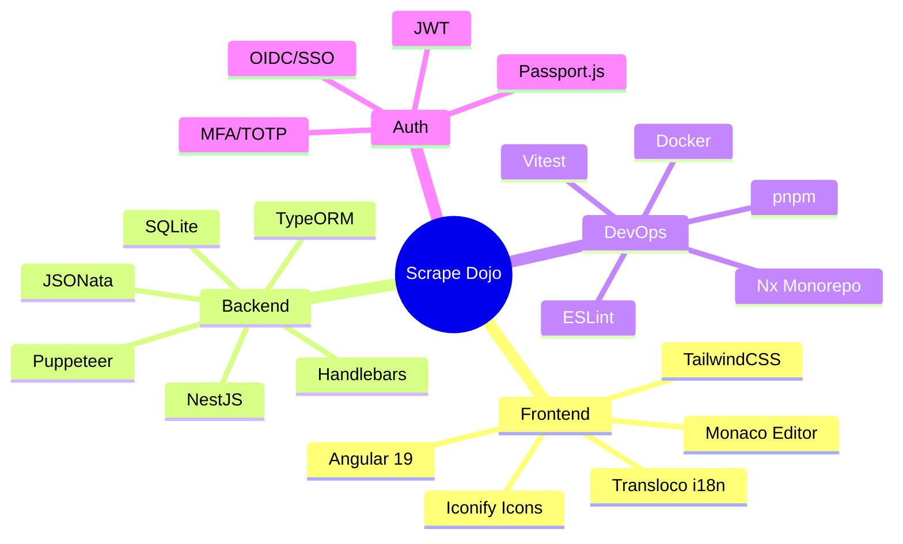
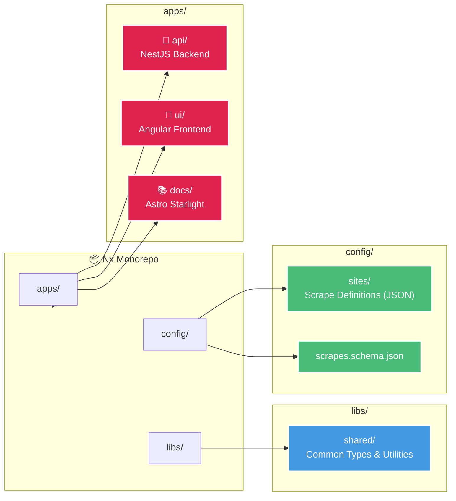
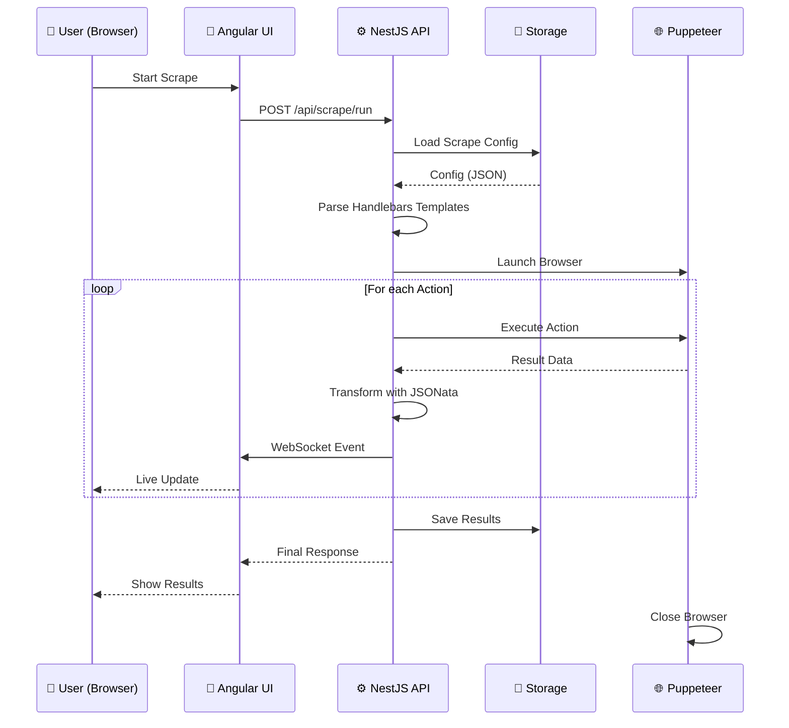
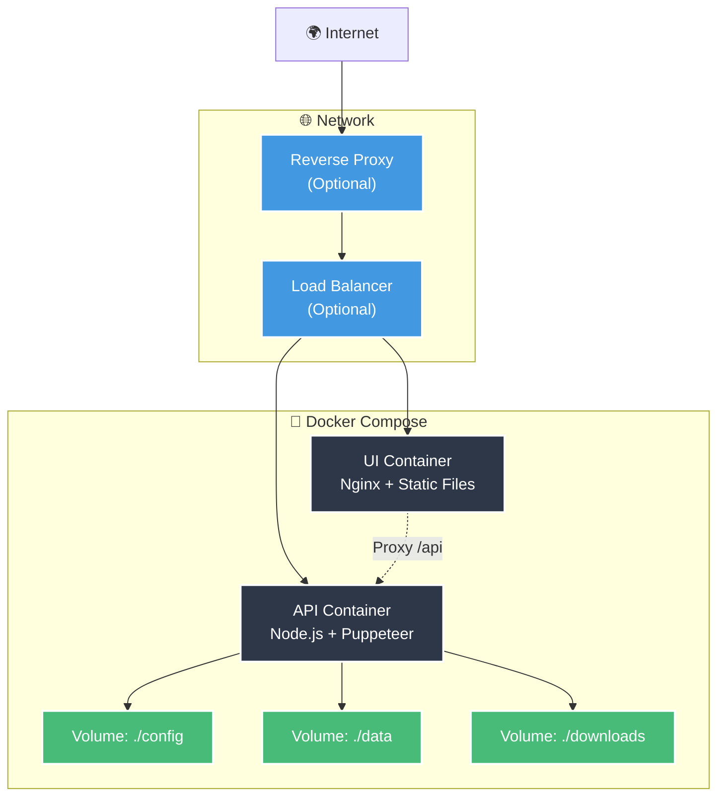
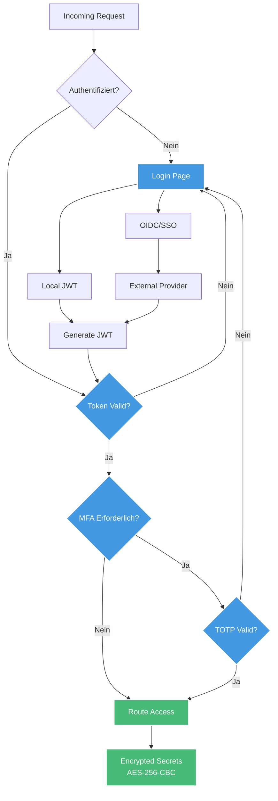

# Architektur-Übersicht

Scrape Dojo ist ein modernes Monorepo-Projekt, das mit Nx verwaltet wird und drei Hauptkomponenten umfasst: API, UI und Dokumentation.

## High-Level Architektur

## Technologie-Stack

## Projektstruktur

## Datenfluss

## Deployment-Architektur

## Sicherheitsarchitektur

## Key Features

### 🎯 Modulares Design
- **Nx Monorepo**: Alle Projekte in einem Repository
- **Shared Libraries**: Wiederverwendbare Typen und Utilities
- **Klare Trennung**: Frontend, Backend und Docs sind getrennt

### 🔄 Echtzeit-Kommunikation
- **WebSocket**: Live-Updates während der Scrape-Ausführung
- **Event-System**: Strukturierte Events für Logs und Status
- **Server-Sent Events**: Alternative für SSE-Support

### 🔒 Sicherheit First
- **Verschlüsselte Secrets**: AES-256-CBC Encryption
- **JWT Authentication**: Sichere Token-basierte Auth
- **OIDC/SSO Support**: Integration mit Enterprise Identity Providern
- **MFA/TOTP**: Zweifaktor-Authentifizierung

### 🚀 Performance
- **Puppeteer**: Hochperformante Browser-Automatisierung
- **TypeORM**: Effiziente Datenbankoperationen
- **Caching**: Intelligentes Caching von Scrape-Configs
- **Streaming**: Große Dateien werden gestreamt

## Weiterführende Dokumentation

- [API Module Structure](/architecture/api-modules) - Detaillierte Übersicht aller NestJS Module
- [Scrape Workflow](/architecture/scrape-workflow) - Wie Scrapes intern ablaufen
- [Authentication Flow](/architecture/authentication) - Vollständiger Auth-Prozess
- [Deployment Guide](/architecture/deployment) - Produktionsumgebung aufsetzen
