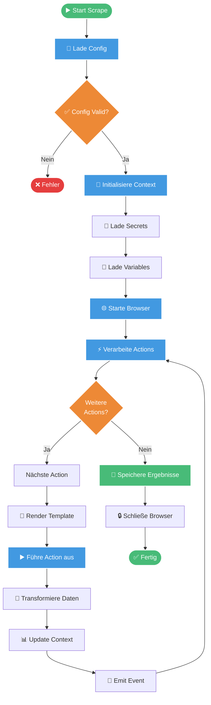
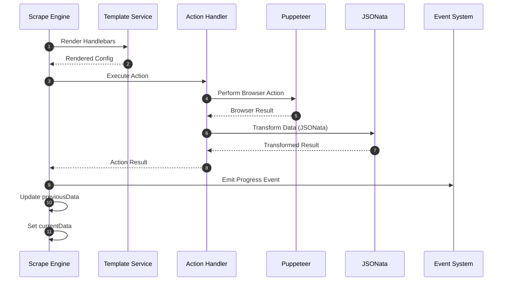
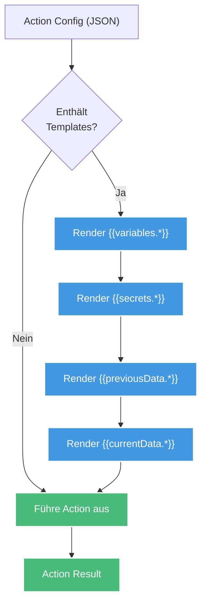
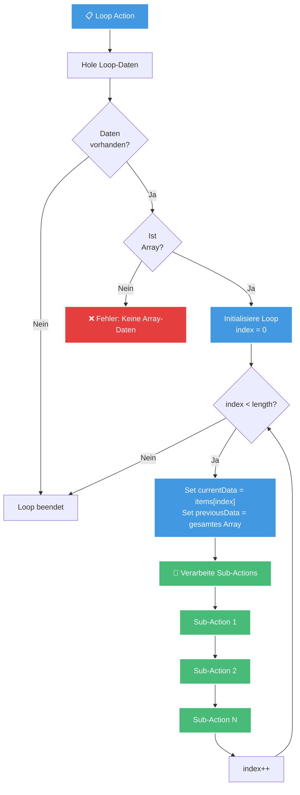
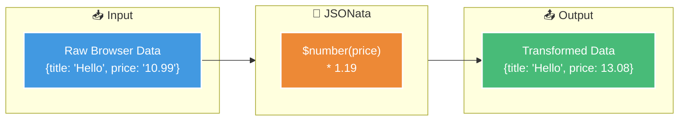
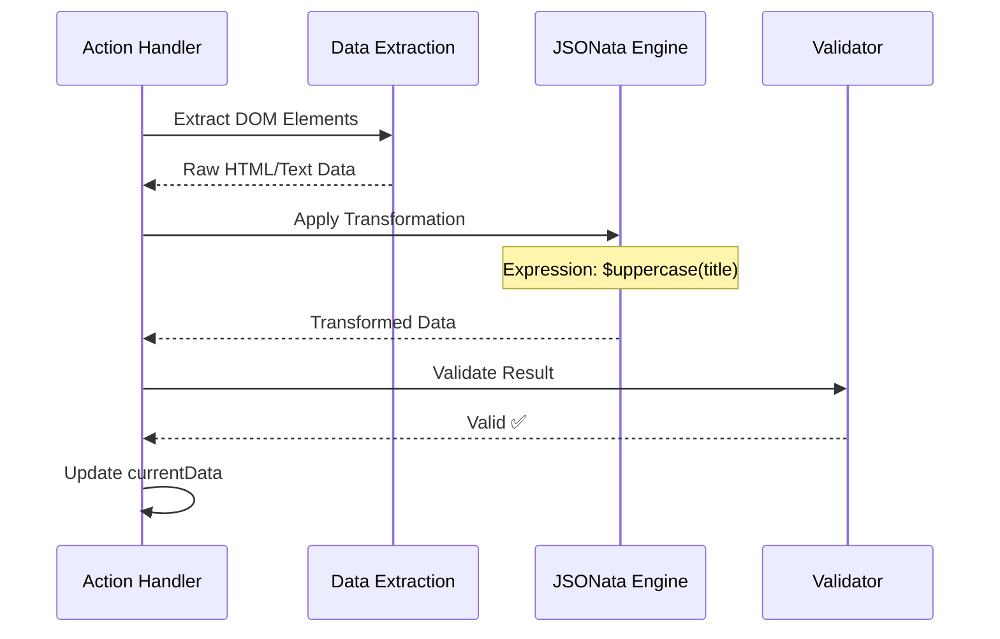
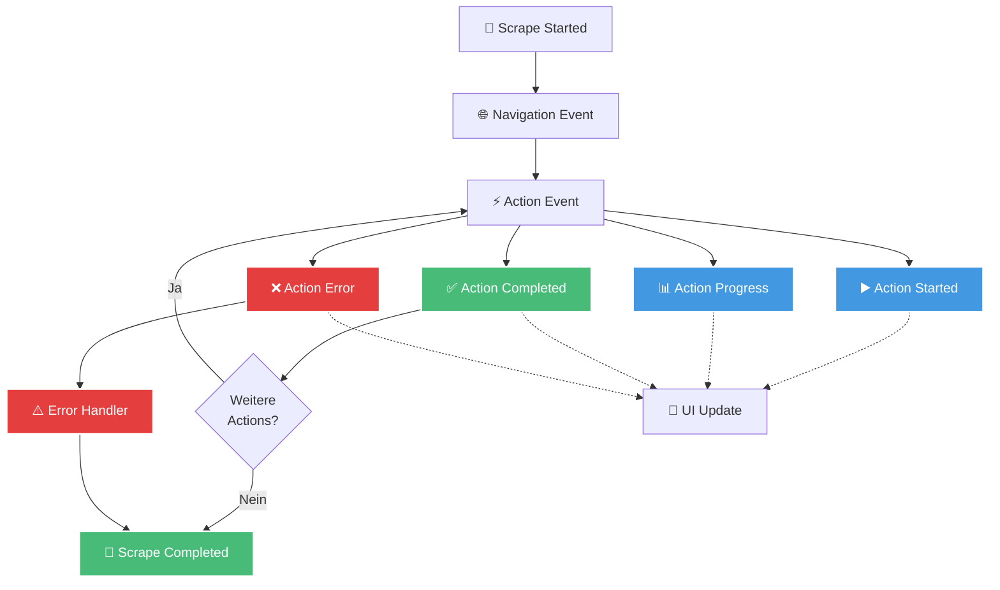
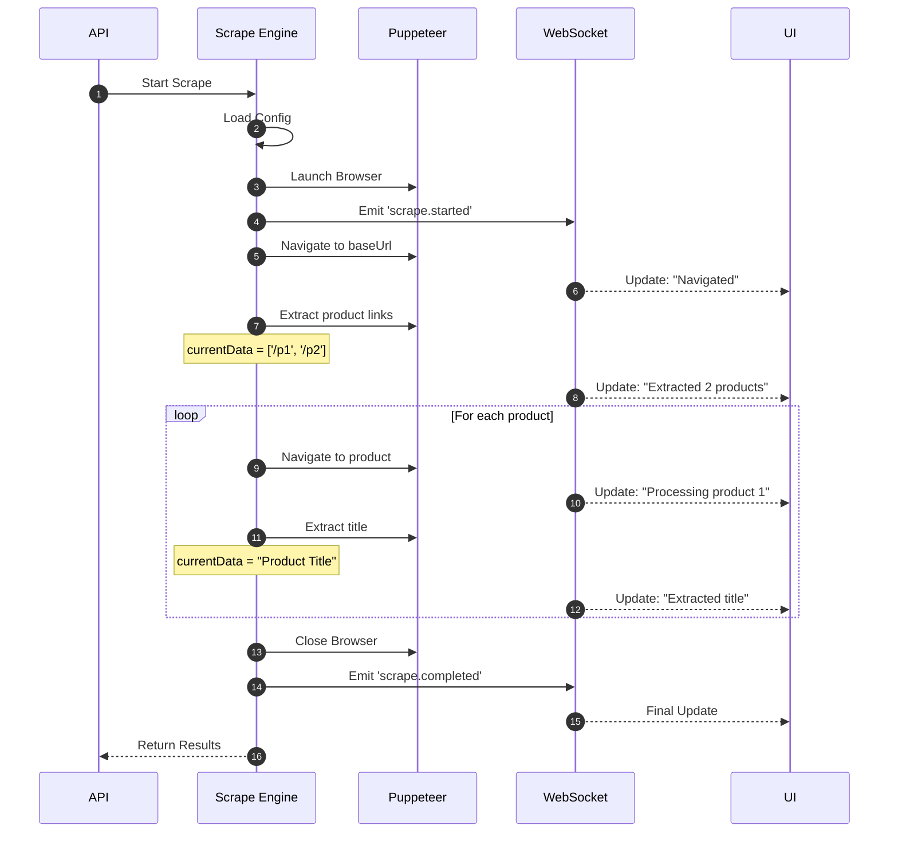
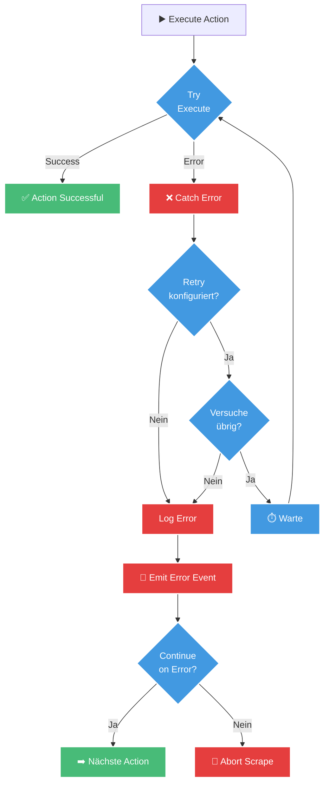

# Scrape Workflow

Ein Scrape-Workflow in Scrape Dojo durchläuft mehrere Phasen, von der Initialisierung bis zum Abschluss. Dieser Leitfaden erklärt den gesamten Prozess im Detail.

## Workflow-Übersicht



## Datenfluss (previousData & currentData)

Ein zentrales Konzept in Scrape Dojo ist der Datenfluss zwischen Actions über `previousData` und `currentData`.

```mermaid
graph LR
    subgraph "Action 1: Navigate"
        A1[Navigate to URL] --> A1Data[currentData: null<br/>previousData: null]
    end

    subgraph "Action 2: Extract Title"
        A2[Extract Element] --> A2Data[currentData: title string<br/>previousData: null]
    end

    subgraph "Action 3: Extract List"
        A3[Extract Elements] --> A3Data["currentData: [item1, item2]<br/>previousData: 'title'"]
    end

    subgraph "Action 4: Loop"
        A4[Loop over items] --> A4Data["currentData: item1<br/>previousData: [item1, item2]"]
    end

    A1Data -->|Flow| A2
    A2Data -->|Flow| A3
    A3Data -->|Flow| A4

    classDef data fill:#4299E1,stroke:#fff,stroke-width:2px,color:#fff
    classDef action fill:#48BB78,stroke:#fff,stroke-width:2px,color:#fff

    class A1Data,A2Data,A3Data,A4Data data
    class A1,A2,A3,A4 action
```



### Data Context Schema

```typescript
interface ActionContext {
  previousData: any;      // Resultat der vorherigen Action
  currentData: any;       // Resultat der aktuellen Action
  variables: object;      // Globale Variablen
  secrets: object;        // Verschlüsselte Secrets
  browser: Browser;       // Puppeteer Browser Instance
  page: Page;            // Aktuelle Browser Page
}
```

## Action Lifecycle



## Template Rendering

Vor jeder Action werden Handlebars-Templates gerendert, um dynamische Werte einzusetzen.



### Template Beispiel

```json
{
  "type": "navigate",
  "url": "{{variables.baseUrl}}/login"
}

// Nach Rendering:
{
  "type": "navigate",
  "url": "https://example.com/login"
}
```

## Loop-Verarbeitung

Loops ermöglichen die Iteration über Arrays und wiederholte Ausführung von Actions.



### Loop Datenfluss

```mermaid
sequenceDiagram
    participant Loop as Loop Action
    participant Context as Context Manager
    participant Sub as Sub-Actions
    
    Note over Loop: Array: ['A', 'B', 'C']
    
    Loop->>Context: Iteration 1
    Context->>Sub: currentData = 'A'<br/>previousData = ['A','B','C']
    Sub-->>Context: Result 1
    
    Loop->>Context: Iteration 2
    Context->>Sub: currentData = 'B'<br/>previousData = ['A','B','C']
    Sub-->>Context: Result 2
    
    Loop->>Context: Iteration 3
    Context->>Sub: currentData = 'C'<br/>previousData = ['A','B','C']
    Sub-->>Context: Result 3
    
    Context-->>Loop: Alle Iterationen abgeschlossen
```

## Transformation mit JSONata

JSONata ermöglicht komplexe Datentransformationen auf extrahierte Daten.



### Transformation Flow



## Event System

Während der Scrape-Ausführung werden verschiedene Events emittiert.



## Vollständiges Beispiel

### Scrape Config
```jsonc
{
  "name": "example-scrape",
  "actions": [
    {
      "type": "navigate",
      "description": "Open homepage",
      "url": "{{variables.baseUrl}}"
    },
    {
      "type": "extract",
      "description": "Extract product links",
      "selector": ".product-link",
      "extractData": "href",
      "multiple": true
    },
    {
      "type": "loop",
      "description": "Process each product",
      "loopData": "{{previousData}}",
      "actions": [
        {
          "type": "navigate",
          "url": "{{currentData}}"
        },
        {
          "type": "extract",
          "selector": ".product-title",
          "extractData": "innerText"
        }
      ]
    }
  ]
}
```

### Ausführungsfluss



## Error Handling



## Best Practices

### 1. **Nutze previousData effektiv**
```jsonc
{
  "type": "extract",
  "selector": ".price",
  "transformData": "$number($substring(previousData, 1))"
}
```

### 2. **Verwende Loops für Arrays**
```jsonc
{
  "type": "loop",
  "loopData": "{{previousData}}",
  "actions": [/* Sub-Actions */]
}
```

### 3. **Setze sinnvolle Descriptions**
```jsonc
{
  "type": "click",
  "description": "Click login button",
  "selector": "#login-btn"
}
```

### 4. **Nutze Transformationen**
```jsonc
{
  "type": "extract",
  "transformData": "{ product: title, price: $number(price) }"
}
```

## Weiterführende Links

- [Available Actions](/user-guide/actions) - Alle verfügbaren Action-Typen
- [Template Syntax](/user-guide/templates) - Handlebars Template-Syntax
- [JSONata Guide](/user-guide/jsonata) - Datentransformationen
- [API Reference](/api/scrape-endpoints) - Scrape API Endpunkte
