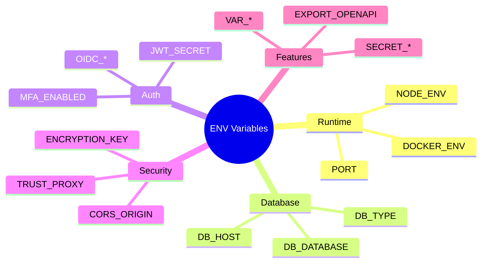

# Environment Variables Referenz

Komplette Übersicht aller unterstützten Environment-Variablen in Scrape Dojo.

## Kategorien



## ⚡ Runtime / Server

### NODE_ENV

- **Typ**: `development` | `production` | `test`
- **Default**: `development`
- **Beschreibung**: Betriebsmodus der Anwendung
- **Auswirkung**:
  - `development`: Ausführliche Logs, CORS permissiv
  - `production`: Optimierte Performance, strikte Sicherheit
  - `test`: E2E-Tests, In-Memory-DB

```bash
NODE_ENV=production
```

### SCRAPE_DOJO_NODE_ENV

- **Typ**: `development` | `production`
- **Default**: Wert von `NODE_ENV`
- **Beschreibung**: Scrape Dojo-spezifischer Env-Mode
- **Usage**: Health-Checks, Puppeteer-Config

```bash
SCRAPE_DOJO_NODE_ENV=production
```

### SCRAPE_DOJO_PORT

- **Typ**: Number
- **Default**: `3000`
- **Beschreibung**: API Server Port
- **Hinweis**: In Docker meist `3000` (intern), extern gemapped

```bash
SCRAPE_DOJO_PORT=3000
```

### SCRAPE_DOJO_DOCKER_ENV

- **Typ**: Boolean
- **Default**: `false`
- **Beschreibung**: Erkennt Docker-Umgebung
- **Auto-Detection**: Wird meist automatisch gesetzt

```bash
SCRAPE_DOJO_DOCKER_ENV=true
```

### SCRAPE_DOJO_TRUST_PROXY

- **Typ**: Number | Boolean | String
- **Default**: `1`
- **Beschreibung**: Reverse Proxy Configuration (Express)
- **Values**:
  - `1` = Trust first proxy
  - `2` = Trust first 2 proxies
  - `true` = Trust all
  - `loopback,linklocal` = Spezifische IPs

```bash
SCRAPE_DOJO_TRUST_PROXY=1
```

### SCRAPE_DOJO_CORS_ORIGIN

- **Typ**: String (comma-separated)
- **Default**: Leer (permissiv in dev)
- **Beschreibung**: Allowed CORS Origins
- **Production**: Immer explizit setzen!

```bash
SCRAPE_DOJO_CORS_ORIGIN=https://app.example.com,https://admin.example.com
```

### EXPORT_OPENAPI

- **Typ**: Boolean
- **Default**: `false`
- **Beschreibung**: OpenAPI-Spec beim Start exportieren
- **Output**: `dist/apps/api/openapi.json`

```bash
EXPORT_OPENAPI=true
```

### SCRAPE_DOJO_LOG_MAX_BYTES

- **Typ**: Number
- **Default**: `5000000` (5MB)
- **Beschreibung**: Max. Größe des In-Memory Log-Buffers
- **Hinweis**: Logs rotieren automatisch

```bash
SCRAPE_DOJO_LOG_MAX_BYTES=10000000
```

---

## 🗄️ Database

### DB_TYPE

- **Typ**: `sqlite` | `postgres` | `mysql`
- **Default**: `sqlite`
- **Beschreibung**: Datenbank-Typ
- **Empfehlung**:
  - Dev: `sqlite`
  - Prod: `postgres`

```bash
DB_TYPE=sqlite
```

### DB_DATABASE

- **Typ**: String
- **Beschreibung**: Datenbank-Name oder Pfad
- **SQLite**: Dateipfad (z.B. `./data/scrape-dojo.db`)
- **PostgreSQL/MySQL**: Datenbank-Name

```bash
# SQLite
DB_DATABASE=./data/scrape-dojo.db

# PostgreSQL
DB_DATABASE=scrape_dojo
```

### DB_HOST

- **Typ**: String
- **Default**: `localhost`
- **Beschreibung**: Datenbank-Host
- **Nur**: PostgreSQL / MySQL

```bash
DB_HOST=localhost
# oder
DB_HOST=postgres  # Docker-Service-Name
```

### DB_PORT

- **Typ**: Number
- **Default**:
  - PostgreSQL: `5432`
  - MySQL: `3306`
- **Beschreibung**: Datenbank-Port

```bash
DB_PORT=5432
```

### DB_USERNAME

- **Typ**: String
- **Beschreibung**: Datenbank-Benutzername
- **Nur**: PostgreSQL / MySQL

```bash
DB_USERNAME=scrape_dojo
```

### DB_PASSWORD

- **Typ**: String
- **Beschreibung**: Datenbank-Passwort
- **Nur**: PostgreSQL / MySQL
- **Sicherheit**: Nie committen!

```bash
DB_PASSWORD=super-secure-password
```

### DB_SYNCHRONIZE

- **Typ**: Boolean
- **Default**: `true` (dev), `false` (prod)
- **Beschreibung**: Auto-Sync DB-Schema mit Entities
- **⚠️ Production**: Immer `false` setzen!

```bash
DB_SYNCHRONIZE=false
```

### DB_LOGGING

- **Typ**: Boolean
- **Default**: `false`
- **Beschreibung**: TypeORM SQL-Logging aktivieren
- **Debug**: Auf `true` setzen

```bash
DB_LOGGING=true
```

---

## 🔐 Security & Encryption

### SCRAPE_DOJO_ENCRYPTION_KEY

- **Typ**: String (64 hex characters)
- **Required**: ✅ **PRODUCTION**
- **Beschreibung**: 256-bit AES Key für Secrets-Verschlüsselung
- **Generate**:
  ```bash
  node -e "console.log(require('crypto').randomBytes(32).toString('hex'))"
  ```

```bash
SCRAPE_DOJO_ENCRYPTION_KEY=a1b2c3d4e5f6789...  # 64 hex chars
```

---

## 🔑 Authentication

### SCRAPE_DOJO_AUTH_ENABLED

- **Typ**: Boolean
- **Default**: `true`
- **Beschreibung**: Aktiviert globale Authentication
- **⚠️ Production**: Niemals `false`!

```bash
SCRAPE_DOJO_AUTH_ENABLED=true
```

### SCRAPE_DOJO_AUTH_JWT_SECRET

- **Typ**: String (min. 32 chars)
- **Required**: ✅ wenn Auth enabled
- **Beschreibung**: Secret für JWT-Signierung
- **Generate**:
  ```bash
  node -e "console.log(require('crypto').randomBytes(32).toString('hex'))"
  ```

```bash
SCRAPE_DOJO_AUTH_JWT_SECRET=your-jwt-secret-at-least-32-chars
```

### SCRAPE_DOJO_AUTH_REFRESH_TOKEN_SECRET

- **Typ**: String (min. 32 chars)
- **Required**: ✅ wenn Auth enabled
- **Beschreibung**: Secret für Refresh-Token-Signierung
- **Hinweis**: Anders als JWT_SECRET!

```bash
SCRAPE_DOJO_AUTH_REFRESH_TOKEN_SECRET=your-refresh-secret
```

### SCRAPE_DOJO_AUTH_ACCESS_TOKEN_EXPIRY

- **Typ**: String (Zeit-Format)
- **Default**: `15m`
- **Beschreibung**: Access-Token Lebensdauer
- **Format**: `1h`, `30m`, `1d`, `7d`

```bash
SCRAPE_DOJO_AUTH_ACCESS_TOKEN_EXPIRY=15m
```

### SCRAPE_DOJO_AUTH_REFRESH_TOKEN_EXPIRY

- **Typ**: String (Zeit-Format)
- **Default**: `7d`
- **Beschreibung**: Refresh-Token Lebensdauer

```bash
SCRAPE_DOJO_AUTH_REFRESH_TOKEN_EXPIRY=7d
```

### SCRAPE_DOJO_AUTH_API_KEY

- **Typ**: String
- **Optional**: Headless/Service Access
- **Beschreibung**: API-Key für Services (statt JWT)
- **Header**: `X-API-Key: <value>`

```bash
SCRAPE_DOJO_AUTH_API_KEY=service-api-key-123
```

### SCRAPE_DOJO_AUTH_RATE_LIMIT_WINDOW_MS

- **Typ**: Number (Milliseconds)
- **Default**: `60000` (1 Min)
- **Beschreibung**: Rate-Limit Zeitfenster für Auth-Endpoints

```bash
SCRAPE_DOJO_AUTH_RATE_LIMIT_WINDOW_MS=60000
```

### SCRAPE_DOJO_AUTH_RATE_LIMIT_MAX

- **Typ**: Number
- **Default**: `30`
- **Beschreibung**: Max. Requests pro Zeitfenster

```bash
SCRAPE_DOJO_AUTH_RATE_LIMIT_MAX=30
```

---

## 🔐 MFA (Multi-Factor Authentication)

### SCRAPE_DOJO_AUTH_REQUIRE_MFA

- **Typ**: Boolean
- **Default**: `true`
- **Beschreibung**: MFA für alle User erzwingen

```bash
SCRAPE_DOJO_AUTH_REQUIRE_MFA=true
```

### SCRAPE_DOJO_AUTH_MFA_ISSUER

- **Typ**: String
- **Default**: `Scrape Dojo`
- **Beschreibung**: Anzeigename in Authenticator-Apps

```bash
SCRAPE_DOJO_AUTH_MFA_ISSUER=Scrape Dojo
```

### SCRAPE_DOJO_AUTH_MFA_CHALLENGE_SECRET

- **Typ**: String (min. 32 chars)
- **Required**: ✅ **PRODUCTION** wenn MFA enabled
- **Beschreibung**: Secret für Challenge-Token-Signierung

```bash
SCRAPE_DOJO_AUTH_MFA_CHALLENGE_SECRET=mfa-challenge-secret
```

### SCRAPE_DOJO_AUTH_MFA_ENCRYPTION_KEY

- **Typ**: String
- **Required**: ✅ **PRODUCTION** wenn MFA enabled
- **Beschreibung**: Verschlüsselung für MFA-Secrets
- **Format**: Beliebiger String oder base64(32 bytes)

```bash
SCRAPE_DOJO_AUTH_MFA_ENCRYPTION_KEY=mfa-encryption-key
```

---

## 🌐 OIDC / SSO

### SCRAPE_DOJO_AUTH_OIDC_ENABLED

- **Typ**: Boolean
- **Default**: `false`
- **Beschreibung**: OIDC-Authentication aktivieren

```bash
SCRAPE_DOJO_AUTH_OIDC_ENABLED=true
```

### SCRAPE_DOJO_AUTH_OIDC_ISSUER_URL

- **Typ**: String (URL)
- **Required**: ✅ wenn OIDC enabled
- **Beschreibung**: OIDC Provider Issuer URL
- **Beispiele**:
  - Keycloak: `https://keycloak.example.com/realms/your-realm`
  - Auth0: `https://your-tenant.auth0.com`
  - Google: `https://accounts.google.com`
  - Azure AD: `https://login.microsoftonline.com/{tenant}/v2.0`

```bash
SCRAPE_DOJO_AUTH_OIDC_ISSUER_URL=https://accounts.google.com
```

### SCRAPE_DOJO_AUTH_OIDC_CLIENT_ID

- **Typ**: String
- **Required**: ✅ wenn OIDC enabled
- **Beschreibung**: OIDC Client ID

```bash
SCRAPE_DOJO_AUTH_OIDC_CLIENT_ID=your-client-id
```

### SCRAPE_DOJO_AUTH_OIDC_CLIENT_SECRET

- **Typ**: String
- **Required**: ✅ wenn OIDC enabled
- **Beschreibung**: OIDC Client Secret
- **Sicherheit**: Nie committen!

```bash
SCRAPE_DOJO_AUTH_OIDC_CLIENT_SECRET=your-client-secret
```

### SCRAPE_DOJO_AUTH_OIDC_REDIRECT_URI

- **Typ**: String (URL)
- **Required**: ✅ wenn OIDC enabled
- **Beschreibung**: Callback URL nach Login
- **⚠️ Wichtig**: Muss exakt beim Provider registriert sein!

```bash
SCRAPE_DOJO_AUTH_OIDC_REDIRECT_URI=http://localhost:3000/auth/oidc/callback
# Production:
SCRAPE_DOJO_AUTH_OIDC_REDIRECT_URI=https://scrape.example.com/auth/oidc/callback
```

### SCRAPE_DOJO_AUTH_OIDC_SCOPES

- **Typ**: String (space-separated)
- **Default**: `openid profile email`
- **Beschreibung**: Angeforderte OIDC Scopes

```bash
SCRAPE_DOJO_AUTH_OIDC_SCOPES=openid profile email
```

### SCRAPE_DOJO_AUTH_OIDC_PROVIDER_NAME

- **Typ**: String
- **Default**: `SSO Login`
- **Beschreibung**: Anzeigename in UI

```bash
SCRAPE_DOJO_AUTH_OIDC_PROVIDER_NAME=Google Login
```

---

## 🔧 Variables & Secrets (Auto-Sync)

### SCRAPE_DOJO_VAR_*

- **Prefix**: `SCRAPE_DOJO_VAR_`
- **Typ**: String
- **Beschreibung**: Globale Variablen (plaintext)
- **Auto-Sync**: Beim Start in DB gespeichert
- **Naming**: `SCRAPE_DOJO_VAR_MY_VAR` → `myVar` (camelCase)

```bash
SCRAPE_DOJO_VAR_DEFAULT_YEAR=2025
SCRAPE_DOJO_VAR_API_ENDPOINT=https://api.example.com
SCRAPE_DOJO_VAR_DEBUG_MODE=true
```

**Usage in Scrapes:**
```handlebars
{{variables.defaultYear}}
{{variables.apiEndpoint}}
{{variables.debugMode}}
```

### SCRAPE_DOJO_SECRET_*

- **Prefix**: `SCRAPE_DOJO_SECRET_`
- **Typ**: String
- **Beschreibung**: Secrets (encrypted in DB)
- **Auto-Sync**: Beim Start verschlüsselt gespeichert
- **Naming**: `SCRAPE_DOJO_SECRET_MY_PASSWORD` → `myPassword`

```bash
SCRAPE_DOJO_SECRET_EMAIL=user@example.com
SCRAPE_DOJO_SECRET_PASSWORD=super-secret
SCRAPE_DOJO_SECRET_API_TOKEN=abc123xyz
```

**Usage in Scrapes:**
```handlebars
{{secrets.email}}
{{secrets.password}}
{{secrets.apiToken}}
```

---

## 📋 Übersichtstabelle

| Variable | Required | Default | Category |
|----------|----------|---------|----------|
| `NODE_ENV` | ❌ | `development` | Runtime |
| `SCRAPE_DOJO_PORT` | ❌ | `3000` | Runtime |
| `SCRAPE_DOJO_TRUST_PROXY` | ❌ | `1` | Runtime |
| `SCRAPE_DOJO_CORS_ORIGIN` | ⚠️ Prod | Leer | Runtime |
| `DB_TYPE` | ❌ | `sqlite` | Database |
| `DB_DATABASE` | ✅ | - | Database |
| `DB_HOST` | ⚠️ Non-SQLite | `localhost` | Database |
| `DB_PORT` | ⚠️ Non-SQLite | `5432`/`3306` | Database |
| `DB_USERNAME` | ⚠️ Non-SQLite | - | Database |
| `DB_PASSWORD` | ⚠️ Non-SQLite | - | Database |
| `SCRAPE_DOJO_ENCRYPTION_KEY` | ✅ Prod | - | Security |
| `SCRAPE_DOJO_AUTH_ENABLED` | ❌ | `true` | Auth |
| `SCRAPE_DOJO_AUTH_JWT_SECRET` | ✅ Auth | - | Auth |
| `SCRAPE_DOJO_AUTH_REFRESH_TOKEN_SECRET` | ✅ Auth | - | Auth |
| `SCRAPE_DOJO_AUTH_ACCESS_TOKEN_EXPIRY` | ❌ | `15m` | Auth |
| `SCRAPE_DOJO_AUTH_REFRESH_TOKEN_EXPIRY` | ❌ | `7d` | Auth |
| `SCRAPE_DOJO_AUTH_REQUIRE_MFA` | ❌ | `true` | MFA |
| `SCRAPE_DOJO_AUTH_MFA_ISSUER` | ❌ | `Scrape Dojo` | MFA |
| `SCRAPE_DOJO_AUTH_MFA_CHALLENGE_SECRET` | ✅ MFA Prod | - | MFA |
| `SCRAPE_DOJO_AUTH_MFA_ENCRYPTION_KEY` | ✅ MFA Prod | - | MFA |
| `SCRAPE_DOJO_AUTH_OIDC_ENABLED` | ❌ | `false` | OIDC |
| `SCRAPE_DOJO_AUTH_OIDC_ISSUER_URL` | ✅ OIDC | - | OIDC |
| `SCRAPE_DOJO_AUTH_OIDC_CLIENT_ID` | ✅ OIDC | - | OIDC |
| `SCRAPE_DOJO_AUTH_OIDC_CLIENT_SECRET` | ✅ OIDC | - | OIDC |
| `SCRAPE_DOJO_AUTH_OIDC_REDIRECT_URI` | ✅ OIDC | - | OIDC |
| `SCRAPE_DOJO_VAR_*` | ❌ | - | Variables |
| `SCRAPE_DOJO_SECRET_*` | ❌ | - | Secrets |

**Legend:**
- ✅ = Immer required
- ⚠️ = Conditional required
- ❌ = Optional

---

## 🚀 Production Setup

### Minimal Production `.env`

```bash
# Runtime
NODE_ENV=production
SCRAPE_DOJO_PORT=3000
SCRAPE_DOJO_TRUST_PROXY=1
SCRAPE_DOJO_CORS_ORIGIN=https://scrape.example.com

# Database (PostgreSQL)
DB_TYPE=postgres
DB_HOST=postgres
DB_PORT=5432
DB_USERNAME=scrape_dojo
DB_PASSWORD=<SECURE_PASSWORD>
DB_DATABASE=scrape_dojo
DB_SYNCHRONIZE=false
DB_LOGGING=false

# Security
SCRAPE_DOJO_ENCRYPTION_KEY=<64_HEX_CHARS>

# Auth
SCRAPE_DOJO_AUTH_ENABLED=true
SCRAPE_DOJO_AUTH_JWT_SECRET=<32+_CHARS>
SCRAPE_DOJO_AUTH_REFRESH_TOKEN_SECRET=<32+_CHARS>
SCRAPE_DOJO_AUTH_ACCESS_TOKEN_EXPIRY=15m
SCRAPE_DOJO_AUTH_REFRESH_TOKEN_EXPIRY=7d

# MFA
SCRAPE_DOJO_AUTH_REQUIRE_MFA=true
SCRAPE_DOJO_AUTH_MFA_CHALLENGE_SECRET=<32+_CHARS>
SCRAPE_DOJO_AUTH_MFA_ENCRYPTION_KEY=<32+_CHARS>

# Secrets (examples)
SCRAPE_DOJO_SECRET_ADMIN_EMAIL=admin@example.com
SCRAPE_DOJO_SECRET_ADMIN_PASSWORD=<SECURE_PASSWORD>
```

### Security Checklist

- ✅ `NODE_ENV=production`
- ✅ `DB_SYNCHRONIZE=false`
- ✅ `SCRAPE_DOJO_CORS_ORIGIN` explizit gesetzt
- ✅ Alle Secrets generiert mit `crypto.randomBytes()`
- ✅ PostgreSQL statt SQLite
- ✅ MFA aktiviert
- ✅ `.env` in `.gitignore`
- ✅ Secrets in Password Manager backed up

---

**Verwandte Themen:**
- [Deployment Guide](/de/architecture/deployment/)
- [Secrets Management](/de/user-guide/secrets-variables/)
- [Authentication](/de/architecture/authentication/)
