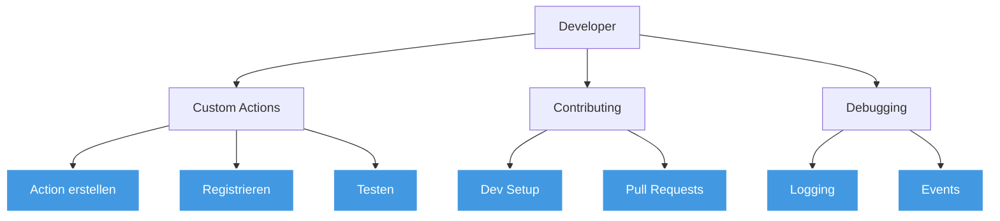
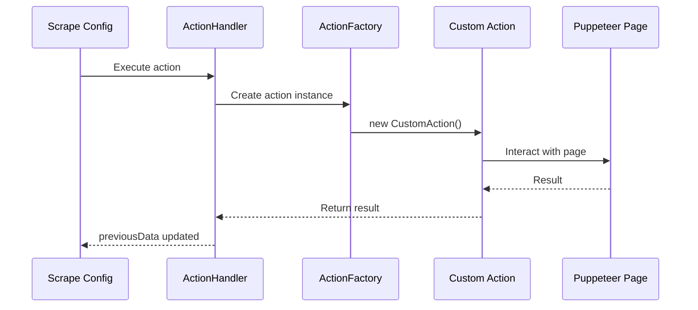

# Developer Guide

Dieser Guide richtet sich an Entwickler, die Scrape Dojo erweitern oder dazu beitragen möchten.

## Übersicht



---

## Custom Actions entwickeln

### Action-Struktur

Alle Actions erben von `BaseAction` und verwenden den `@Action` Decorator.

**Action Categories:**
- `navigation` - Seitennavigation
- `interaction` - User-Interaktion
- `extraction` - Datenextraktion
- `flow` - Kontrollfluss
- `utility` - Hilfsfunktionen
- `data` - Datenverarbeitung

### Beispiel: Einfache Action

```typescript
import { Action } from '../_decorators/action.decorator';
import { BaseAction } from './bases/base.action';

interface MyActionParams {
  message: string;
  count?: number;
}

@Action('myAction', {
  displayName: 'My Custom Action',
  icon: 'MessageSquare',
  description: 'Does something custom',
  color: 'blue',
  category: 'utility'
})
export class MyAction extends BaseAction<MyActionParams> {
  async run(): Promise<any> {
    const { message, count = 1 } = this.params;
    
    this.logger.log(`Executing custom action: ${message}`);
    
    // Deine Logik hier
    for (let i = 0; i < count; i++) {
      console.log(`${message} - ${i + 1}`);
    }
    
    return {
      executed: true,
      count
    };
  }
}
```

### Action mit Puppeteer

```typescript
@Action('customExtract', {
  displayName: 'Custom Extract',
  icon: 'Search',
  description: 'Extracts data with custom logic',
  category: 'extraction'
})
export class CustomExtractAction extends BaseAction<CustomExtractParams> {
  async run(): Promise<any> {
    const { selector } = this.params;
    
    // Zugriff auf Puppeteer Page
    const element = await this.page.$(selector);
    
    if (!element) {
      throw new Error(`Element not found: ${selector}`);
    }
    
    // Custom Extraktion
    const data = await element.evaluate((el) => {
      return {
        text: el.textContent?.trim(),
        html: el.innerHTML,
        classes: Array.from(el.classList)
      };
    });
    
    this.logger.debug(`Extracted: ${JSON.stringify(data)}`);
    
    return data;
  }
}
```

### Action mit previousData

```typescript
@Action('aggregateData', {
  displayName: 'Aggregate Data',
  description: 'Aggregates data from previous actions',
  category: 'data'
})
export class AggregateDataAction extends BaseAction<AggregateParams> {
  async run(): Promise<any> {
    // Zugriff auf Daten vorheriger Actions
    const items = this.previousData.get('extractedItems');
    
    if (!Array.isArray(items)) {
      throw new Error('No items to aggregate');
    }
    
    // Aggregation
    const result = {
      total: items.length,
      sum: items.reduce((acc, item) => acc + (item.value || 0), 0),
      average: items.reduce((acc, item) => acc + (item.value || 0), 0) / items.length
    };
    
    return result;
  }
}
```

### Action mit Events

```typescript
@Action('progressAction', {
  displayName: 'Progress Action',
  description: 'Action with progress reporting',
  category: 'utility'
})
export class ProgressAction extends BaseAction<ProgressParams> {
  async run(): Promise<any> {
    const { items } = this.params;
    const total = items.length;
    
    for (let i = 0; i < total; i++) {
      const item = items[i];
      
      // Event senden
      this.data.scrapeEventsService?.emitEvent({
        type: 'log',
        scrapeId: this.data.scrapeId!,
        runId: this.data.runId,
        message: `Processing item ${i + 1}/${total}`
      });
      
      // Verarbeitung
      await this.processItem(item);
    }
    
    return { processed: total };
  }
  
  private async processItem(item: any) {
    // Deine Logik
  }
}
```

---

## Action registrieren

### 1. Action-Datei erstellen

Erstelle eine neue Datei in `apps/api/src/action-handler/actions/`:

```
my-action.action.ts
```

### 2. In index.ts importieren

Füge den Import in `apps/api/src/action-handler/actions/index.ts` hinzu:

```typescript
import './my-action.action';
```

### 3. Action-Name zum Type hinzufügen

In `libs/shared/src/lib/interfaces.ts`:

```typescript
export type ActionName =
  | 'navigate'
  | 'click'
  | 'extract'
  // ... existing actions
  | 'myAction';  // Füge deine Action hinzu
```

### 4. Kompilieren und testen

```bash
# API neu starten
pnpm nx serve api

# Testen via API
curl http://localhost:3000/api/actions/metadata
```

---

## Testing

### Unit Tests

```typescript
import { Test } from '@nestjs/testing';
import { MyAction } from './my-action.action';

describe('MyAction', () => {
  let action: MyAction;
  
  beforeEach(async () => {
    const module = await Test.createTestingModule({
      providers: [MyAction]
    }).compile();
    
    action = module.get<MyAction>(MyAction);
  });
  
  it('should execute correctly', async () => {
    const params = { message: 'test', count: 3 };
    const result = await action.run();
    
    expect(result.executed).toBe(true);
    expect(result.count).toBe(3);
  });
});
```

### Integration Tests

Teste Actions in echten Scrape-Konfigurationen:

```jsonc
{
  "id": "test-my-action",
  "steps": [
    {
      "name": "Test",
      "actions": [
        {
          "action": "myAction",
          "name": "Test custom action",
          "params": {
            "message": "Hello World",
            "count": 5
          }
        },
        {
          "action": "logger",
          "name": "Log result",
          "params": {
            "message": "Result: {{previousData.myAction}}"
          }
        }
      ]
    }
  ]
}
```

---

## Debugging

### Logging

Actions haben Zugriff auf den `ScrapeLogger`:

```typescript
this.logger.log('Info message');
this.logger.debug('Debug details');
this.logger.error('Error occurred');
this.logger.scrape('Scrape-specific log');
```

### Events tracken

```typescript
// In der Action
this.data.scrapeEventsService?.emitEvent({
  type: 'log',
  scrapeId: this.data.scrapeId!,
  runId: this.data.runId,
  message: 'Custom event message',
  actionName: this.name
});
```

### Browser DevTools

Für Puppeteer-Debugging:

```bash
# In .env
PUPPETEER_HEADLESS=false
PUPPETEER_DEVTOOLS=true
```

---

## Contributing

### Development Setup

```bash
# Repository klonen
git clone https://github.com/disane87/scrape-dojo.git
cd scrape-dojo

# Dependencies installieren
pnpm install

# Dev Server starten
pnpm start:api
pnpm start:ui
pnpm start:docs
```

### Code-Stil

- **TypeScript strict mode** aktiviert
- **ESLint** für Code-Qualität
- **Prettier** für Formatierung

```bash
# Linting
pnpm nx run-many -t lint

# Tests
pnpm nx test api
```

### Pull Requests

1. **Fork** das Repository
2. **Branch** erstellen: `git checkout -b feature/my-feature`
3. **Commits** mit aussagekräftigen Nachrichten
4. **Tests** hinzufügen/aktualisieren
5. **Push** zum Fork
6. **Pull Request** erstellen

**PR Guidelines:**
- Beschreibe was und warum
- Füge Screenshots bei UI-Änderungen hinzu
- Stelle sicher dass Tests durchlaufen
- Dokumentiere neue Features

---

## Projekt-Architektur

### Monorepo-Struktur

```
scrape-dojo/
├── apps/
│   ├── api/              # NestJS Backend
│   ├── ui/               # Angular Frontend
│   └── docs/             # Astro Documentation
├── libs/
│   └── shared/           # Shared Types/Interfaces
├── config/
│   └── sites/            # Scrape Configurations
└── nx.json               # Nx Configuration
```

### Action System



### Event System

Events werden über `ScrapeEventsService` versendet:

```typescript
interface ScrapeEvent {
  type: 'step-status' | 'action-status' | 'log' | 'error';
  scrapeId: string;
  runId?: string;
  actionName?: string;
  message?: string;
  result?: unknown;
}
```

---

## Best Practices

### 1. Action Parameters validieren

```typescript
async run(): Promise<any> {
  const { selector, timeout = 30000 } = this.params;
  
  if (!selector) {
    throw new Error('Selector parameter is required');
  }
  
  // Deine Logik
}
```

### 2. Error Handling

```typescript
async run(): Promise<any> {
  try {
    const result = await this.page.$(this.params.selector);
    
    if (!result) {
      this.logger.error(`Element not found: ${this.params.selector}`);
      return null;
    }
    
    return result;
  } catch (error) {
    this.logger.error(`Action failed: ${error.message}`);
    throw error;
  }
}
```

### 3. TypeScript Types nutzen

```typescript
interface StrictParams {
  required: string;
  optional?: number;
  choices: 'option1' | 'option2';
}

@Action('typedAction', { /* metadata */ })
export class TypedAction extends BaseAction<StrictParams> {
  async run(): Promise<{ success: boolean }> {
    // Type-safe params
    const { required, optional, choices } = this.params;
    return { success: true };
  }
}
```

---

## Weiterführende Links

- [GitHub Repository](https://github.com/disane87/scrape-dojo)
- [API Architecture](/de/architecture/api-modules/)
- [Actions Reference](/de/user-guide/actions/)
- [Contributing Guidelines](https://github.com/disane87/scrape-dojo/blob/main/CONTRIBUTING.md)
