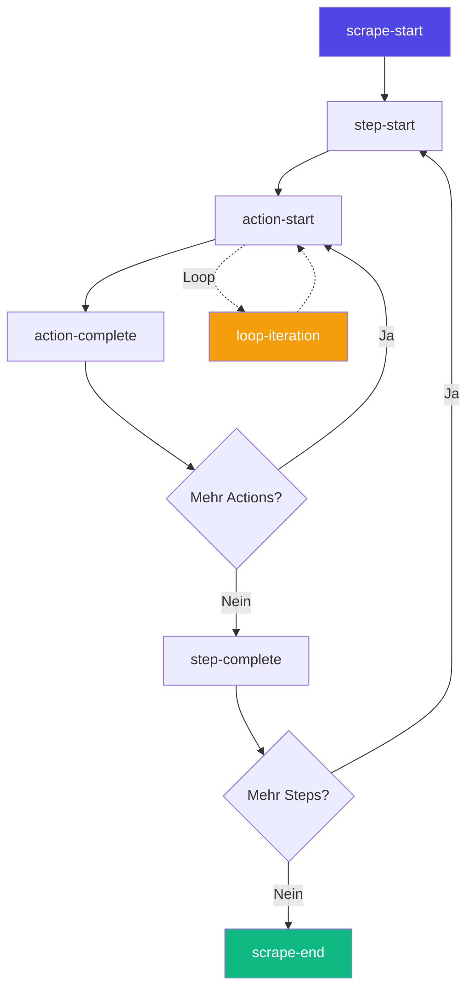

# Server-Sent Events (SSE)

Scrape Dojo nutzt Server-Sent Events (SSE) für Echtzeit-Updates während Workflow-Ausführungen. Dies ermöglicht Live-Monitoring in der UI ohne Polling.

## Übersicht

```mermaid
sequenceDiagram
    participant UI as UI Client
    participant SSE as SSE Endpoint
    participant WF as Workflow
    participant DB as Database
    
    UI->>SSE: EventSource('/api/events')
    SSE-->>UI: Connection established
    
    WF->>DB: Workflow startet
    DB->>SSE: Event: scrape-start
    SSE-->>UI: {type: 'scrape-start'}
    
    WF->>DB: Step completed
    DB->>SSE: Event: step-complete
    SSE-->>UI: {type: 'step-complete'}
    
    WF->>DB: Workflow beendet
    DB->>SSE: Event: scrape-end
    SSE-->>UI: {type: 'scrape-end'}
    
    UI->>SSE: Close()
    
    style SSE fill:#4f46e5,color:#fff
    style WF fill:#10b981,color:#fff
```

## SSE-Architektur

### EventSource API

```typescript
// UI: Verbindung aufbauen
const eventSource = new EventSource('/api/events?access_token=xxx');

eventSource.onmessage = (event) => {
  const data = JSON.parse(event.data);
  console.log('Event received:', data);
};

eventSource.onerror = (error) => {
  console.error('SSE error:', error);
  eventSource.close();
};
```

### Backend Implementation

```typescript
@Sse('events')
events(): Observable<MessageEvent> {
  return this.scrapeEventsService.events$.pipe(
    map(event => ({
      data: JSON.stringify(event)
    }))
  );
}
```

## Event-Typen

### Workflow Events

| Event-Type | Beschreibung | Payload |
|------------|--------------|---------|
| `scrape-start` | Workflow gestartet | `{scrapeId, runId}` |
| `scrape-end` | Workflow beendet | `{scrapeId, runId, status, error}` |
| `scrape-complete` | Workflow erfolgreich | `{scrapeId, runId}` |
| `step-start` | Step gestartet | `{scrapeId, runId, stepName}` |
| `step-complete` | Step abgeschlossen | `{scrapeId, runId, stepName}` |
| `action-start` | Action gestartet | `{scrapeId, runId, action}` |
| `action-complete` | Action abgeschlossen | `{scrapeId, runId, action, result}` |

### Loop Events

| Event-Type | Beschreibung | Payload |
|------------|--------------|---------|
| `loop-start` | Loop gestartet | `{loopPath, total}` |
| `loop-iteration` | Loop-Iteration | `{loopPath, index, total}` |
| `loop-complete` | Loop beendet | `{loopPath, total}` |

### Special Events

| Event-Type | Beschreibung | Payload |
|------------|--------------|---------|
| `log` | Log-Nachricht | `{level, message, context}` |
| `otp-request` | OTP-Eingabe benötigt | `{requestId, message}` |
| `notification` | Notification | `{type, title, message}` |
| `ping` | Keepalive | `{timestamp}` |

## Event-Struktur

```typescript
interface ScrapeEvent {
  type: EventType;
  scrapeId?: string;
  runId?: string;
  stepName?: string;
  action?: string;
  result?: any;
  error?: string;
  status?: 'running' | 'completed' | 'error';
  message?: string;
  level?: 'debug' | 'log' | 'warn' | 'error';
  timestamp: number;
  
  // Loop-spezifisch
  loopPath?: Array<{name: string, index: number}>;
  total?: number;
  index?: number;
  
  // OTP-spezifisch
  otp?: OtpRequest;
  
  // Notification-spezifisch
  notification?: NotificationData;
}
```

## UI-Integration

### ScrapeEventsService

```typescript
@Injectable({ providedIn: 'root' })
export class ScrapeEventsService {
  private eventSource: EventSource | null = null;
  private eventsSubject = new Subject<ScrapeEvent>();
  
  readonly events$ = this.eventsSubject.asObservable();
  
  connect(): void {
    const token = this.authService.getAccessToken();
    this.eventSource = new EventSource(
      `/api/events?access_token=${token}`
    );
    
    this.eventSource.onmessage = (event) => {
      const data: ScrapeEvent = JSON.parse(event.data);
      this.eventsSubject.next(data);
    };
  }
  
  disconnect(): void {
    this.eventSource?.close();
    this.eventSource = null;
  }
}
```

### Event-Handling

```typescript
// Dashboard Component
this.eventsService.events$.subscribe(event => {
  switch (event.type) {
    case 'scrape-start':
      this.onWorkflowStart(event);
      break;
    case 'step-complete':
      this.updateProgress(event);
      break;
    case 'log':
      this.appendLog(event);
      break;
    case 'notification':
      this.showNotification(event.notification);
      break;
  }
});
```

## Authentication

SSE-Verbindungen können keine Custom Headers senden. Daher wird das JWT-Token als Query-Parameter übergeben:

```typescript
// JWT Strategy erlaubt Token aus Query für /events
jwtFromRequest: ExtractJwt.fromExtractors([
  ExtractJwt.fromAuthHeaderAsBearerToken(),
  (req: any) => {
    const path = String(req.path || req.url || '');
    if (!path.includes('/events')) return null;
    return req.query?.access_token || req.query?.token;
  }
])
```

**Sicherheit:**
- Token nur für `/api/events` Endpoint
- Short-lived Access Tokens (15min)
- Automatic Reconnect bei Token-Ablauf

## Event-Emission

### Im Backend

```typescript
// ScrapeEventsService
export class ScrapeEventsService {
  private emitter = new Subject<ScrapeEvent>();
  readonly events$ = this.emitter.asObservable();
  
  emitScrapeStart(scrapeId: string, runId: string): void {
    this.emit({
      type: 'scrape-start',
      scrapeId,
      runId,
      timestamp: Date.now()
    });
  }
  
  emitLog(message: string, level: LogLevel, scrapeId?: string): void {
    this.emit({
      type: 'log',
      level,
      message,
      scrapeId,
      timestamp: Date.now()
    });
  }
  
  private emit(event: ScrapeEvent): void {
    this.emitter.next(event);
  }
}
```

### Actions Integration

```typescript
// In einer Action
export class NavigateAction extends BaseAction<NavigateParams> {
  async run(): Promise<void> {
    this.data?.scrapeEventsService?.emit({
      type: 'action-start',
      scrapeId: this.data.scrapeId,
      runId: this.data.runId,
      action: 'navigate',
      timestamp: Date.now()
    });
    
    // ... Navigation durchführen ...
    
    this.data?.scrapeEventsService?.emit({
      type: 'action-complete',
      scrapeId: this.data.scrapeId,
      runId: this.data.runId,
      action: 'navigate',
      timestamp: Date.now()
    });
  }
}
```

## Live-Monitoring

### Progress Tracking



### UI-Update-Strategie

```typescript
// Optimiertes Event-Handling
this.eventsService.events$
  .pipe(
    // Throttle für UI-Performance
    throttleTime(100),
    // Filter für aktiven Workflow
    filter(event => event.scrapeId === this.activeScrapeId)
  )
  .subscribe(event => {
    this.updateUI(event);
  });
```

## Reconnection Strategy

```typescript
export class ScrapeEventsService {
  private reconnectAttempts = 0;
  private maxReconnectAttempts = 5;
  
  connect(): void {
    this.eventSource = new EventSource('/api/events?token=...');
    
    this.eventSource.onerror = () => {
      this.eventSource?.close();
      
      if (this.reconnectAttempts < this.maxReconnectAttempts) {
        const delay = Math.min(1000 * 2 ** this.reconnectAttempts, 30000);
        setTimeout(() => {
          this.reconnectAttempts++;
          this.connect();
        }, delay);
      }
    };
    
    this.eventSource.onopen = () => {
      this.reconnectAttempts = 0;
    };
  }
}
```

**Exponential Backoff:**
- Versuch 1: 1s
- Versuch 2: 2s
- Versuch 3: 4s
- Versuch 4: 8s
- Versuch 5: 16s
- Max: 30s

## Testing SSE

### Ping Endpoint

```bash
POST /api/events/ping
```

Sendet Test-Event an alle verbundenen Clients:

```json
{
  "type": "ping",
  "timestamp": 1704067200000,
  "message": "Connection test"
}
```

### Status Endpoint

```bash
GET /api/events/status
```

**Response:**
```json
{
  "activeConnections": 3,
  "uptime": 3600000
}
```

### Manual Testing

```bash
# Terminal 1: Start SSE Connection
curl -N -H "Accept: text/event-stream" \
  "http://localhost:3333/api/events?access_token=YOUR_TOKEN"

# Terminal 2: Trigger Workflow
curl -X POST http://localhost:3333/api/scrape/my-workflow
```

**Output (Terminal 1):**
```
data: {"type":"scrape-start","scrapeId":"my-workflow","runId":"run-xxx","timestamp":1704067200000}

data: {"type":"step-start","scrapeId":"my-workflow","stepName":"step-1","timestamp":1704067201000}

data: {"type":"log","message":"Navigating to URL...","level":"log","timestamp":1704067202000}
```

## Performance

### Connection Pooling

```typescript
// SSE hält Verbindung offen
// Server: 1 Connection = 1 Client
// Empfohlen: Max 100 concurrent connections

// Bei Bedarf: Load Balancing
// Sticky Sessions erforderlich!
```

### Memory Management

```typescript
// EventEmitter cleanup
private subscribers = new Set<Subscription>();

subscribe(handler: (event: ScrapeEvent) => void): Subscription {
  const sub = this.events$.subscribe(handler);
  this.subscribers.add(sub);
  return sub;
}

cleanup(): void {
  this.subscribers.forEach(sub => sub.unsubscribe());
  this.subscribers.clear();
}
```

## Debugging

### Event-Logger

```typescript
// Developer-Mode: Alle Events loggen
if (environment.debug) {
  this.eventsService.events$.subscribe(event => {
    console.log(`[SSE] ${event.type}:`, event);
  });
}
```

### Network Tab

Chrome DevTools → Network → EventStream:

```
GET /api/events?access_token=xxx
Status: 200 OK
Type: text/event-stream
Transfer: chunked
```

**Messages:**
- Grün: Erfolgreich empfangen
- Rot: Connection Error
- Grau: Connection geschlossen

## Best Practices

### 1. Event Filtering

```typescript
// ❌ Alle Events verarbeiten
this.eventsService.events$.subscribe(event => {
  this.handleEvent(event);
});

// ✅ Nur relevante Events
this.eventsService.events$
  .pipe(
    filter(event => 
      event.scrapeId === this.currentScrapeId &&
      ['step-complete', 'scrape-end'].includes(event.type)
    )
  )
  .subscribe(event => {
    this.handleEvent(event);
  });
```

### 2. Cleanup

```typescript
ngOnDestroy(): void {
  this.eventsService.disconnect();
  this.subscription?.unsubscribe();
}
```

### 3. Error Handling

```typescript
this.eventsService.events$
  .pipe(
    catchError(error => {
      console.error('SSE error:', error);
      return EMPTY;
    })
  )
  .subscribe(...);
```

### 4. Buffering

```typescript
// Bei schnellen Events: Buffer nutzen
this.eventsService.events$
  .pipe(
    bufferTime(500),
    filter(events => events.length > 0)
  )
  .subscribe(events => {
    this.handleBatch(events);
  });
```

## Troubleshooting

### Connection schließt sofort

**Ursache:** Token ungültig oder abgelaufen

**Lösung:**
```typescript
// Refresh Token vor Reconnect
await this.authService.refreshToken();
this.eventsService.connect();
```

### Events kommen nicht an

**Debug:**
```bash
# Prüfe Backend-Logs
docker-compose logs api | grep SSE

# Teste direkt mit curl
curl -N "http://localhost:3333/api/events?access_token=xxx"
```

### Memory Leak

**Symptom:** UI wird langsamer

**Ursache:** Subscriptions nicht unsubscribed

**Lösung:**
```typescript
// takeUntil Pattern
private destroy$ = new Subject<void>();

ngOnInit(): void {
  this.eventsService.events$
    .pipe(takeUntil(this.destroy$))
    .subscribe(...);
}

ngOnDestroy(): void {
  this.destroy$.next();
  this.destroy$.complete();
}
```

---

**Verwandte Themen:**
- [Run History](/de/user-guide/run-history/)
- [Notifications](/de/user-guide/actions/utility/)
- [API Architecture](/de/architecture/api-modules/)
