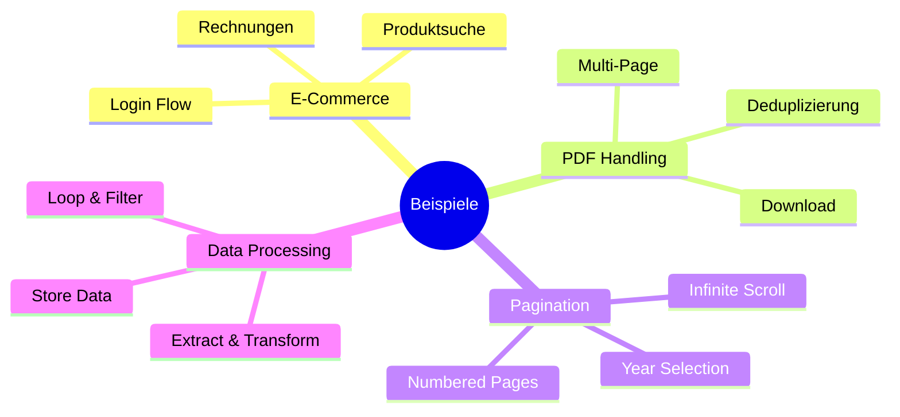

# Beispiele

Diese Beispiele zeigen häufige Scraping-Patterns basierend auf echten Use Cases.

## Übersicht



---

## E-Commerce Scraping

### Login-Flow mit Conditional Logic

Basierend auf dem Amazon-Scraper zeigt dieses Beispiel, wie man mit verschiedenen Login-Varianten umgeht.

```jsonc
{
  "id": "ecommerce-login",
  "steps": [
    {
      "name": "Login",
      "actions": [
        {
          "action": "navigate",
          "name": "Open login page",
          "params": {
            "url": "https://example.com/login"
          }
        },
        {
          "action": "delay",
          "name": "Wait for page",
          "params": {
            "time": 2000
          }
        },
        {
          "action": "extract",
          "name": "Check if password field visible",
          "params": {
            "selector": "input[type='password']",
            "property": "tagName",
            "optional": true
          }
        },
        {
          "action": "type",
          "name": "Enter email",
          "params": {
            "selector": "input[type='email']",
            "text": "{{secrets.email}}"
          }
        },
        {
          "action": "skipIf",
          "name": "Skip if password already visible",
          "params": {
            "condition": "$exists(passwordFieldVisible)"
          }
        },
        {
          "action": "click",
          "name": "Submit email",
          "params": {
            "selector": "#continue-button"
          }
        },
        {
          "action": "delay",
          "name": "Wait for password page",
          "params": {
            "time": 1000
          }
        },
        {
          "action": "type",
          "name": "Enter password",
          "params": {
            "selector": "input[type='password']",
            "text": "{{secrets.password}}"
          }
        },
        {
          "action": "click",
          "name": "Submit login",
          "params": {
            "selector": "#login-button"
          }
        }
      ]
    }
  ]
}
```

### Produktdaten extrahieren

```jsonc
{
  "id": "product-extraction",
  "steps": [
    {
      "name": "Extract Products",
      "actions": [
        {
          "action": "navigate",
          "name": "Open product list",
          "params": {
            "url": "https://example.com/products"
          }
        },
        {
          "action": "extractAll",
          "name": "Get all product cards",
          "params": {
            "selector": ".product-card"
          }
        },
        {
          "action": "transform",
          "name": "Structure product data",
          "params": {
            "expression": `
              extractedElements.{
                "title": $trim($('.title').innerText),
                "price": $number($replace($('.price').innerText, '[€,]', '')),
                "image": $('.image').src,
                "url": $('.link').href
              }
            `
          }
        },
        {
          "action": "logger",
          "name": "Log results",
          "params": {
            "message": "Found {{$count(structuredData)}} products"
          }
        }
      ]
    }
  ]
}
```

---

## PDF Download mit Deduplizierung

Basierend auf dem order-pdf-scraper: Downloads mit persistierter Tracking.

```jsonc
{
  "id": "pdf-downloader",
  "metadata": {
    "variables": [
      {
        "name": "selectedYear",
        "type": "select",
        "options": [
          {"label": "2024", "value": "2024"},
          {"label": "2025", "value": "2025"}
        ]
      }
    ]
  },
  "steps": [
    {
      "name": "Initialize",
      "actions": [
        {
          "action": "transform",
          "name": "Load seen IDs",
          "params": {
            "expression": "$string('{{storedData.pdfDownloader.seenIds}}')"
          }
        },
        {
          "action": "logger",
          "name": "Log existing IDs",
          "params": {
            "message": "Already seen: {{seenIds}}"
          }
        }
      ]
    },
    {
      "name": "Download PDFs",
      "actions": [
        {
          "action": "navigate",
          "name": "Open page",
          "params": {
            "url": "https://example.com/documents?year={{variables.selectedYear}}"
          }
        },
        {
          "action": "extractAll",
          "name": "Get document IDs",
          "params": {
            "selector": ".document",
            "property": "data-id"
          }
        },
        {
          "action": "transform",
          "name": "Filter new documents",
          "params": {
            "expression": `
              $filter(documentIds, function($id) {
                $not($contains(seenIds, $id))
              })
            `
          }
        },
        {
          "action": "loop",
          "name": "Download each PDF",
          "params": {
            "elementKey": "newDocuments",
            "actions": [
              {
                "action": "download",
                "name": "Download PDF",
                "params": {
                  "selector": "[data-id='{{currentData}}'] .download-button",
                  "folder": "downloads/{{variables.selectedYear}}"
                }
              },
              {
                "action": "storeData",
                "name": "Mark as seen",
                "params": {
                  "key": "pdfDownloader.seenIds",
                  "value": "{{seenIds}},{{currentData}}",
                  "append": true
                }
              }
            ]
          }
        }
      ]
    }
  ]
}
```

---

## Pagination Patterns

### Multi-Page Scraping

```jsonc
{
  "id": "multi-page-scraper",
  "metadata": {
    "variables": [
      {
        "name": "maxPages",
        "type": "number",
        "default": 5
      }
    ]
  },
  "steps": [
    {
      "name": "Setup",
      "actions": [
        {
          "action": "transform",
          "name": "Generate page numbers",
          "params": {
            "expression": "[1..$number($maxPages)]"
          }
        }
      ]
    },
    {
      "name": "Scrape Pages",
      "actions": [
        {
          "action": "loop",
          "name": "Loop through pages",
          "params": {
            "elementKey": "pages",
            "actions": [
              {
                "action": "navigate",
                "name": "Open page",
                "params": {
                  "url": "https://example.com/items?page={{currentData}}"
                }
              },
              {
                "action": "waitForSelector",
                "name": "Wait for items",
                "params": {
                  "selector": ".item-list",
                  "visible": true
                }
              },
              {
                "action": "extractAll",
                "name": "Extract items",
                "params": {
                  "selector": ".item"
                }
              },
              {
                "action": "logger",
                "name": "Log progress",
                "params": {
                  "message": "Page {{currentData}}/{{$maxPages}}: {{$count(extractedElements)}} items"
                }
              }
            ]
          }
        }
      ]
    }
  ]
}
```

### Infinite Scroll

```jsonc
{
  "id": "infinite-scroll",
  "steps": [
    {
      "name": "Load all items",
      "actions": [
        {
          "action": "navigate",
          "name": "Open page",
          "params": {
            "url": "https://example.com/feed"
          }
        },
        {
          "action": "transform",
          "name": "Scroll iterations",
          "params": {
            "expression": "[1..10]"
          }
        },
        {
          "action": "loop",
          "name": "Scroll and wait",
          "params": {
            "elementKey": "iterations",
            "actions": [
              {
                "action": "keyboardPress",
                "name": "Scroll down",
                "params": {
                  "key": "End"
                }
              },
              {
                "action": "delay",
                "name": "Wait for load",
                "params": {
                  "time": 2000
                }
              },
              {
                "action": "logger",
                "name": "Log iteration",
                "params": {
                  "message": "Scroll {{currentData}}/10"
                }
              }
            ]
          }
        },
        {
          "action": "extractAll",
          "name": "Extract all items",
          "params": {
            "selector": ".feed-item"
          }
        }
      ]
    }
  ]
}
```

---

## Data Processing

### Extract, Transform, Store

```jsonc
{
  "id": "data-pipeline",
  "steps": [
    {
      "name": "Process Data",
      "actions": [
        {
          "action": "navigate",
          "name": "Open source",
          "params": {
            "url": "https://example.com/data"
          }
        },
        {
          "action": "extractAll",
          "name": "Extract raw data",
          "params": {
            "selector": "table tr"
          }
        },
        {
          "action": "transform",
          "name": "Clean and structure",
          "params": {
            "expression": `
              extractedElements.{
                "name": $trim($('td:nth-child(1)').innerText),
                "value": $number($('td:nth-child(2)').innerText),
                "date": $toMillis($('td:nth-child(3)').innerText, '[D].[M].[Y]')
              }[value > 0]
            `
          }
        },
        {
          "action": "transform",
          "name": "Sort by value",
          "params": {
            "expression": "cleanedData^(>value)"
          }
        },
        {
          "action": "storeData",
          "name": "Persist results",
          "params": {
            "key": "dataPipeline.results",
            "value": "{{sortedData}}"
          }
        },
        {
          "action": "logger",
          "name": "Summary",
          "params": {
            "message": "Processed {{$count(sortedData)}} records. Total: {{$sum(sortedData.value)}}"
          }
        }
      ]
    }
  ]
}
```

---

## Weiterführende Links

- [Actions Reference](/de/user-guide/actions/) - Alle verfügbaren Actions
- [JSONata Transformationen](/de/user-guide/jsonata/) - Daten transformieren
- [Scrape Workflow](/de/architecture/scrape-workflow/) - Workflow verstehen
