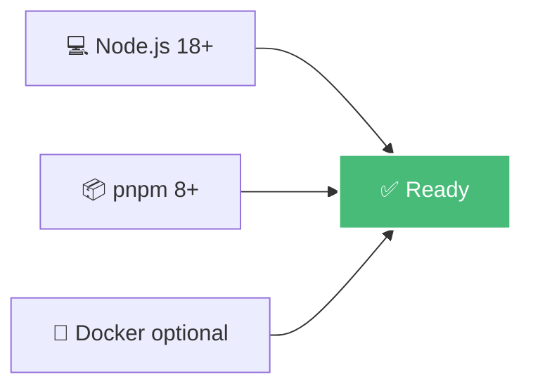
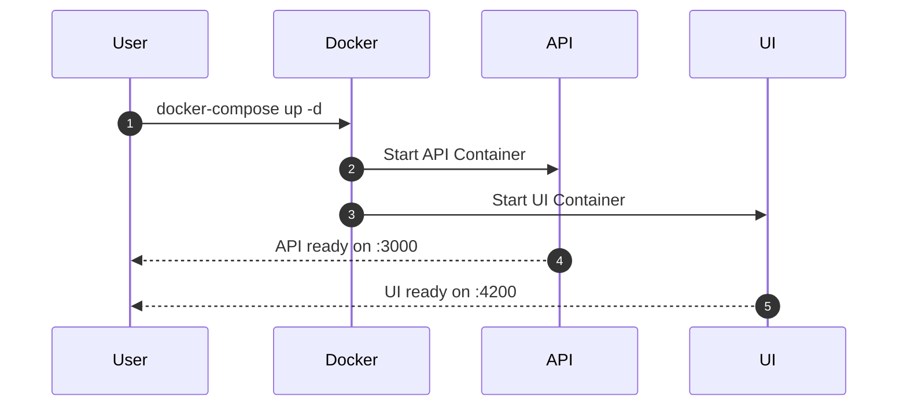
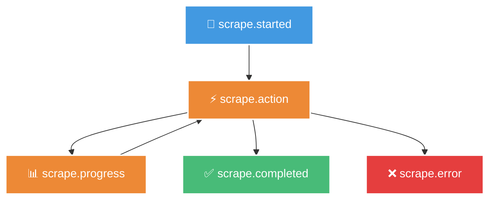

# Schnellstart

Dieser Guide bringt dich in wenigen Minuten mit Scrape Dojo zum Laufen.

## Voraussetzungen



- Node.js 18 oder höher
- pnpm 8 oder höher (oder npm/yarn)
- Optional: Docker & Docker Compose

## Installation

### Option 1: Docker (empfohlen)



```bash
# Repository klonen
git clone https://github.com/disane87/scrape-dojo.git
cd scrape-dojo

# Environment-Variablen konfigurieren
cp .env.example .env
# Editiere .env - mindestens JWT_SECRET und ENCRYPTION_KEY setzen

# Container starten
docker-compose up -d

# Logs verfolgen
docker-compose logs -f
```

**URLs:**
- UI: http://localhost:4200
- API: http://localhost:3000
- API Docs: http://localhost:3000/api

### Option 2: Lokale Entwicklung

```bash
# Repository klonen
git clone https://github.com/disane87/scrape-dojo.git
cd scrape-dojo

# Dependencies installieren
pnpm install

# Environment-Variablen konfigurieren
cp .env.example .env
# Editiere .env

# Alle Services starten
pnpm start

# Oder einzeln:
pnpm start:api   # API auf :3000
pnpm start:ui    # UI auf :4200
pnpm start:docs  # Docs auf :4321
```

## Erster Scrape

### 1. Scrape-Konfiguration erstellen

Erstelle eine neue Datei `config/sites/my-first-scrape.jsonc`:

```jsonc
{
  "name": "my-first-scrape",
  "description": "Mein erster Scrape mit Scrape Dojo",
  "actions": [
    {
      "type": "navigate",
      "description": "Öffne die Website",
      "url": "https://example.com"
    },
    {
      "type": "extract",
      "description": "Extrahiere den Titel",
      "selector": "h1",
      "extractData": "innerText"
    },
    {
      "type": "extract",
      "description": "Extrahiere den ersten Paragraph",
      "selector": "p",
      "extractData": "innerText"
    }
  ]
}
```

### 2. Scrape ausführen

#### Via UI (einfachste Methode)


1. Öffne http://localhost:4200
2. Navigiere zu "Scrapes"
3. Wähle "my-first-scrape"
4. Klicke "Run"
5. Beobachte die Live-Ausführung
6. Prüfe die Ergebnisse

#### Via API

```bash
curl -X POST http://localhost:3000/api/scrape/run \
  -H "Content-Type: application/json" \
  -d '{
    "configName": "my-first-scrape"
  }'
```

### 3. Ergebnis verstehen

Der Scrape liefert folgende Struktur:

```typescript
{
  runId: "unique-run-id",
  status: "completed",
  startTime: "2024-01-11T10:00:00.000Z",
  endTime: "2024-01-11T10:00:05.000Z",
  results: {
    // Extrahierte Daten
    title: "Example Domain",
    paragraph: "This domain is for use in..."
  }
}
```

## Erweiterte Konfiguration

### Mit Variablen

```jsonc
{
  "name": "parameterized-scrape",
  "actions": [
    {
      "type": "navigate",
      "url": "{{variables.baseUrl}}/{{variables.path}}"
    }
  ]
}
```

**Variablen setzen:**
1. Via UI: Settings → Variables
2. Via API: POST /api/variables

```json
{
  "baseUrl": "https://example.com",
  "path": "products"
}
```

### Mit Secrets (verschlüsselt)

```jsonc
{
  "name": "authenticated-scrape",
  "actions": [
    {
      "type": "navigate",
      "url": "{{variables.loginUrl}}"
    },
    {
      "type": "type",
      "selector": "#username",
      "value": "{{secrets.username}}"
    },
    {
      "type": "type",
      "selector": "#password",
      "value": "{{secrets.password}}"
    },
    {
      "type": "click",
      "selector": "#login-button"
    }
  ]
}
```

**Secrets setzen:**
1. Via UI: Settings → Secrets
2. Via API: POST /api/secrets

### Mit Loops

```jsonc
{
  "name": "multi-item-scrape",
  "actions": [
    {
      "type": "extract",
      "description": "Extrahiere alle Produkt-Links",
      "selector": ".product-link",
      "extractData": "href",
      "multiple": true
    },
    {
      "type": "loop",
      "description": "Besuche jedes Produkt",
      "loopData": "{{previousData}}",
      "actions": [
        {
          "type": "navigate",
          "url": "{{currentData}}"
        },
        {
          "type": "extract",
          "selector": ".product-title",
          "extractData": "innerText"
        },
        {
          "type": "extract",
          "selector": ".product-price",
          "extractData": "innerText",
          "transformData": "$number($substring(innerText, 1))"
        }
      ]
    }
  ]
}
```

## Live Monitoring

### WebSocket Events

Verbinde dich mit dem WebSocket-Endpunkt für Live-Updates:

```typescript
import { io } from 'socket.io-client';

const socket = io('http://localhost:3000');

socket.on('scrape.started', (data) => {
  console.log('Scrape started:', data);
});

socket.on('scrape.action', (data) => {
  console.log('Action:', data.description);
});

socket.on('scrape.completed', (data) => {
  console.log('Scrape completed:', data.results);
});
```

### Event-Typen



## Nächste Schritte

<div class="not-content">
  
  **🎯 Lerne mehr über Actions**
  - [Alle verfügbaren Actions](/user-guide/actions/)
  - [Template-Syntax](/user-guide/templates/)
  - [Datentransformation](/user-guide/jsonata/)

  **🔐 Konfiguriere Authentifizierung**
  - [JWT Setup](/configuration/jwt/)
  - [OIDC/SSO Integration](/configuration/oidc/)
  - [MFA einrichten](/configuration/mfa/)

  **🚀 Produktionsumgebung**
  - [Docker Deployment](/architecture/deployment/)
  - [Monitoring](/deployment/monitoring/)
  - [Best Practices](/deployment/best-practices/)

</div>

## Beispiel-Projekte

### E-Commerce Scraper
```bash
# Beispiel für Amazon-Produktsuche
config/sites/amazon-product-search.jsonc
```

### News Aggregator
```bash
# Beispiel für Nachrichten sammeln
config/sites/news-aggregator.jsonc
```

### Social Media Monitor
```bash
# Beispiel für Social Media Posts
config/sites/social-media-monitor.jsonc
```

## Troubleshooting

### ❌ Port bereits belegt

```bash
# Prüfe welcher Prozess den Port nutzt
lsof -i :3000  # macOS/Linux
netstat -ano | findstr :3000  # Windows

# Oder ändere den Port in .env
SCRAPE_DOJO_PORT=3001
```

### ❌ Docker startet nicht

```bash
# Logs prüfen
docker-compose logs api
docker-compose logs ui

# Container neu starten
docker-compose down
docker-compose up -d
```

### ❌ Browser startet nicht

```bash
# Puppeteer im Headless-Modus
PUPPETEER_HEADLESS=true

# Puppeteer mit zusätzlichen Args
PUPPETEER_ARGS=--no-sandbox,--disable-setuid-sandbox
```

## Hilfe & Support

- 📖 [Vollständige Dokumentation](/architecture/overview/)
- 🐛 [GitHub Issues](https://github.com/disane87/scrape-dojo/issues)
- 💬 [Diskussionen](https://github.com/disane87/scrape-dojo/discussions)
- 📧 Email: support@scrape-dojo.com

---

**Viel Erfolg mit Scrape Dojo! 🥋**
