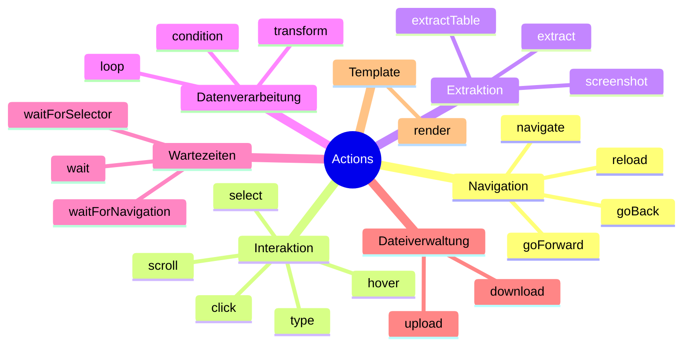
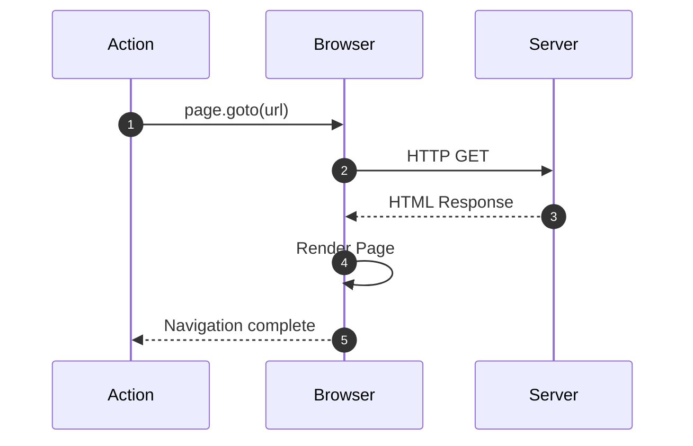
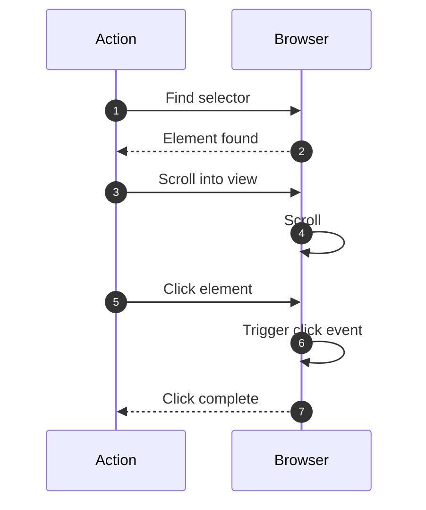
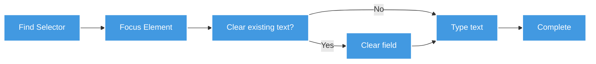
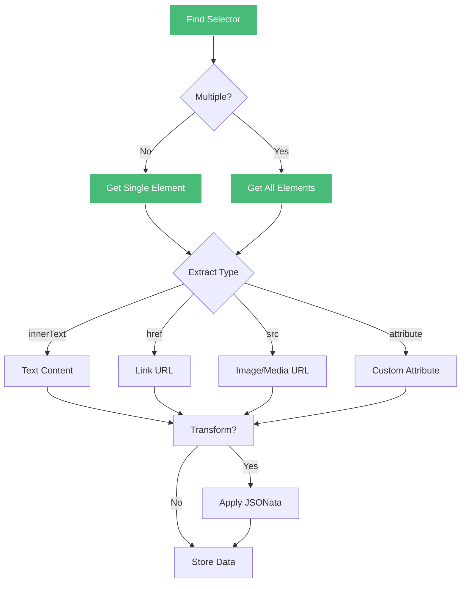
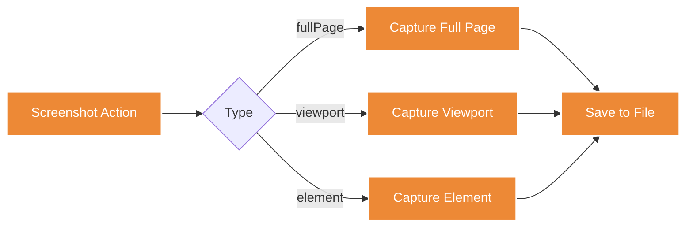
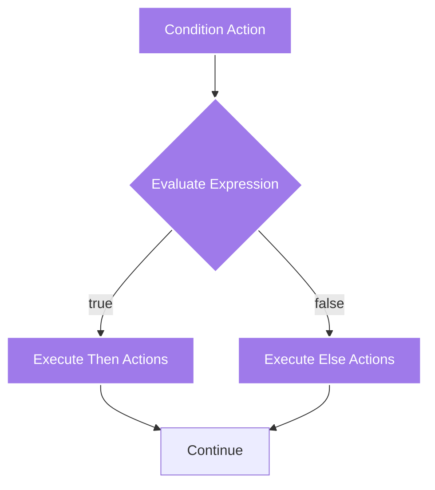
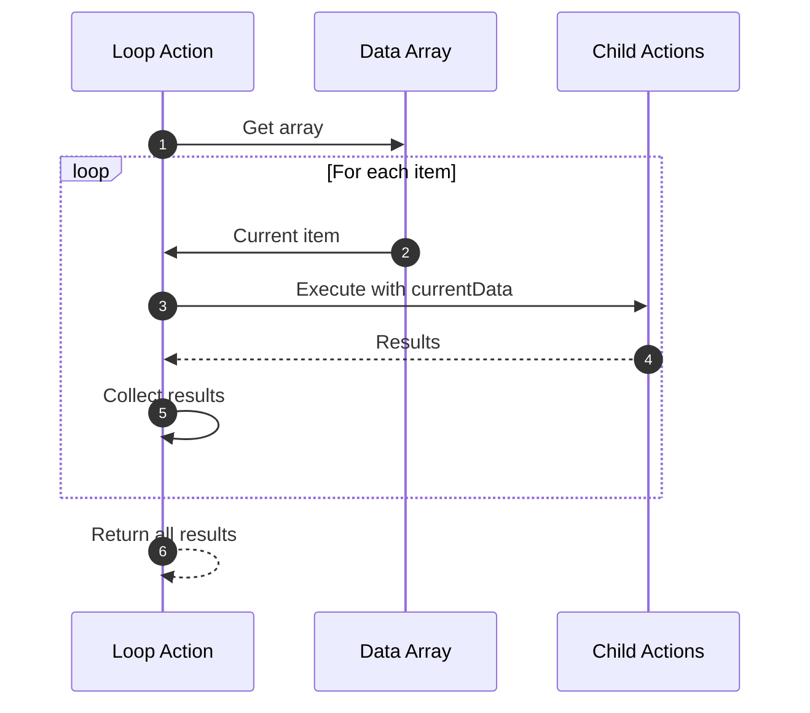
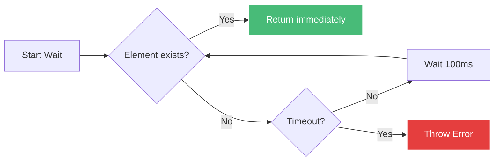
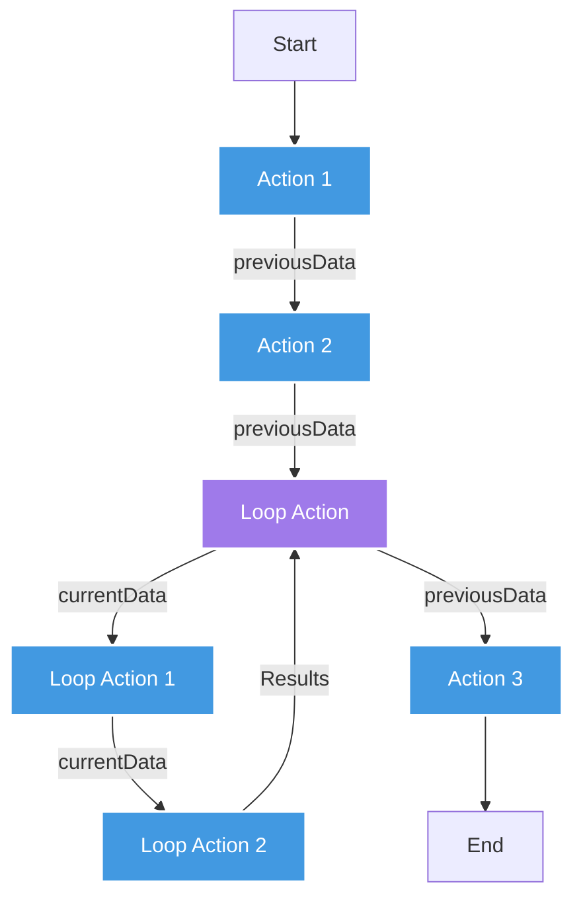

# Actions Reference

Actions sind die Bausteine eines Scrapes in Scrape Dojo. Jede Action führt eine spezifische Aufgabe aus, wie z.B. Navigation, Datenextraktion oder User-Interaktion.

## Übersicht



## Kapitel-Übersicht

Die Actions sind in folgende Kapitel aufgeteilt:

### [Navigation Actions](/de/user-guide/actions/navigation/)
Actions zum Navigieren zwischen Seiten: `navigate`, `goBack`, `goForward`, `reload`

### [Interaktions-Actions](/de/user-guide/actions/interaction/)
Actions zur Interaktion mit Seitenelementen: `click`, `type`, `select`, `hover`, `scroll`

### [Extraktions-Actions](/de/user-guide/actions/extraction/)
Actions zum Extrahieren von Daten: `extract`, `extractTable`, `screenshot`

### [Datenverarbeitungs-Actions](/de/user-guide/actions/data-processing/)
Actions zur Verarbeitung und Transformation: `transform`, `condition`, `loop`

### [Wartezeit-Actions](/de/user-guide/actions/timing/)
Actions zum Warten auf Events: `wait`, `waitForSelector`, `waitForNavigation`

### [Datei-Actions](/de/user-guide/actions/files/)
Actions für Datei-Operationen: `download`, `upload`

### [Template-Actions](/de/user-guide/actions/templates/)
Actions für Template-Rendering: `render`

## Quick Reference

---

## 🧭 Navigation Actions

### navigate

Navigiert zu einer URL.



**Parameter:**

| Parameter | Typ | Required | Beschreibung |
|-----------|-----|----------|--------------|
| `type` | string | ✅ | `"navigate"` |
| `url` | string | ✅ | Ziel-URL (unterstützt Templates) |
| `waitUntil` | string | ❌ | Wann gilt Navigation als abgeschlossen |
| `timeout` | number | ❌ | Timeout in Millisekunden (default: 30000) |

**waitUntil-Optionen:**
- `load` - Wenn load-Event gefeuert wird (default)
- `domcontentloaded` - Wenn DOM vollständig geladen
- `networkidle0` - Wenn keine Netzwerkaktivität für 500ms
- `networkidle2` - Wenn max. 2 Netzwerkverbindungen für 500ms

**Beispiel:**
```jsonc
{
  "type": "navigate",
  "description": "Öffne die Produktseite",
  "url": "https://example.com/products/{{variables.productId}}",
  "waitUntil": "networkidle2",
  "timeout": 60000
}
```

**Mit Variablen:**
```jsonc
{
  "type": "navigate",
  "url": "{{variables.baseUrl}}/search?q={{variables.searchTerm}}",
  "waitUntil": "load"
}
```

---

### goBack

Navigiert zur vorherigen Seite (Browser-Zurück).

**Parameter:**

| Parameter | Typ | Required | Beschreibung |
|-----------|-----|----------|--------------|
| `type` | string | ✅ | `"goBack"` |
| `waitUntil` | string | ❌ | Siehe navigate |

**Beispiel:**
```jsonc
{
  "type": "goBack",
  "description": "Zurück zur Übersicht"
}
```

---

### goForward

Navigiert zur nächsten Seite (Browser-Vorwärts).

**Beispiel:**
```jsonc
{
  "type": "goForward",
  "description": "Vorwärts zur Detailseite"
}
```

---

### reload

Lädt die aktuelle Seite neu.

**Parameter:**

| Parameter | Typ | Required | Beschreibung |
|-----------|-----|----------|--------------|
| `type` | string | ✅ | `"reload"` |
| `waitUntil` | string | ❌ | Siehe navigate |

**Beispiel:**
```jsonc
{
  "type": "reload",
  "description": "Seite neu laden",
  "waitUntil": "networkidle0"
}
```

---

## 🖱️ Interaktions-Actions

### click

Klickt auf ein Element.



**Parameter:**

| Parameter | Typ | Required | Beschreibung |
|-----------|-----|----------|--------------|
| `type` | string | ✅ | `"click"` |
| `selector` | string | ✅ | CSS-Selektor des Elements |
| `waitForSelector` | number | ❌ | Wartezeit für Selektor (ms) |
| `button` | string | ❌ | `"left"`, `"right"`, `"middle"` (default: left) |
| `clickCount` | number | ❌ | Anzahl der Klicks (default: 1) |
| `delay` | number | ❌ | Verzögerung zwischen Klicks (ms) |

**Beispiel:**
```jsonc
{
  "type": "click",
  "description": "Klicke auf Login-Button",
  "selector": "#login-button",
  "waitForSelector": 5000
}
```

**Doppelklick:**
```jsonc
{
  "type": "click",
  "selector": ".file-item",
  "clickCount": 2,
  "delay": 100
}
```

**Rechtsklick:**
```jsonc
{
  "type": "click",
  "selector": ".context-menu-trigger",
  "button": "right"
}
```

---

### type

Tippt Text in ein Input-Feld.



**Parameter:**

| Parameter | Typ | Required | Beschreibung |
|-----------|-----|----------|--------------|
| `type` | string | ✅ | `"type"` |
| `selector` | string | ✅ | CSS-Selektor des Input-Feldes |
| `value` | string | ✅ | Zu tippender Text (unterstützt Templates) |
| `delay` | number | ❌ | Verzögerung zwischen Tasten (ms, default: 0) |
| `clear` | boolean | ❌ | Feld vorher leeren (default: true) |

**Beispiel:**
```jsonc
{
  "type": "type",
  "description": "Benutzername eingeben",
  "selector": "#username",
  "value": "{{secrets.username}}",
  "delay": 100
}
```

**Passwort eingeben:**
```jsonc
{
  "type": "type",
  "selector": "#password",
  "value": "{{secrets.password}}",
  "clear": true
}
```

**Mit Variablen:**
```jsonc
{
  "type": "type",
  "selector": "#search-input",
  "value": "{{variables.searchTerm}}",
  "delay": 50
}
```

---

### select

Wählt eine Option aus einem Dropdown.

**Parameter:**

| Parameter | Typ | Required | Beschreibung |
|-----------|-----|----------|--------------|
| `type` | string | ✅ | `"select"` |
| `selector` | string | ✅ | CSS-Selektor des Select-Elements |
| `value` | string | ✅ | Value des Options-Elements |

**Beispiel:**
```jsonc
{
  "type": "select",
  "description": "Wähle Land",
  "selector": "#country",
  "value": "DE"
}
```

**Mit Template:**
```jsonc
{
  "type": "select",
  "selector": "#category",
  "value": "{{variables.selectedCategory}}"
}
```

---

### hover

Bewegt die Maus über ein Element (hovern).

**Parameter:**

| Parameter | Typ | Required | Beschreibung |
|-----------|-----|----------|--------------|
| `type` | string | ✅ | `"hover"` |
| `selector` | string | ✅ | CSS-Selektor des Elements |

**Beispiel:**
```jsonc
{
  "type": "hover",
  "description": "Hover über Menü-Item",
  "selector": ".menu-item"
}
```

**Verwendung für Dropdown-Menü:**
```jsonc
[
  {
    "type": "hover",
    "selector": ".nav-menu",
    "description": "Öffne Dropdown-Menü"
  },
  {
    "type": "click",
    "selector": ".nav-menu .submenu-item",
    "description": "Klicke auf Submenu-Item"
  }
]
```

---

### scroll

Scrollt die Seite oder ein Element.

**Parameter:**

| Parameter | Typ | Required | Beschreibung |
|-----------|-----|----------|--------------|
| `type` | string | ✅ | `"scroll"` |
| `selector` | string | ❌ | CSS-Selektor (für Element-Scroll) |
| `x` | number | ❌ | Horizontal-Position (px) |
| `y` | number | ❌ | Vertikal-Position (px) |

**Beispiel - Seite scrollen:**
```jsonc
{
  "type": "scroll",
  "description": "Scrolle nach unten",
  "y": 1000
}
```

**Element scrollen:**
```jsonc
{
  "type": "scroll",
  "selector": ".scrollable-container",
  "y": 500
}
```

**Infinite Scroll:**
```jsonc
{
  "type": "loop",
  "description": "Infinite Scroll laden",
  "loopData": "[1, 2, 3, 4, 5]",
  "actions": [
    {
      "type": "scroll",
      "y": 9999
    },
    {
      "type": "wait",
      "timeout": 2000
    }
  ]
}
```

---

## 📊 Extraktions-Actions

### extract

Extrahiert Daten von der Seite.



**Parameter:**

| Parameter | Typ | Required | Beschreibung |
|-----------|-----|----------|--------------|
| `type` | string | ✅ | `"extract"` |
| `selector` | string | ✅ | CSS-Selektor |
| `extractData` | string | ✅ | Was extrahieren: `innerText`, `href`, `src`, `attribute` |
| `attribute` | string | ❌ | Attribut-Name (wenn extractData = `attribute`) |
| `multiple` | boolean | ❌ | Alle Matches extrahieren (default: false) |
| `transformData` | string | ❌ | JSONata-Expression zur Transformation |

**Beispiel - Text extrahieren:**
```jsonc
{
  "type": "extract",
  "description": "Produkttitel extrahieren",
  "selector": "h1.product-title",
  "extractData": "innerText"
}
```

**Link extrahieren:**
```jsonc
{
  "type": "extract",
  "selector": "a.product-link",
  "extractData": "href"
}
```

**Bild-URL extrahieren:**
```jsonc
{
  "type": "extract",
  "selector": "img.product-image",
  "extractData": "src"
}
```

**Custom Attribut:**
```jsonc
{
  "type": "extract",
  "selector": ".product",
  "extractData": "attribute",
  "attribute": "data-product-id"
}
```

**Multiple Elemente:**
```jsonc
{
  "type": "extract",
  "description": "Alle Produktpreise",
  "selector": ".product-price",
  "extractData": "innerText",
  "multiple": true
}
```

**Mit JSONata-Transformation:**
```jsonc
{
  "type": "extract",
  "selector": ".price",
  "extractData": "innerText",
  "transformData": "$number($replace(innerText, '€', ''))"
}
```

**Komplexe Extraktion:**
```jsonc
{
  "type": "extract",
  "selector": ".product-card",
  "extractData": "innerText",
  "multiple": true,
  "transformData": `{
    "title": $('.title').innerText,
    "price": $number($('.price').innerText),
    "rating": $number($('.rating').@data-rating)
  }`
}
```

---

### extractTable

Extrahiert eine HTML-Tabelle als strukturierte Daten.

**Parameter:**

| Parameter | Typ | Required | Beschreibung |
|-----------|-----|----------|--------------|
| `type` | string | ✅ | `"extractTable"` |
| `selector` | string | ✅ | CSS-Selektor der Tabelle |
| `hasHeader` | boolean | ❌ | Erste Zeile als Header (default: true) |

**Beispiel:**
```jsonc
{
  "type": "extractTable",
  "description": "Produkttabelle extrahieren",
  "selector": "table.products",
  "hasHeader": true
}
```

**Ergebnis:**
```json
[
  {
    "Name": "Laptop XPS 15",
    "Preis": "1299.99",
    "Lager": "Verfügbar"
  },
  {
    "Name": "Monitor 27\"",
    "Preis": "399.99",
    "Lager": "Nachbestellt"
  }
]
```

---

### screenshot

Erstellt einen Screenshot.



**Parameter:**

| Parameter | Typ | Required | Beschreibung |
|-----------|-----|----------|--------------|
| `type` | string | ✅ | `"screenshot"` |
| `selector` | string | ❌ | Element für Screenshot (optional) |
| `fullPage` | boolean | ❌ | Gesamte Seite (default: false) |
| `filename` | string | ❌ | Dateiname (default: timestamp) |

**Beispiel - Viewport:**
```jsonc
{
  "type": "screenshot",
  "description": "Screenshot des Viewports"
}
```

**Full Page:**
```jsonc
{
  "type": "screenshot",
  "fullPage": true,
  "filename": "full-page.png"
}
```

**Element Screenshot:**
```jsonc
{
  "type": "screenshot",
  "selector": ".product-container",
  "filename": "product.png"
}
```

---

## 🔄 Datenverarbeitungs-Actions

### transform

Transformiert Daten mit JSONata.

**Parameter:**

| Parameter | Typ | Required | Beschreibung |
|-----------|-----|----------|--------------|
| `type` | string | ✅ | `"transform"` |
| `expression` | string | ✅ | JSONata-Expression |

**Beispiel - Array filtern:**
```jsonc
{
  "type": "transform",
  "description": "Nur Produkte > 100€",
  "expression": "previousData[price > 100]"
}
```

**Array sortieren:**
```jsonc
{
  "type": "transform",
  "expression": "previousData^(>price)"
}
```

**Daten umstrukturieren:**
```jsonc
{
  "type": "transform",
  "expression": `{
    "products": previousData.{
      "name": title,
      "cost": price,
      "available": stock > 0
    }
  }`
}
```

---

### condition

Führt Actions nur unter bestimmten Bedingungen aus.



**Parameter:**

| Parameter | Typ | Required | Beschreibung |
|-----------|-----|----------|--------------|
| `type` | string | ✅ | `"condition"` |
| `condition` | string | ✅ | JSONata Boolean-Expression |
| `then` | array | ✅ | Actions bei true |
| `else` | array | ❌ | Actions bei false |

**Beispiel:**
```jsonc
{
  "type": "condition",
  "description": "Prüfe ob eingeloggt",
  "condition": "$exists(previousData.userId)",
  "then": [
    {
      "type": "navigate",
      "url": "/dashboard"
    }
  ],
  "else": [
    {
      "type": "navigate",
      "url": "/login"
    }
  ]
}
```

**Mit Vergleich:**
```jsonc
{
  "type": "condition",
  "condition": "previousData.itemCount > 0",
  "then": [
    {
      "type": "click",
      "selector": ".checkout-button"
    }
  ],
  "else": [
    {
      "type": "extract",
      "selector": ".empty-cart-message",
      "extractData": "innerText"
    }
  ]
}
```

---

### loop

Führt Actions wiederholt für jedes Element aus.



**Parameter:**

| Parameter | Typ | Required | Beschreibung |
|-----------|-----|----------|--------------|
| `type` | string | ✅ | `"loop"` |
| `loopData` | string | ✅ | JSONata-Expression (Array) |
| `actions` | array | ✅ | Actions pro Iteration |
| `maxIterations` | number | ❌ | Max. Anzahl Iterationen |

**Beispiel - Über Links iterieren:**
```jsonc
{
  "type": "loop",
  "description": "Besuche alle Produktseiten",
  "loopData": "{{previousData.productLinks}}",
  "actions": [
    {
      "type": "navigate",
      "url": "{{currentData}}"
    },
    {
      "type": "extract",
      "selector": "h1",
      "extractData": "innerText"
    }
  ]
}
```

**Mit Limit:**
```jsonc
{
  "type": "loop",
  "loopData": "previousData.urls",
  "maxIterations": 5,
  "actions": [
    {
      "type": "navigate",
      "url": "{{currentData}}"
    }
  ]
}
```

**Nested Loop:**
```jsonc
{
  "type": "loop",
  "loopData": "previousData.categories",
  "actions": [
    {
      "type": "navigate",
      "url": "{{currentData.url}}"
    },
    {
      "type": "extract",
      "selector": ".product-link",
      "extractData": "href",
      "multiple": true
    },
    {
      "type": "loop",
      "loopData": "{{previousData}}",
      "maxIterations": 10,
      "actions": [
        {
          "type": "navigate",
          "url": "{{currentData}}"
        }
      ]
    }
  ]
}
```

---

## ⏱️ Wartezeit-Actions

### wait

Wartet eine bestimmte Zeit.

**Parameter:**

| Parameter | Typ | Required | Beschreibung |
|-----------|-----|----------|--------------|
| `type` | string | ✅ | `"wait"` |
| `timeout` | number | ✅ | Wartezeit in Millisekunden |

**Beispiel:**
```jsonc
{
  "type": "wait",
  "description": "Warte 2 Sekunden",
  "timeout": 2000
}
```

---

### waitForSelector

Wartet bis ein Element erscheint.



**Parameter:**

| Parameter | Typ | Required | Beschreibung |
|-----------|-----|----------|--------------|
| `type` | string | ✅ | `"waitForSelector"` |
| `selector` | string | ✅ | CSS-Selektor |
| `timeout` | number | ❌ | Max. Wartezeit (ms, default: 30000) |
| `visible` | boolean | ❌ | Warte bis sichtbar (default: false) |
| `hidden` | boolean | ❌ | Warte bis versteckt (default: false) |

**Beispiel:**
```jsonc
{
  "type": "waitForSelector",
  "description": "Warte auf Suchergebnisse",
  "selector": ".search-results",
  "timeout": 10000
}
```

**Warte bis sichtbar:**
```jsonc
{
  "type": "waitForSelector",
  "selector": ".modal",
  "visible": true,
  "timeout": 5000
}
```

**Warte bis versteckt:**
```jsonc
{
  "type": "waitForSelector",
  "selector": ".loading-spinner",
  "hidden": true,
  "timeout": 30000
}
```

---

### waitForNavigation

Wartet auf eine Navigation.

**Parameter:**

| Parameter | Typ | Required | Beschreibung |
|-----------|-----|----------|--------------|
| `type` | string | ✅ | `"waitForNavigation"` |
| `waitUntil` | string | ❌ | Siehe navigate |
| `timeout` | number | ❌ | Max. Wartezeit (ms) |

**Beispiel:**
```jsonc
[
  {
    "type": "click",
    "selector": "#submit-button"
  },
  {
    "type": "waitForNavigation",
    "waitUntil": "networkidle0",
    "timeout": 10000
  }
]
```

---

## 📁 Datei-Actions

### download

Lädt eine Datei herunter.

**Parameter:**

| Parameter | Typ | Required | Beschreibung |
|-----------|-----|----------|--------------|
| `type` | string | ✅ | `"download"` |
| `selector` | string | ✅ | CSS-Selektor des Download-Links |
| `filename` | string | ❌ | Zieldateiname |

**Beispiel:**
```jsonc
{
  "type": "download",
  "description": "PDF herunterladen",
  "selector": "a.download-pdf",
  "filename": "report.pdf"
}
```

---

### upload

Lädt eine Datei in ein Input-Feld hoch.

**Parameter:**

| Parameter | Typ | Required | Beschreibung |
|-----------|-----|----------|--------------|
| `type` | string | ✅ | `"upload"` |
| `selector` | string | ✅ | CSS-Selektor des File-Inputs |
| `filePath` | string | ✅ | Pfad zur Upload-Datei |

**Beispiel:**
```jsonc
{
  "type": "upload",
  "description": "Bild hochladen",
  "selector": "input[type='file']",
  "filePath": "/path/to/image.jpg"
}
```

---

## 📝 Template-Action

### render

Rendert ein Handlebars-Template.

**Parameter:**

| Parameter | Typ | Required | Beschreibung |
|-----------|-----|----------|--------------|
| `type` | string | ✅ | `"render"` |
| `template` | string | ✅ | Handlebars-Template |
| `data` | object | ❌ | Template-Daten |

**Beispiel:**
```jsonc
{
  "type": "render",
  "description": "HTML generieren",
  "template": "<h1>{{title}}</h1><p>{{description}}</p>",
  "data": {
    "title": "{{previousData.productTitle}}",
    "description": "{{previousData.productDesc}}"
  }
}
```

---

## 🎯 Best Practices

### 1. Immer Descriptions verwenden

```jsonc
{
  "type": "click",
  "description": "Klicke auf Login-Button",  // ✅ Gut
  "selector": "#login"
}

// vs

{
  "type": "click",  // ❌ Schlecht - keine Description
  "selector": "#login"
}
```

### 2. Selektoren robust wählen

```jsonc
// ✅ Gut - ID-Selektoren sind stabil
{
  "selector": "#product-title"
}

// ⚠️ Okay - Class-Selektoren
{
  "selector": ".product-title"
}

// ❌ Vermeiden - zu spezifische Selektoren
{
  "selector": "body > div:nth-child(3) > div > h1"
}
```

### 3. Timeouts anpassen

```jsonc
{
  "type": "waitForSelector",
  "selector": ".slow-loading-content",
  "timeout": 60000  // ✅ Großzügiger Timeout für langsame Seiten
}
```

### 4. Error Handling mit Conditions

```jsonc
{
  "type": "condition",
  "condition": "$exists(previousData.errorMessage)",
  "then": [
    {
      "type": "screenshot",
      "filename": "error-state.png"
    }
  ]
}
```

### 5. Loops limitieren

```jsonc
{
  "type": "loop",
  "loopData": "previousData.items",
  "maxIterations": 100,  // ✅ Verhindert Endlosschleifen
  "actions": [...]
}
```

---

## 📊 Datenfluss



### Verfügbare Daten-Variablen

| Variable | Beschreibung | Verfügbar in |
|----------|--------------|--------------|
| `previousData` | Ergebnis der vorherigen Action | Allen Actions |
| `currentData` | Aktuelles Loop-Element | Loop-Actions |
| `variables.*` | Globale Variablen | Allen Actions |
| `secrets.*` | Verschlüsselte Secrets | Allen Actions |

**Beispiel:**
```jsonc
[
  {
    "type": "extract",
    "selector": ".products",
    "multiple": true
    // Result wird zu previousData
  },
  {
    "type": "loop",
    "loopData": "{{previousData}}",  // Nutzt vorheriges Ergebnis
    "actions": [
      {
        "type": "navigate",
        "url": "{{currentData.url}}"  // Nutzt aktuelles Loop-Element
      }
    ]
  }
]
```

---

## 🔗 Weiterführende Links

- [Template-Syntax](/de/user-guide/templates/) - Handlebars & Template-Variablen
- [JSONata Transformationen](/de/user-guide/jsonata/) - Daten transformieren
- [Scrape Workflow](/de/architecture/scrape-workflow/) - Kompletter Workflow-Ablauf
- [Beispiele](/de/examples/common-patterns/) - Häufige Action-Muster
