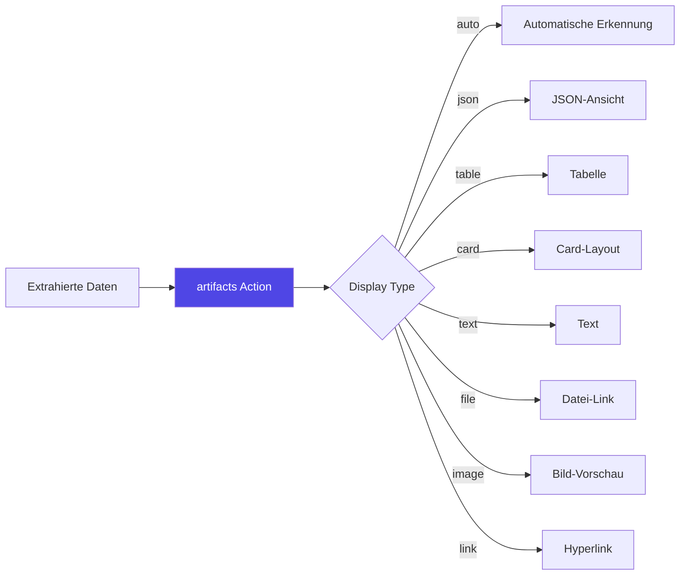
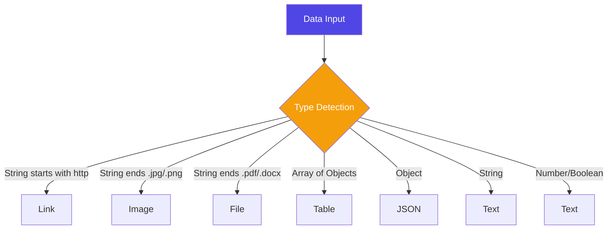
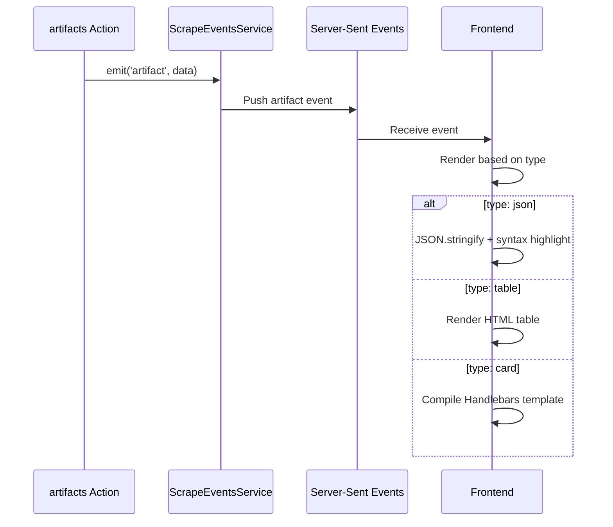

# Artifacts Action

Die `artifacts` Action ermöglicht es, extrahierte Daten in verschiedenen Formaten strukturiert darzustellen. Ideal für Berichte, Dashboards und Debug-Ausgaben.

## Übersicht



## Parameter

| Parameter | Typ | Required | Beschreibung |
|-----------|-----|----------|--------------|
| `data` | any | ✅ | Darzustellende Daten |
| `type` | DisplayType | ❌ | Format der Darstellung (default: `auto`) |
| `title` | string | ❌ | Titel der Ausgabe |
| `description` | string | ❌ | Beschreibung/Untertitel |
| `template` | string | ❌ | Handlebars-Template für `card`-Typ |
| `flush` | boolean | ❌ | Kompakte Liste für Cards (default: `false`) |

### Display Types

```typescript
type DisplayType = 
  | 'auto'    // Automatische Erkennung
  | 'json'    // JSON-formatiert
  | 'table'   // Tabellen-Ansicht
  | 'text'    // Einfacher Text
  | 'file'    // Datei-Download-Link
  | 'image'   // Bild-Vorschau
  | 'link'    // Klickbarer Link
  | 'card';   // Karten-Layout mit Template
```

## Verwendung

### Basis-Beispiel

```jsonc
{
  "action": "artifacts",
  "params": {
    "data": "{{previousData.result}}",
    "title": "Scrape Results",
    "type": "auto"
  }
}
```

### JSON-Ausgabe

```jsonc
{
  "action": "artifacts",
  "params": {
    "data": {
      "total": 42,
      "items": ["item1", "item2"],
      "timestamp": "2025-01-11T10:00:00Z"
    },
    "type": "json",
    "title": "API Response"
  }
}
```

**UI-Darstellung:**
```json
{
  "total": 42,
  "items": [
    "item1",
    "item2"
  ],
  "timestamp": "2025-01-11T10:00:00Z"
}
```

### Tabellen-Ansicht

```jsonc
{
  "action": "extractAll",
  "params": {
    "selector": ".product",
    "fields": {
      "name": "h2",
      "price": ".price",
      "stock": ".stock"
    },
    "storeAs": "products"
  }
},
{
  "action": "artifacts",
  "params": {
    "data": "{{previousData.products}}",
    "type": "table",
    "title": "Product Overview"
  }
}
```

**UI-Darstellung:**

| name | price | stock |
|------|-------|-------|
| Product A | €19.99 | In Stock |
| Product B | €29.99 | Low Stock |
| Product C | €39.99 | Out of Stock |

### Card-Layout mit Template

```jsonc
{
  "action": "artifacts",
  "params": {
    "data": "{{previousData.orders}}",
    "type": "card",
    "title": "Recent Orders",
    "template": "<strong>{{orderNumber}}</strong><br>{{customerName}}<br><em>€{{total}}</em>",
    "flush": true
  }
}
```

**UI-Darstellung:**
```
┌─────────────────────────┐
│ Recent Orders           │
├─────────────────────────┤
│ ORD-12345              │
│ Max Mustermann         │
│ €129.99                │
├─────────────────────────┤
│ ORD-12346              │
│ Anna Schmidt           │
│ €79.50                 │
└─────────────────────────┘
```

### Text-Ausgabe

```jsonc
{
  "action": "artifacts",
  "params": {
    "data": "Scrape completed successfully. Found {{previousData.items.length}} items.",
    "type": "text",
    "title": "Status"
  }
}
```

### Datei-Link

```jsonc
{
  "action": "download",
  "params": {
    "selector": "a.pdf-link",
    "directory": "./downloads",
    "storeAs": "downloadedFile"
  }
},
{
  "action": "artifacts",
  "params": {
    "data": "{{previousData.downloadedFile.path}}",
    "type": "file",
    "title": "Downloaded PDF"
  }
}
```

### Bild-Vorschau

```jsonc
{
  "action": "screenshot",
  "params": {
    "fullPage": false,
    "storeAs": "pageScreenshot"
  }
},
{
  "action": "artifacts",
  "params": {
    "data": "{{previousData.pageScreenshot.path}}",
    "type": "image",
    "title": "Page Screenshot"
  }
}
```

### Link-Ausgabe

```jsonc
{
  "action": "artifacts",
  "params": {
    "data": "https://example.com/report.pdf",
    "type": "link",
    "title": "Report Available",
    "description": "Click to download the full report"
  }
}
```

## Automatische Type-Erkennung

Bei `type: "auto"` erkennt die Action automatisch:



## Erweiterte Beispiele

### Dashboard mit mehreren Artifacts

```jsonc
{
  "steps": [
    {
      "name": "Collect Data",
      "actions": [
        {
          "action": "navigate",
          "params": { "url": "{{secrets.dashboardUrl}}" }
        },
        {
          "action": "extractAll",
          "params": {
            "selector": ".metric",
            "fields": {
              "name": ".metric-name",
              "value": ".metric-value",
              "trend": ".trend"
            },
            "storeAs": "metrics"
          }
        },
        {
          "action": "extract",
          "params": {
            "selector": ".summary",
            "storeAs": "summary"
          }
        }
      ]
    },
    {
      "name": "Display Results",
      "actions": [
        {
          "action": "artifacts",
          "params": {
            "data": "{{previousData.summary}}",
            "type": "text",
            "title": "Summary"
          }
        },
        {
          "action": "artifacts",
          "params": {
            "data": "{{previousData.metrics}}",
            "type": "table",
            "title": "Metrics Overview"
          }
        }
      ]
    }
  ]
}
```

### Bedingte Ausgabe

```jsonc
{
  "action": "artifacts",
  "params": {
    "data": "{{previousData.errors}}",
    "type": "json",
    "title": "⚠️ Errors Found",
    "description": "{{previousData.errors.length}} errors occurred"
  },
  "skipIf": "{{eq previousData.errors.length 0}}"
}
```

### Formatierte Card-Liste

```jsonc
{
  "action": "extractAll",
  "params": {
    "selector": ".user",
    "fields": {
      "name": ".name",
      "email": ".email",
      "role": ".role",
      "status": ".status"
    },
    "storeAs": "users"
  }
},
{
  "action": "artifacts",
  "params": {
    "data": "{{previousData.users}}",
    "type": "card",
    "title": "Team Members",
    "template": `
      <div class="user-card">
        <strong>{{name}}</strong>
        <span class="badge {{status}}">{{status}}</span>
        <br>
        <small>{{email}}</small>
        <br>
        <em>{{role}}</em>
      </div>
    `,
    "flush": false
  }
}
```

## Template-Syntax (Card-Typ)

Bei `type: "card"` können Handlebars-Templates verwendet werden:

### Basis-Syntax

```handlebars
<strong>{{field}}</strong>
<em>{{anotherField}}</em>
<span>{{nested.property}}</span>
```

### Helpers

```handlebars
<!-- Bedingungen -->
{{#if active}}Active{{else}}Inactive{{/if}}

<!-- Schleifen (bei verschachtelten Arrays) -->
{{#each items}}
  <li>{{this}}</li>
{{/each}}

<!-- Formatierung -->
{{uppercase name}}
{{lowercase email}}
```

### HTML-Styling

```handlebars
<div style="color: {{statusColor}};">
  <h3>{{title}}</h3>
  <p>{{description}}</p>
  <small>{{formatDate timestamp}}</small>
</div>
```

## Best Practices

### ✅ Empfehlungen

1. **Type explizit setzen**: Für konsistente Darstellung
2. **Aussagekräftige Titel**: Kontext für jede Ausgabe
3. **Daten strukturieren**: Vor artifacts transformieren
4. **Templates wiederverwenden**: In Variables speichern
5. **Flush für Listen**: Bei vielen Card-Items kompakt darstellen

### Daten vorbereiten

```jsonc
{
  "action": "transform",
  "params": {
    "input": "{{previousData.rawData}}",
    "expression": `
      $map(items, function($item) {
        {
          "name": $item.title,
          "value": $number($item.price),
          "available": $item.stock > 0
        }
      })
    `,
    "storeAs": "formattedData"
  }
},
{
  "action": "artifacts",
  "params": {
    "data": "{{previousData.formattedData}}",
    "type": "table",
    "title": "Processed Items"
  }
}
```

## UI-Integration



### Event-Struktur

```typescript
interface DisplayArtifact {
  type: DisplayType;
  title?: string;
  description?: string;
  data: any;
  template?: string;
  flush?: boolean;
  metadata?: {
    itemCount?: number;
    dataType?: string;
    timestamp?: number;
  };
}
```

## Unterschied zu logger

| Feature | `artifacts` | `logger` |
|---------|-------------|----------|
| **Zweck** | Strukturierte Daten | Log-Meldungen |
| **Output** | UI Artifacts Panel | Logs Panel |
| **Formatierung** | Automatisch | Nur Text |
| **Typen** | 8 Display-Typen | Nur String |
| **Templates** | ✅ Handlebars | ❌ |
| **Persistenz** | In Run-History | In Logs |

## Fehlerbehandlung

### Ungültige Daten

```jsonc
{
  "action": "artifacts",
  "params": {
    "data": "{{previousData.maybeUndefined}}",
    "type": "json",
    "title": "Optional Data"
  },
  "skipIf": "{{not previousData.maybeUndefined}}"
}
```

### Fallback auf Text

```jsonc
{
  "action": "artifacts",
  "params": {
    "data": "{{previousData.complexData}}",
    "type": "auto",  // Falls table/json fehlschlägt → text
    "title": "Results"
  }
}
```

## Debugging

### Vollständige Daten-Inspektion

```jsonc
{
  "action": "artifacts",
  "params": {
    "data": "{{previousData}}",
    "type": "json",
    "title": "🔍 Debug: Complete previousData"
  }
}
```

### Metadata anzeigen

```jsonc
{
  "action": "artifacts",
  "params": {
    "data": {
      "extractedCount": "{{previousData.items.length}}",
      "timestamp": "{{currentData.timestamp}}",
      "variables": "{{variables}}",
      "storedData": "{{storedData}}"
    },
    "type": "json",
    "title": "🔧 Debug Info"
  }
}
```

---

**Verwandte Actions:**
- [logger](/de/user-guide/actions/timing/) - Log-Meldungen
- [transform](/de/user-guide/actions/data-processing/) - Daten transformieren
- [screenshot](/de/user-guide/actions/extraction/) - Screenshots erstellen

**Verwandte Themen:**
- [Handlebars Templating](/de/user-guide/templating/)
- [Server-Sent Events](/de/architecture/api-modules/)
