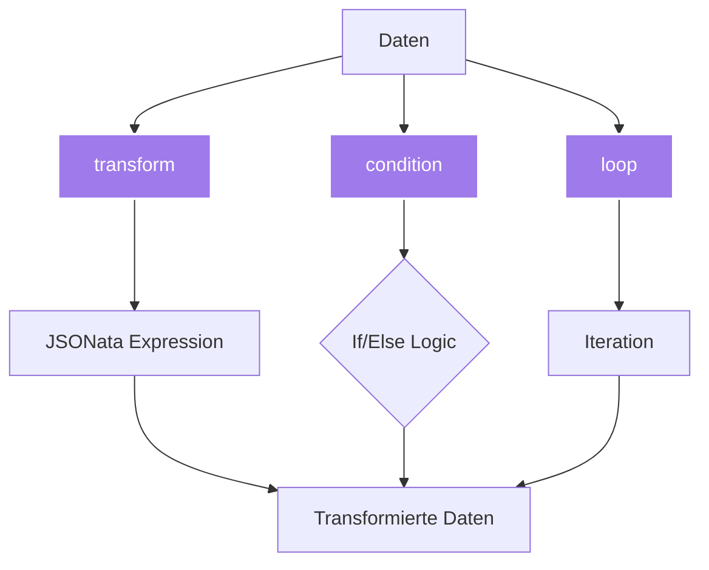
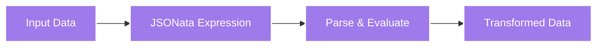
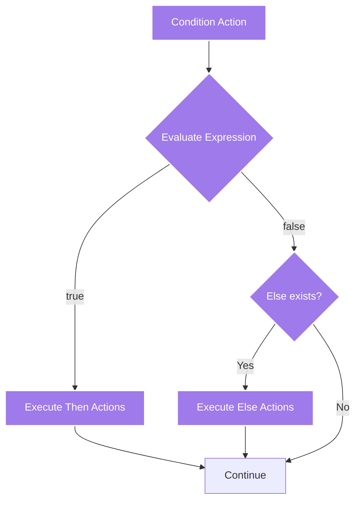
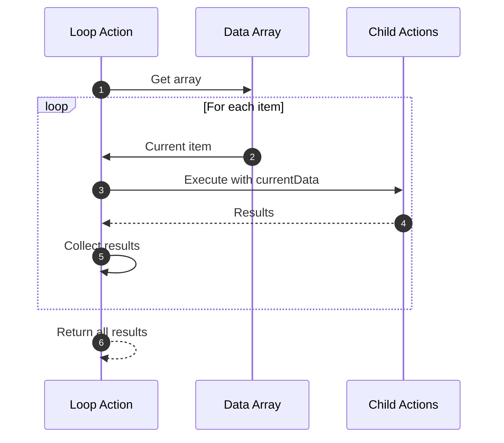

# Datenverarbeitungs-Actions

Datenverarbeitungs-Actions ermöglichen die Transformation, Filterung und bedingte Ausführung von Workflows.

## Übersicht



---

## transform

Transformiert Daten mit JSONata-Expressions.



### Parameter

| Parameter | Typ | Required | Beschreibung |
|-----------|-----|----------|--------------|
| `type` | string | ✅ | `"transform"` |
| `expression` | string | ✅ | JSONata-Expression |

### Beispiele

**Array filtern:**
```jsonc
{
  "type": "transform",
  "description": "Nur Produkte über 100€",
  "expression": "previousData[price > 100]"
}
```

**Array sortieren:**
```jsonc
{
  "type": "transform",
  "description": "Nach Preis aufsteigend sortieren",
  "expression": "previousData^(>price)"
}
```

**Absteigend sortieren:**
```jsonc
{
  "type": "transform",
  "expression": "previousData^(<price)"
}
```

**Daten umstrukturieren:**
```jsonc
{
  "type": "transform",
  "expression": `
    {
      "products": previousData.{
        "name": title,
        "cost": price,
        "available": stock > 0
      }
    }
  `
}
```

### Komplexe Transformationen

**Gruppieren:**
```jsonc
{
  "type": "transform",
  "description": "Gruppiere Produkte nach Kategorie",
  "expression": `
    {
      "categories": $distinct(previousData.category).{
        "name": $,
        "products": $filter(previousData, function($v) { $v.category = $ })
      }
    }
  `
}
```

**Aggregationen:**
```jsonc
{
  "type": "transform",
  "expression": `
    {
      "total": $sum(previousData.price),
      "average": $average(previousData.price),
      "count": $count(previousData),
      "min": $min(previousData.price),
      "max": $max(previousData.price)
    }
  `
}
```

**String-Operationen:**
```jsonc
{
  "type": "transform",
  "expression": `
    previousData.{
      "title": $uppercase(title),
      "slug": $lowercase($replace(title, '\\s', '-')),
      "excerpt": $substring(description, 0, 100) & '...'
    }
  `
}
```

### Daten-Pipeline

```jsonc
[
  {
    "type": "extract",
    "selector": ".product",
    "extractData": "innerText",
    "multiple": true
  },
  {
    "type": "transform",
    "description": "Bereinigen und strukturieren",
    "expression": `
      previousData.{
        "name": $trim(title),
        "price": $number($replace(price, '[€,]', ''))
      }
    `
  },
  {
    "type": "transform",
    "description": "Filtern",
    "expression": "previousData[price > 50 and price < 500]"
  },
  {
    "type": "transform",
    "description": "Sortieren",
    "expression": "previousData^(>price)"
  }
]
```

---

## condition

Führt Actions nur unter bestimmten Bedingungen aus.



### Parameter

| Parameter | Typ | Required | Beschreibung |
|-----------|-----|----------|--------------|
| `type` | string | ✅ | `"condition"` |
| `condition` | string | ✅ | JSONata Boolean-Expression |
| `then` | array | ✅ | Actions bei true |
| `else` | array | ❌ | Actions bei false |

### Beispiele

**Existenz prüfen:**
```jsonc
{
  "type": "condition",
  "description": "Prüfe ob eingeloggt",
  "condition": "$exists(previousData.userId)",
  "then": [
    {
      "type": "navigate",
      "url": "/dashboard"
    }
  ],
  "else": [
    {
      "type": "navigate",
      "url": "/login"
    }
  ]
}
```

**Wertebereich prüfen:**
```jsonc
{
  "type": "condition",
  "condition": "previousData.itemCount > 0",
  "then": [
    {
      "type": "click",
      "selector": ".checkout-button"
    }
  ],
  "else": [
    {
      "type": "extract",
      "selector": ".empty-cart-message",
      "extractData": "innerText"
    }
  ]
}
```

**String-Vergleich:**
```jsonc
{
  "type": "condition",
  "condition": "previousData.status = 'available'",
  "then": [
    {
      "type": "click",
      "selector": ".add-to-cart"
    }
  ]
}
```

**Mehrere Bedingungen:**
```jsonc
{
  "type": "condition",
  "condition": "previousData.price > 100 and previousData.inStock = true",
  "then": [
    {
      "type": "click",
      "selector": ".buy-now"
    }
  ]
}
```

### Error Handling

```jsonc
{
  "type": "condition",
  "description": "Prüfe auf Fehler",
  "condition": "$exists(previousData.error)",
  "then": [
    {
      "type": "screenshot",
      "filename": "error-state.png"
    },
    {
      "type": "extract",
      "selector": ".error-message",
      "extractData": "innerText"
    }
  ]
}
```

### Login-Check

```jsonc
[
  {
    "type": "navigate",
    "url": "https://example.com"
  },
  {
    "type": "extract",
    "selector": ".user-menu",
    "extractData": "innerText"
  },
  {
    "type": "condition",
    "condition": "$not($contains(previousData, 'Login'))",
    "then": [
      {
        "type": "extract",
        "selector": ".user-profile",
        "extractData": "innerText"
      }
    ],
    "else": [
      {
        "type": "navigate",
        "url": "/login"
      }
    ]
  }
]
```

---

## loop

Führt Actions wiederholt für jedes Element eines Arrays aus.



### Parameter

| Parameter | Typ | Required | Beschreibung |
|-----------|-----|----------|--------------|
| `type` | string | ✅ | `"loop"` |
| `loopData` | string | ✅ | JSONata-Expression (Array) |
| `actions` | array | ✅ | Actions pro Iteration |
| `maxIterations` | number | ❌ | Max. Anzahl Iterationen |

### Verfügbare Variablen im Loop

| Variable | Beschreibung |
|----------|--------------|
| `currentData` | Aktuelles Array-Element |
| `previousData` | Ergebnis der vorherigen Action (außerhalb Loop) |
| `$index()` | Index des aktuellen Elements (0-basiert) |

### Beispiele

**Über Links iterieren:**
```jsonc
{
  "type": "loop",
  "description": "Besuche alle Produktseiten",
  "loopData": "{{previousData.productLinks}}",
  "actions": [
    {
      "type": "navigate",
      "url": "{{currentData}}"
    },
    {
      "type": "extract",
      "selector": "h1.title",
      "extractData": "innerText"
    }
  ]
}
```

**Mit maxIterations:**
```jsonc
{
  "type": "loop",
  "loopData": "previousData.urls",
  "maxIterations": 5,
  "actions": [
    {
      "type": "navigate",
      "url": "{{currentData}}"
    },
    {
      "type": "screenshot",
      "filename": "page-{{$index()}}.png"
    }
  ]
}
```

**Über Array von Objekten:**
```jsonc
[
  {
    "type": "extract",
    "selector": ".product",
    "extractData": "innerText",
    "multiple": true,
    "transformData": `
      [$.{
        "url": $('.link').@href,
        "name": $('.name').innerText
      }]
    `
  },
  {
    "type": "loop",
    "loopData": "{{previousData}}",
    "actions": [
      {
        "type": "navigate",
        "url": "{{currentData.url}}"
      },
      {
        "type": "extract",
        "selector": ".price",
        "extractData": "innerText"
      }
    ]
  }
]
```

### Nested Loop

```jsonc
{
  "type": "loop",
  "description": "Kategorien durchlaufen",
  "loopData": "previousData.categories",
  "actions": [
    {
      "type": "navigate",
      "url": "{{currentData.url}}"
    },
    {
      "type": "extract",
      "selector": ".product-link",
      "extractData": "href",
      "multiple": true
    },
    {
      "type": "loop",
      "description": "Produkte in Kategorie",
      "loopData": "{{previousData}}",
      "maxIterations": 10,
      "actions": [
        {
          "type": "navigate",
          "url": "{{currentData}}"
        },
        {
          "type": "extract",
          "selector": ".product-details",
          "extractData": "innerText"
        }
      ]
    }
  ]
}
```

### Multi-Page Scraping

```jsonc
[
  {
    "type": "extract",
    "selector": ".pagination a",
    "extractData": "href",
    "multiple": true
  },
  {
    "type": "loop",
    "loopData": "{{previousData}}",
    "maxIterations": 20,
    "actions": [
      {
        "type": "navigate",
        "url": "{{currentData}}"
      },
      {
        "type": "extract",
        "selector": ".product-item",
        "extractData": "innerText",
        "multiple": true
      }
    ]
  }
]
```

---

## Best Practices

### 1. Transform für Datenqualität

```jsonc
// ✅ Gut - Daten bereinigen
{
  "type": "transform",
  "expression": `
    previousData.{
      "price": $number($replace(price, '[€,\\s]', '')),
      "title": $trim(title),
      "available": $exists(stock) and stock > 0
    }
  `
}
```

### 2. Conditions für Fehlerbehandlung

```jsonc
// ✅ Fehler abfangen
{
  "type": "condition",
  "condition": "$exists(previousData) and $count(previousData) > 0",
  "then": [
    // Weiterarbeiten
  ],
  "else": [
    {
      "type": "screenshot",
      "filename": "no-data-error.png"
    }
  ]
}
```

### 3. Loops limitieren

```jsonc
// ✅ Endlosschleifen verhindern
{
  "type": "loop",
  "loopData": "previousData.items",
  "maxIterations": 100,  // Sicherheitsgrenze
  "actions": [...]
}
```

### 4. Performance optimieren

```jsonc
// ✅ Daten vorfiltern
[
  {
    "type": "extract",
    "selector": ".item",
    "extractData": "innerText",
    "multiple": true
  },
  {
    "type": "transform",
    "description": "Vorfiltern reduziert Loop-Iterationen",
    "expression": "previousData[price > 100]"
  },
  {
    "type": "loop",
    "loopData": "{{previousData}}",
    "actions": [...]
  }
]
```

---

## Häufige Fehler vermeiden

### ❌ Falscher Datentyp in Condition

```jsonc
{
  "type": "condition",
  "condition": "previousData.price > 100",  // ❌ price ist String
  "then": [...]
}
```

**✅ Besser:**
```jsonc
{
  "type": "transform",
  "expression": "previousData.{$: $, priceNum: $number(price)}"
},
{
  "type": "condition",
  "condition": "previousData.priceNum > 100",  // ✅ Number
  "then": [...]
}
```

### ❌ Loop ohne maxIterations

```jsonc
{
  "type": "loop",
  "loopData": "previousData.dynamicArray",  // ❌ Kann riesig sein!
  "actions": [...]
}
```

**✅ Besser:**
```jsonc
{
  "type": "loop",
  "loopData": "previousData.dynamicArray",
  "maxIterations": 50,  // ✅ Sicherheit
  "actions": [...]
}
```

### ❌ currentData vs previousData verwechseln

```jsonc
{
  "type": "loop",
  "loopData": "previousData.urls",
  "actions": [
    {
      "type": "navigate",
      "url": "{{previousData}}"  // ❌ Falsch! Nimmt Array
    }
  ]
}
```

**✅ Besser:**
```jsonc
{
  "type": "loop",
  "loopData": "previousData.urls",
  "actions": [
    {
      "type": "navigate",
      "url": "{{currentData}}"  // ✅ Aktuelles Loop-Element
    }
  ]
}
```

---

## Weiterführende Links

- [JSONata Transformationen](/de/user-guide/jsonata/) - JSONata im Detail
- [Extraktions-Actions](/de/user-guide/actions/extraction/) - Daten extrahieren
- [Scrape Workflow](/de/architecture/scrape-workflow/) - Datenfluss verstehen
