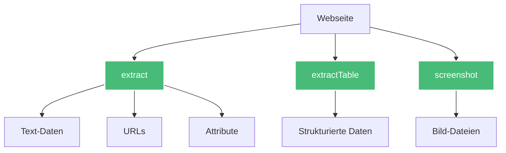
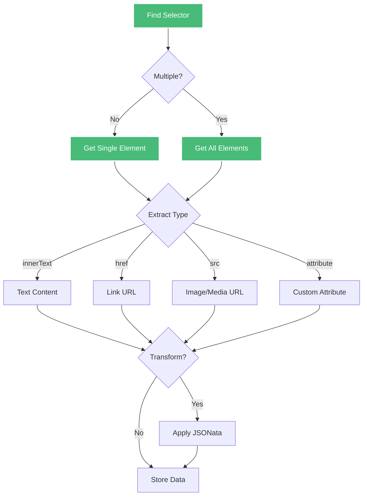
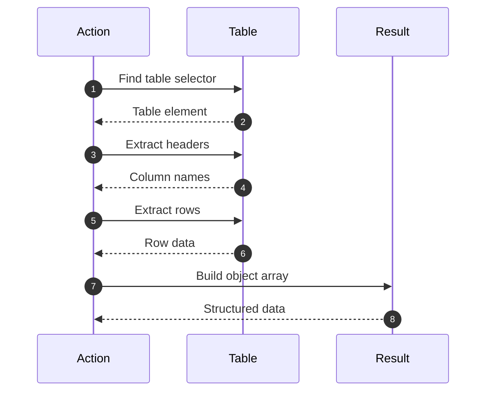
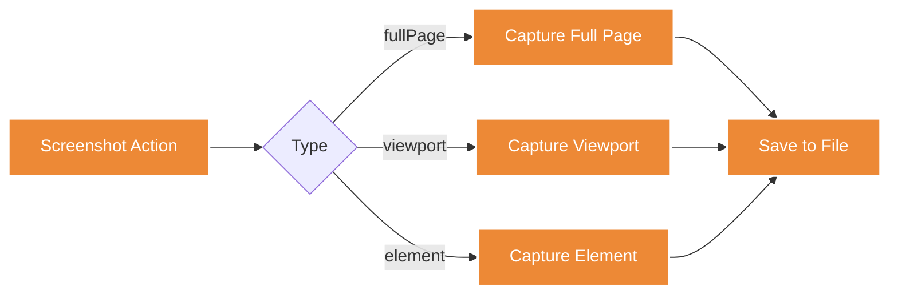

# Extraktions-Actions

Extraktions-Actions ermöglichen das Auslesen von Daten, Text, Bildern und Tabellen aus Webseiten.

## Übersicht



---

## extract

Extrahiert Daten von der Seite.



### Parameter

| Parameter | Typ | Required | Beschreibung |
|-----------|-----|----------|--------------|
| `type` | string | ✅ | `"extract"` |
| `selector` | string | ✅ | CSS-Selektor |
| `extractData` | string | ✅ | `innerText`, `href`, `src`, `attribute` |
| `attribute` | string | ❌ | Attribut-Name (wenn extractData = `attribute`) |
| `multiple` | boolean | ❌ | Alle Matches extrahieren (default: false) |
| `transformData` | string | ❌ | JSONata-Expression zur Transformation |

### extractData-Optionen

| Option | Beschreibung | Beispiel |
|--------|--------------|----------|
| `innerText` | Text-Inhalt des Elements | `"Produkttitel"` |
| `href` | Link-URL aus `<a>` Tag | `"https://example.com"` |
| `src` | Bild/Media-URL aus ``, `<video>` | `"image.jpg"` |
| `attribute` | Beliebiges HTML-Attribut | `data-id="123"` |

### Beispiele

**Text extrahieren:**
```jsonc
{
  "type": "extract",
  "description": "Produkttitel extrahieren",
  "selector": "h1.product-title",
  "extractData": "innerText"
}
```

**Link-URL extrahieren:**
```jsonc
{
  "type": "extract",
  "description": "Produktlink extrahieren",
  "selector": "a.product-link",
  "extractData": "href"
}
```

**Bild-URL extrahieren:**
```jsonc
{
  "type": "extract",
  "selector": "img.product-image",
  "extractData": "src"
}
```

**Custom Attribut:**
```jsonc
{
  "type": "extract",
  "selector": ".product",
  "extractData": "attribute",
  "attribute": "data-product-id"
}
```

**Multiple Elemente:**
```jsonc
{
  "type": "extract",
  "description": "Alle Produktpreise extrahieren",
  "selector": ".product-price",
  "extractData": "innerText",
  "multiple": true
}
```

### Mit JSONata-Transformation

**Preis formatieren:**
```jsonc
{
  "type": "extract",
  "selector": ".price",
  "extractData": "innerText",
  "transformData": "$number($replace(innerText, '€', ''))"
}
```

**String bereinigen:**
```jsonc
{
  "type": "extract",
  "selector": ".title",
  "extractData": "innerText",
  "transformData": "$trim(innerText)"
}
```

**Datum parsen:**
```jsonc
{
  "type": "extract",
  "selector": ".date",
  "extractData": "innerText",
  "transformData": "$toMillis(innerText, '[D].[M].[Y]')"
}
```

### Komplexe Extraktion mit Transformation

```jsonc
{
  "type": "extract",
  "selector": ".product-card",
  "extractData": "innerText",
  "multiple": true,
  "transformData": `
    [$.{
      "title": $trim($('.title').innerText),
      "price": $number($replace($('.price').innerText, '[€,]', '')),
      "rating": $number($('.rating').@data-rating),
      "inStock": $contains($('.stock').innerText, 'Verfügbar')
    }]
  `
}
```

### Produktliste extrahieren

```jsonc
[
  {
    "type": "navigate",
    "url": "https://shop.com/products"
  },
  {
    "type": "extract",
    "description": "Extrahiere alle Produktdaten",
    "selector": ".product-item",
    "extractData": "innerText",
    "multiple": true,
    "transformData": `
      [$.{
        "id": $('.product').@data-id,
        "name": $('.product-name').innerText,
        "price": $number($replace($('.price').innerText, '€', '')),
        "image": $('.image').@src,
        "url": $('.link').@href
      }]
    `
  }
]
```

### Nested Data Extraktion

```jsonc
{
  "type": "extract",
  "selector": ".category",
  "extractData": "innerText",
  "multiple": true,
  "transformData": `
    [$.{
      "category": $('.category-name').innerText,
      "products": $('.product', $).{
        "name": $('.name').innerText,
        "price": $('.price').innerText
      }
    }]
  `
}
```

---

## extractTable

Extrahiert eine HTML-Tabelle als strukturierte Daten.



### Parameter

| Parameter | Typ | Required | Beschreibung |
|-----------|-----|----------|--------------|
| `type` | string | ✅ | `"extractTable"` |
| `selector` | string | ✅ | CSS-Selektor der Tabelle |
| `hasHeader` | boolean | ❌ | Erste Zeile als Header (default: true) |

### Beispiele

**Einfache Tabelle:**
```jsonc
{
  "type": "extractTable",
  "description": "Produkttabelle extrahieren",
  "selector": "table.products",
  "hasHeader": true
}
```

**HTML Tabelle:**
```html
<table class="products">
  <thead>
    <tr>
      <th>Name</th>
      <th>Preis</th>
      <th>Lager</th>
    </tr>
  </thead>
  <tbody>
    <tr>
      <td>Laptop XPS 15</td>
      <td>1299.99</td>
      <td>Verfügbar</td>
    </tr>
    <tr>
      <td>Monitor 27"</td>
      <td>399.99</td>
      <td>Nachbestellt</td>
    </tr>
  </tbody>
</table>
```

**Ergebnis:**
```json
[
  {
    "Name": "Laptop XPS 15",
    "Preis": "1299.99",
    "Lager": "Verfügbar"
  },
  {
    "Name": "Monitor 27\"",
    "Preis": "399.99",
    "Lager": "Nachbestellt"
  }
]
```

### Tabelle ohne Header

```jsonc
{
  "type": "extractTable",
  "selector": "table.data",
  "hasHeader": false
}
```

**Ergebnis (Array von Arrays):**
```json
[
  ["Laptop XPS 15", "1299.99", "Verfügbar"],
  ["Monitor 27\"", "399.99", "Nachbestellt"]
]
```

### Tabelle mit Transformation

```jsonc
[
  {
    "type": "extractTable",
    "selector": "table.products",
    "hasHeader": true
  },
  {
    "type": "transform",
    "expression": `
      previousData.{
        "product": Name,
        "price": $number(Preis),
        "available": Lager = 'Verfügbar'
      }
    `
  }
]
```

---

## screenshot

Erstellt einen Screenshot der Seite oder eines Elements.



### Parameter

| Parameter | Typ | Required | Beschreibung |
|-----------|-----|----------|--------------|
| `type` | string | ✅ | `"screenshot"` |
| `selector` | string | ❌ | Element für Screenshot (optional) |
| `fullPage` | boolean | ❌ | Gesamte Seite (default: false) |
| `filename` | string | ❌ | Dateiname (default: timestamp) |

### Screenshot-Typen

| Typ | Beschreibung | Verwendung |
|-----|--------------|------------|
| Viewport | Nur sichtbarer Bereich | Standard, schnell |
| Full Page | Gesamte Seite | Dokumentation, Archivierung |
| Element | Nur ein Element | Spezifischer Content |

### Beispiele

**Viewport Screenshot:**
```jsonc
{
  "type": "screenshot",
  "description": "Screenshot des Viewports"
}
```

**Full Page Screenshot:**
```jsonc
{
  "type": "screenshot",
  "description": "Screenshot der gesamten Seite",
  "fullPage": true,
  "filename": "full-page.png"
}
```

**Element Screenshot:**
```jsonc
{
  "type": "screenshot",
  "selector": ".product-container",
  "filename": "product.png"
}
```

**Mit Zeitstempel:**
```jsonc
{
  "type": "screenshot",
  "fullPage": true,
  "filename": "{{variables.siteName}}-{{$now()}}.png"
}
```

### Error-State dokumentieren

```jsonc
[
  {
    "type": "navigate",
    "url": "https://example.com"
  },
  {
    "type": "condition",
    "condition": "$exists($('.error-message'))",
    "then": [
      {
        "type": "screenshot",
        "filename": "error-state.png",
        "fullPage": true
      }
    ]
  }
]
```

### Scrape-Verlauf dokumentieren

```jsonc
{
  "type": "loop",
  "loopData": "previousData.urls",
  "actions": [
    {
      "type": "navigate",
      "url": "{{currentData}}"
    },
    {
      "type": "screenshot",
      "filename": "page-{{$index()}}.png"
    }
  ]
}
```

---

## Best Practices

### 1. Selektoren testen

```jsonc
// ✅ Vorher prüfen ob Element existiert
[
  {
    "type": "waitForSelector",
    "selector": ".product-title",
    "timeout": 5000
  },
  {
    "type": "extract",
    "selector": ".product-title",
    "extractData": "innerText"
  }
]
```

### 2. Multiple sinnvoll einsetzen

```jsonc
// ✅ Für Listen
{
  "type": "extract",
  "selector": ".product-item",
  "extractData": "innerText",
  "multiple": true
}

// ❌ Für einzelnes Element
{
  "type": "extract",
  "selector": "#page-title",
  "extractData": "innerText",
  "multiple": true  // Unnötig!
}
```

### 3. Transformationen für Datenqualität

```jsonc
{
  "type": "extract",
  "selector": ".price",
  "extractData": "innerText",
  "transformData": `
    $number(
      $replace(
        $trim(innerText),
        '[€,\\s]',
        ''
      )
    )
  `
}
```

### 4. Screenshots sparsam verwenden

```jsonc
// ✅ Nur bei Bedarf
{
  "type": "condition",
  "condition": "$exists(previousData.error)",
  "then": [
    {
      "type": "screenshot",
      "filename": "error.png"
    }
  ]
}

// ❌ Bei jedem Scrape
{
  "type": "screenshot",  // Erzeugt viele Dateien!
  "fullPage": true
}
```

---

## Häufige Fehler vermeiden

### ❌ Falsche extractData-Option

```jsonc
{
  "type": "extract",
  "selector": "a",
  "extractData": "innerText"  // ❌ Extrahiert Text statt URL
}
```

**✅ Besser:**
```jsonc
{
  "type": "extract",
  "selector": "a",
  "extractData": "href"  // ✅ Extrahiert URL
}
```

### ❌ Transformation ohne Fehlerbehandlung

```jsonc
{
  "type": "extract",
  "selector": ".price",
  "extractData": "innerText",
  "transformData": "$number(innerText)"  // ❌ Kann fehlschlagen
}
```

**✅ Besser:**
```jsonc
{
  "type": "extract",
  "selector": ".price",
  "extractData": "innerText",
  "transformData": `
    $exists(innerText) and innerText != ''
      ? $number($replace(innerText, '[€,]', ''))
      : 0
  `
}
```

### ❌ Multiple vergessen

```jsonc
{
  "type": "extract",
  "selector": ".product",  // Gibt nur 1 Element zurück!
  "extractData": "innerText"
}
```

**✅ Besser:**
```jsonc
{
  "type": "extract",
  "selector": ".product",
  "extractData": "innerText",
  "multiple": true  // ✅ Alle Produkte
}
```

---

## Weiterführende Links

- [JSONata Transformationen](/de/user-guide/jsonata/) - Datenverarbeitung
- [Datenverarbeitungs-Actions](/de/user-guide/actions/data-processing/) - Transform, Loop, Condition
- [Template-Syntax](/de/user-guide/templates/) - Variablen nutzen
