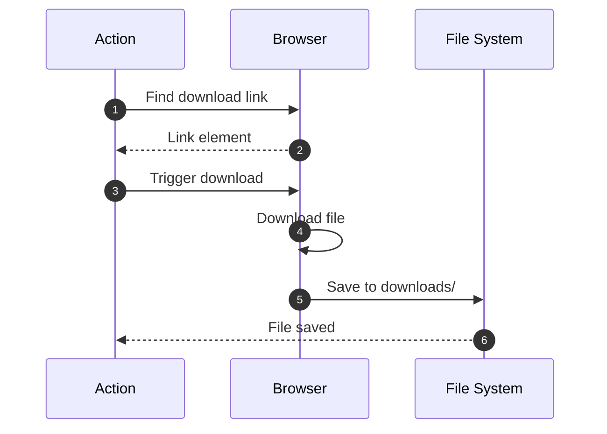
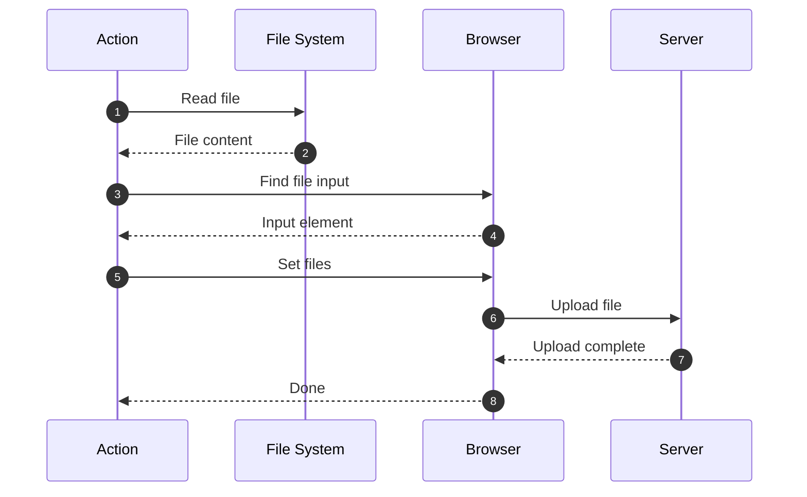

# Datei-Actions

Datei-Actions ermöglichen den Upload und Download von Dateien während des Scrapings.

## Übersicht


---

## download

Lädt eine Datei vom Browser herunter.



### Parameter

| Parameter | Typ | Required | Beschreibung |
|-----------|-----|----------|--------------|
| `type` | string | ✅ | `"download"` |
| `selector` | string | ✅ | CSS-Selektor des Download-Links |
| `filename` | string | ❌ | Zieldateiname (optional) |

### Beispiele

**PDF herunterladen:**
```jsonc
{
  "type": "download",
  "description": "Rechnung herunterladen",
  "selector": "a.download-invoice",
  "filename": "invoice.pdf"
}
```

**Automatischer Dateiname:**
```jsonc
{
  "type": "download",
  "selector": ".download-report"
  // Verwendet Original-Dateiname
}
```

**Mit Variablen:**
```jsonc
{
  "type": "download",
  "selector": ".download-link",
  "filename": "{{variables.documentType}}-{{variables.date}}.pdf"
}
```

**Mit previousData:**
```jsonc
[
  {
    "type": "extract",
    "selector": ".document-id",
    "extractData": "innerText"
  },
  {
    "type": "download",
    "selector": ".download-button",
    "filename": "document-{{previousData}}.pdf"
  }
]
```

### Mehrere Dateien herunterladen

```jsonc
[
  {
    "type": "extract",
    "selector": ".download-link",
    "extractData": "href",
    "multiple": true
  },
  {
    "type": "loop",
    "loopData": "{{previousData}}",
    "maxIterations": 50,
    "actions": [
      {
        "type": "navigate",
        "url": "{{currentData}}"
      },
      {
        "type": "download",
        "selector": ".download-button",
        "filename": "file-{{$index()}}.pdf"
      }
    ]
  }
]
```

### Conditionales Download

```jsonc
[
  {
    "type": "extract",
    "selector": ".file-size",
    "extractData": "innerText"
  },
  {
    "type": "condition",
    "condition": "$number($replace(previousData, ' MB', '')) < 10",
    "then": [
      {
        "type": "download",
        "selector": ".download-link",
        "description": "Nur Dateien < 10MB"
      }
    ]
  }
]
```

### Rechnungen herunterladen

```jsonc
[
  {
    "type": "navigate",
    "url": "https://example.com/invoices"
  },
  {
    "type": "extract",
    "selector": ".invoice-row",
    "extractData": "innerText",
    "multiple": true,
    "transformData": `
      [$.{
        "id": $('.invoice-id').innerText,
        "downloadLink": $('.download').@href
      }]
    `
  },
  {
    "type": "loop",
    "loopData": "{{previousData}}",
    "actions": [
      {
        "type": "navigate",
        "url": "{{currentData.downloadLink}}"
      },
      {
        "type": "download",
        "selector": ".pdf-download",
        "filename": "invoice-{{currentData.id}}.pdf"
      }
    ]
  }
]
```

---

## upload

Lädt eine Datei über ein File-Input-Element hoch.



### Parameter

| Parameter | Typ | Required | Beschreibung |
|-----------|-----|----------|--------------|
| `type` | string | ✅ | `"upload"` |
| `selector` | string | ✅ | CSS-Selektor des File-Inputs |
| `filePath` | string | ✅ | Pfad zur Upload-Datei |

### Beispiele

**Bild hochladen:**
```jsonc
{
  "type": "upload",
  "description": "Profilbild hochladen",
  "selector": "input[type='file']",
  "filePath": "C:\\Users\\user\\profile.jpg"
}
```

**Mit relativen Pfad:**
```jsonc
{
  "type": "upload",
  "selector": "#avatar-upload",
  "filePath": "./data/avatar.png"
}
```

**Mit Variablen:**
```jsonc
{
  "type": "upload",
  "selector": ".file-input",
  "filePath": "{{variables.uploadPath}}/{{variables.filename}}"
}
```

### Dokument-Upload mit Formular

```jsonc
[
  {
    "type": "navigate",
    "url": "https://example.com/upload"
  },
  {
    "type": "type",
    "selector": "#document-title",
    "value": "Wichtiges Dokument"
  },
  {
    "type": "select",
    "selector": "#category",
    "value": "contracts"
  },
  {
    "type": "upload",
    "selector": "#file-input",
    "filePath": "./documents/contract.pdf"
  },
  {
    "type": "click",
    "selector": "#submit-button"
  },
  {
    "type": "waitForSelector",
    "selector": ".success-message",
    "visible": true
  }
]
```

### Mehrere Dateien hochladen

```jsonc
{
  "type": "loop",
  "loopData": `[
    "./images/photo1.jpg",
    "./images/photo2.jpg",
    "./images/photo3.jpg"
  ]`,
  "actions": [
    {
      "type": "upload",
      "selector": "input[type='file']",
      "filePath": "{{currentData}}"
    },
    {
      "type": "wait",
      "timeout": 2000,
      "description": "Warte auf Upload-Verarbeitung"
    }
  ]
}
```

### Avatar-Upload mit Vorschau

```jsonc
[
  {
    "type": "upload",
    "selector": "#avatar-input",
    "filePath": "./avatar.jpg"
  },
  {
    "type": "waitForSelector",
    "selector": ".avatar-preview",
    "visible": true,
    "timeout": 5000
  },
  {
    "type": "screenshot",
    "selector": ".avatar-preview",
    "filename": "avatar-preview.png"
  },
  {
    "type": "click",
    "selector": ".save-avatar"
  }
]
```

---

## Best Practices

### 1. Absolute Pfade verwenden

```jsonc
// ✅ Gut - Absoluter Pfad
{
  "type": "upload",
  "filePath": "C:\\Workspace\\files\\document.pdf"
}

// ⚠️ Okay - Relativer Pfad (relativ zu Scrape-Config)
{
  "type": "upload",
  "filePath": "./files/document.pdf"
}
```

### 2. Datei-Existenz prüfen

```jsonc
// Verwende Conditions oder Loops mit Fehlerbehandlung
[
  {
    "type": "condition",
    "condition": "$exists(variables.filePath)",
    "then": [
      {
        "type": "upload",
        "selector": "input[type='file']",
        "filePath": "{{variables.filePath}}"
      }
    ]
  }
]
```

### 3. Nach Upload warten

```jsonc
[
  {
    "type": "upload",
    "selector": "#file-input",
    "filePath": "./large-file.zip"
  },
  {
    "type": "waitForSelector",
    "selector": ".upload-progress",
    "visible": true
  },
  {
    "type": "waitForSelector",
    "selector": ".upload-complete",
    "visible": true,
    "timeout": 60000  // Großzügig für große Dateien
  }
]
```

### 4. Download-Ordner organisieren

```jsonc
{
  "type": "download",
  "selector": ".download-link",
  "filename": "{{variables.year}}/{{variables.month}}/report.pdf"
  // Erstellt Ordnerstruktur: downloads/2026/01/report.pdf
}
```

---

## Häufige Fehler vermeiden

### ❌ Falscher Selector für File-Input

```jsonc
// ❌ Button statt Input
{
  "type": "upload",
  "selector": ".upload-button"  // Kein file input!
}
```

**✅ Besser:**
```jsonc
{
  "type": "upload",
  "selector": "input[type='file']"  // ✅ File input
}
```

### ❌ Datei-Pfad mit falschen Slashes

```jsonc
// ❌ Windows - Falsche Slashes
{
  "type": "upload",
  "filePath": "C:/Users/file.pdf"  // Kann Probleme machen
}
```

**✅ Besser:**
```jsonc
// Windows
{
  "type": "upload",
  "filePath": "C:\\Users\\file.pdf"  // ✅ Escaped backslashes
}

// Oder Unix-Style (funktioniert meist auch)
{
  "type": "upload",
  "filePath": "C:/Users/file.pdf"  // ✅ Forward slashes
}
```

### ❌ Download ohne Wartezeit

```jsonc
// ❌ Download startet, aber wird nicht abgewartet
{
  "type": "download",
  "selector": ".download-link"
}
{
  "type": "navigate",
  "url": "/next-page"  // Download wird abgebrochen!
}
```

**✅ Besser:**
```jsonc
{
  "type": "download",
  "selector": ".download-link"
}
{
  "type": "wait",
  "timeout": 5000,  // ✅ Warte bis Download fertig
  "description": "Warte auf Download-Abschluss"
}
{
  "type": "navigate",
  "url": "/next-page"
}
```

---

## Erweiterte Beispiele

### Batch-Download mit Metadata

```jsonc
[
  {
    "type": "navigate",
    "url": "https://example.com/documents"
  },
  {
    "type": "extractTable",
    "selector": "table.documents",
    "hasHeader": true
  },
  {
    "type": "transform",
    "expression": `
      previousData.{
        "filename": Titel & '.pdf',
        "url": $('.download').@href,
        "date": Datum
      }
    `
  },
  {
    "type": "loop",
    "loopData": "{{previousData}}",
    "maxIterations": 100,
    "actions": [
      {
        "type": "navigate",
        "url": "{{currentData.url}}"
      },
      {
        "type": "download",
        "selector": ".pdf-download",
        "filename": "{{currentData.date}}-{{currentData.filename}}"
      }
    ]
  }
]
```

### Upload mit Validierung

```jsonc
[
  {
    "type": "upload",
    "selector": "#document-upload",
    "filePath": "./contract.pdf"
  },
  {
    "type": "waitForSelector",
    "selector": ".file-name",
    "visible": true
  },
  {
    "type": "extract",
    "selector": ".file-name",
    "extractData": "innerText"
  },
  {
    "type": "condition",
    "condition": "$contains(previousData, 'contract.pdf')",
    "then": [
      {
        "type": "click",
        "selector": "#submit"
      }
    ],
    "else": [
      {
        "type": "screenshot",
        "filename": "upload-error.png"
      }
    ]
  }
]
```

---

## Weiterführende Links

- [Interaktions-Actions](/de/user-guide/actions/interaction/) - Formular-Interaktion
- [Wartezeit-Actions](/de/user-guide/actions/timing/) - Upload/Download abwarten
- [Template-Syntax](/de/user-guide/templates/) - Dynamische Dateinamen
