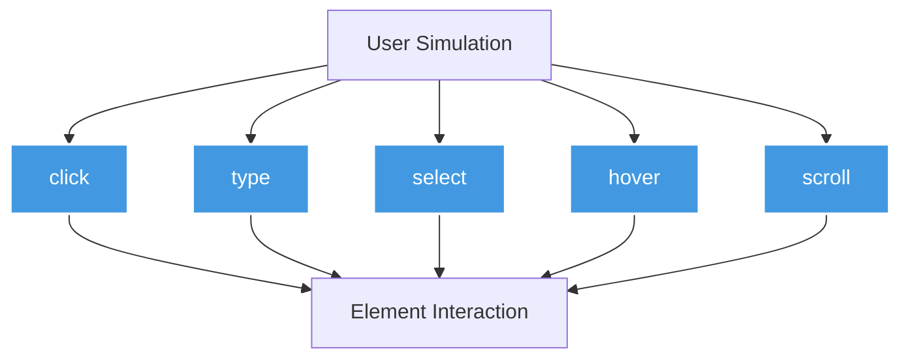
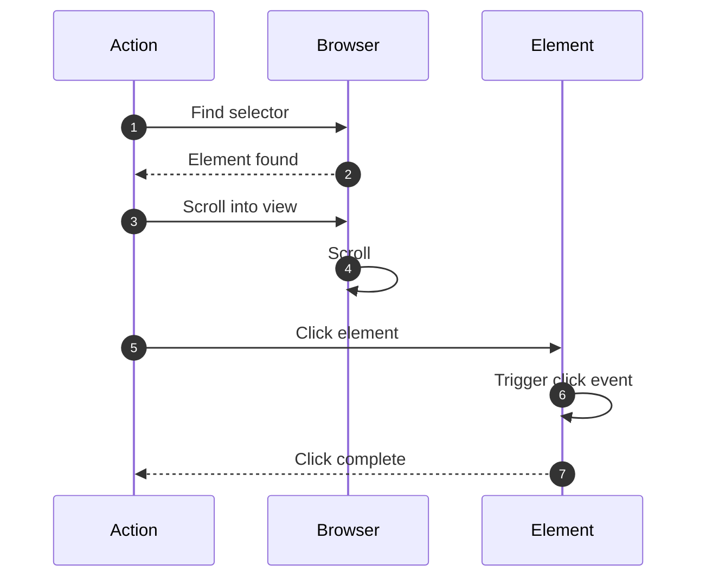
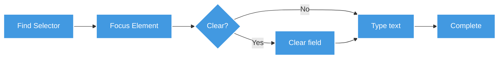
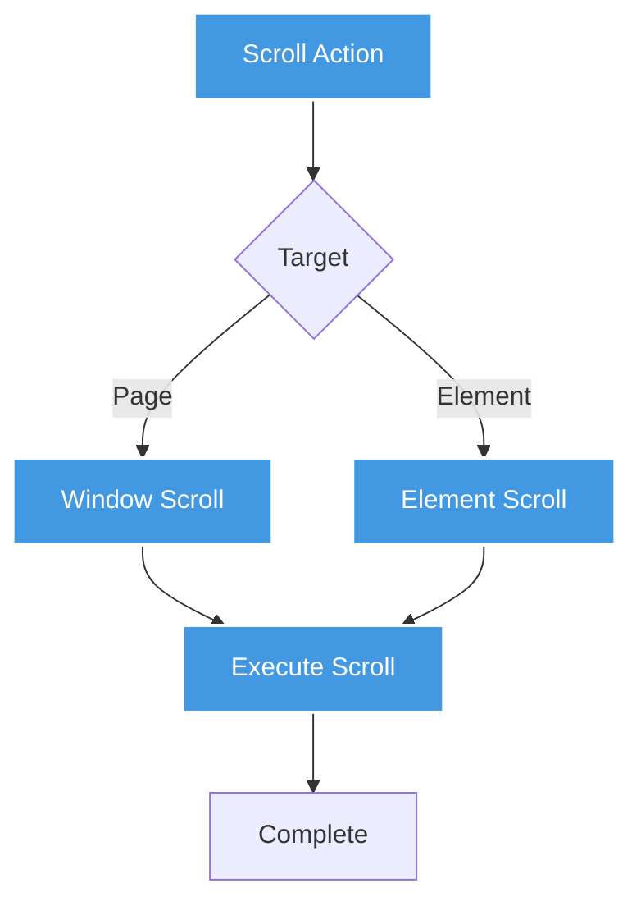
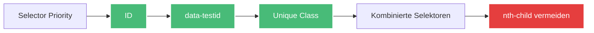

# Interaktions-Actions

Interaktions-Actions ermöglichen die Simulation von Benutzerinteraktionen wie Klicken, Tippen und Scrollen.

## Übersicht



---

## click

Klickt auf ein Element.



### Parameter

| Parameter | Typ | Required | Beschreibung |
|-----------|-----|----------|--------------|
| `type` | string | ✅ | `"click"` |
| `selector` | string | ✅ | CSS-Selektor des Elements |
| `waitForSelector` | number | ❌ | Wartezeit für Selektor (ms) |
| `button` | string | ❌ | `"left"`, `"right"`, `"middle"` (default: left) |
| `clickCount` | number | ❌ | Anzahl der Klicks (default: 1) |
| `delay` | number | ❌ | Verzögerung zwischen Klicks (ms) |

### Beispiele

**Einfacher Click:**
```jsonc
{
  "type": "click",
  "description": "Klicke auf Login-Button",
  "selector": "#login-button"
}
```

**Mit Wartezeit:**
```jsonc
{
  "type": "click",
  "selector": ".dynamic-button",
  "waitForSelector": 5000
}
```

**Doppelklick:**
```jsonc
{
  "type": "click",
  "selector": ".file-item",
  "clickCount": 2,
  "delay": 100
}
```

**Rechtsklick:**
```jsonc
{
  "type": "click",
  "selector": ".context-menu-trigger",
  "button": "right"
}
```

**Mittelklick (neuer Tab):**
```jsonc
{
  "type": "click",
  "selector": "a.product-link",
  "button": "middle"
}
```

---

## type

Tippt Text in ein Input-Feld.



### Parameter

| Parameter | Typ | Required | Beschreibung |
|-----------|-----|----------|--------------|
| `type` | string | ✅ | `"type"` |
| `selector` | string | ✅ | CSS-Selektor des Input-Feldes |
| `value` | string | ✅ | Zu tippender Text (unterstützt Templates) |
| `delay` | number | ❌ | Verzögerung zwischen Tasten (ms, default: 0) |
| `clear` | boolean | ❌ | Feld vorher leeren (default: true) |

### Beispiele

**Benutzername eingeben:**
```jsonc
{
  "type": "type",
  "description": "Benutzername eingeben",
  "selector": "#username",
  "value": "{{secrets.username}}"
}
```

**Passwort mit Delay:**
```jsonc
{
  "type": "type",
  "selector": "#password",
  "value": "{{secrets.password}}",
  "delay": 100  // Simuliert menschliche Tippgeschwindigkeit
}
```

**Suchbegriff:**
```jsonc
{
  "type": "type",
  "selector": "#search-input",
  "value": "{{variables.searchTerm}}",
  "clear": true
}
```

**Text anhängen:**
```jsonc
{
  "type": "type",
  "selector": "#notes",
  "value": " - Additional note",
  "clear": false  // Text wird angehängt
}
```

### Login-Formular Beispiel

```jsonc
[
  {
    "type": "navigate",
    "url": "https://example.com/login"
  },
  {
    "type": "type",
    "selector": "#email",
    "value": "{{secrets.email}}"
  },
  {
    "type": "type",
    "selector": "#password",
    "value": "{{secrets.password}}",
    "delay": 50
  },
  {
    "type": "click",
    "selector": "#login-button"
  }
]
```

---

## select

Wählt eine Option aus einem Dropdown-Menü.

### Parameter

| Parameter | Typ | Required | Beschreibung |
|-----------|-----|----------|--------------|
| `type` | string | ✅ | `"select"` |
| `selector` | string | ✅ | CSS-Selektor des Select-Elements |
| `value` | string | ✅ | Value des Options-Elements |

### Beispiele

**Land auswählen:**
```jsonc
{
  "type": "select",
  "description": "Wähle Land Deutschland",
  "selector": "#country",
  "value": "DE"
}
```

**Kategorie mit Variable:**
```jsonc
{
  "type": "select",
  "selector": "#category",
  "value": "{{variables.selectedCategory}}"
}
```

**Sortierung:**
```jsonc
{
  "type": "select",
  "selector": "#sort-by",
  "value": "price-asc"
}
```

### Filter-Formular Beispiel

```jsonc
[
  {
    "type": "navigate",
    "url": "https://shop.com/products"
  },
  {
    "type": "select",
    "selector": "#category",
    "value": "electronics"
  },
  {
    "type": "select",
    "selector": "#price-range",
    "value": "100-500"
  },
  {
    "type": "select",
    "selector": "#sort",
    "value": "popularity"
  }
]
```

---

## hover

Bewegt die Maus über ein Element (Hover-Effekt).

### Parameter

| Parameter | Typ | Required | Beschreibung |
|-----------|-----|----------|--------------|
| `type` | string | ✅ | `"hover"` |
| `selector` | string | ✅ | CSS-Selektor des Elements |

### Beispiele

**Einfacher Hover:**
```jsonc
{
  "type": "hover",
  "description": "Hover über Menü-Item",
  "selector": ".menu-item"
}
```

### Dropdown-Menü öffnen

```jsonc
[
  {
    "type": "hover",
    "selector": ".nav-menu",
    "description": "Öffne Dropdown-Menü"
  },
  {
    "type": "wait",
    "timeout": 500
  },
  {
    "type": "click",
    "selector": ".nav-menu .submenu-item"
  }
]
```

### Tooltip anzeigen

```jsonc
[
  {
    "type": "hover",
    "selector": ".info-icon"
  },
  {
    "type": "waitForSelector",
    "selector": ".tooltip",
    "visible": true
  },
  {
    "type": "extract",
    "selector": ".tooltip",
    "extractData": "innerText"
  }
]
```

---

## scroll

Scrollt die Seite oder ein Element.



### Parameter

| Parameter | Typ | Required | Beschreibung |
|-----------|-----|----------|--------------|
| `type` | string | ✅ | `"scroll"` |
| `selector` | string | ❌ | CSS-Selektor (für Element-Scroll) |
| `x` | number | ❌ | Horizontal-Position (px) |
| `y` | number | ❌ | Vertikal-Position (px) |

### Beispiele

**Seite nach unten scrollen:**
```jsonc
{
  "type": "scroll",
  "description": "Scrolle 1000px nach unten",
  "y": 1000
}
```

**Zum Seitenende:**
```jsonc
{
  "type": "scroll",
  "y": 999999  // Scrollt bis zum Ende
}
```

**Element scrollen:**
```jsonc
{
  "type": "scroll",
  "selector": ".scrollable-container",
  "y": 500
}
```

**Horizontal scrollen:**
```jsonc
{
  "type": "scroll",
  "selector": ".carousel",
  "x": 300
}
```

### Infinite Scroll laden

```jsonc
{
  "type": "loop",
  "description": "Lade alle Inhalte via Infinite Scroll",
  "loopData": "[1, 2, 3, 4, 5]",
  "actions": [
    {
      "type": "scroll",
      "y": 999999
    },
    {
      "type": "wait",
      "timeout": 2000,
      "description": "Warte auf Nachladen"
    }
  ]
}
```

### Lazy Loading Images

```jsonc
[
  {
    "type": "scroll",
    "y": 500
  },
  {
    "type": "wait",
    "timeout": 1000
  },
  {
    "type": "scroll",
    "y": 1000
  },
  {
    "type": "wait",
    "timeout": 1000
  },
  {
    "type": "extract",
    "selector": "img[src]",
    "extractData": "src",
    "multiple": true
  }
]
```

---

## Best Practices

### 1. Robuste Selektoren verwenden



**✅ Gut:**
```jsonc
{
  "selector": "#login-button"  // ID - sehr stabil
}
```

```jsonc
{
  "selector": "[data-testid='submit']"  // data-Attribut - stabil
}
```

**⚠️ Okay:**
```jsonc
{
  "selector": ".btn-primary"  // Class - kann sich ändern
}
```

**❌ Vermeiden:**
```jsonc
{
  "selector": "body > div:nth-child(3) > button"  // Sehr fragil!
}
```

### 2. Wartezeiten bei dynamischen Elementen

```jsonc
{
  "type": "click",
  "selector": ".ajax-loaded-button",
  "waitForSelector": 5000  // ✅ Warte auf Element
}
```

### 3. Secrets für sensible Daten

```jsonc
{
  "type": "type",
  "selector": "#password",
  "value": "{{secrets.password}}"  // ✅ Verschlüsselt gespeichert
}
```

### 4. Menschliche Delays simulieren

```jsonc
{
  "type": "type",
  "selector": "#search",
  "value": "laptop",
  "delay": 100  // ✅ Sieht natürlicher aus
}
```

### 5. Scroll vor Click

```jsonc
[
  {
    "type": "scroll",
    "selector": ".footer-button",
    "y": 0  // Scrollt Element in View
  },
  {
    "type": "click",
    "selector": ".footer-button"
  }
]
```

---

## Häufige Fehler vermeiden

### ❌ Click auf unsichtbares Element

```jsonc
{
  "type": "click",
  "selector": ".hidden-button"  // ❌ Element nicht sichtbar
}
```

**✅ Besser:**
```jsonc
[
  {
    "type": "waitForSelector",
    "selector": ".hidden-button",
    "visible": true
  },
  {
    "type": "click",
    "selector": ".hidden-button"
  }
]
```

### ❌ Type ohne clear bei vorhandenem Text

```jsonc
{
  "type": "type",
  "selector": "#input-with-text",
  "value": "new text",
  "clear": false  // ❌ Text wird angehängt statt ersetzt
}
```

**✅ Besser:**
```jsonc
{
  "type": "type",
  "selector": "#input-with-text",
  "value": "new text",
  "clear": true  // ✅ Feld wird erst geleert
}
```

---

## Weiterführende Links

- [Navigation Actions](/de/user-guide/actions/navigation/) - Seiten öffnen
- [Extraktions-Actions](/de/user-guide/actions/extraction/) - Daten extrahieren
- [Wartezeit-Actions](/de/user-guide/actions/timing/) - Auf Elemente warten
