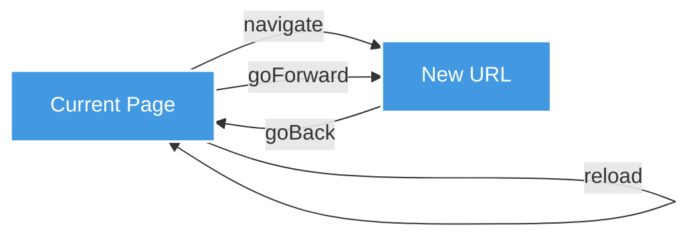
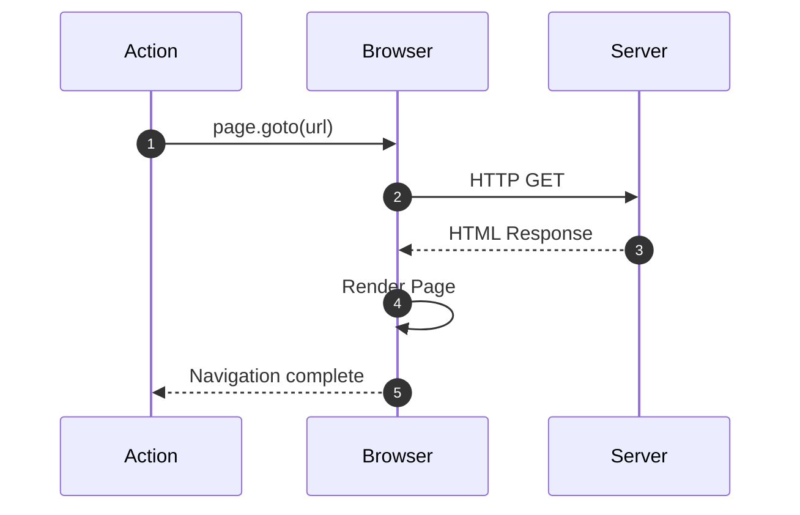
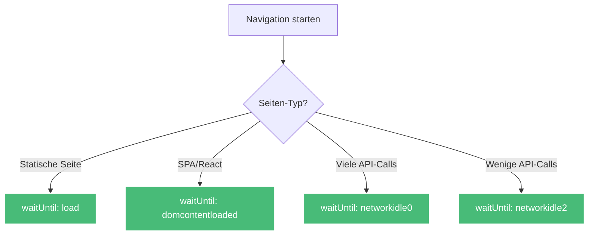

# Navigation Actions

Navigation Actions steuern die Browser-Navigation zwischen verschiedenen URLs und Seiten.

## Übersicht



---

## navigate

Navigiert zu einer URL.



### Parameter

| Parameter | Typ | Required | Beschreibung |
|-----------|-----|----------|--------------|
| `type` | string | ✅ | `"navigate"` |
| `url` | string | ✅ | Ziel-URL (unterstützt Templates) |
| `waitUntil` | string | ❌ | Wann gilt Navigation als abgeschlossen |
| `timeout` | number | ❌ | Timeout in Millisekunden (default: 30000) |

### waitUntil-Optionen

- `load` - Wenn load-Event gefeuert wird (default)
- `domcontentloaded` - Wenn DOM vollständig geladen
- `networkidle0` - Wenn keine Netzwerkaktivität für 500ms
- `networkidle2` - Wenn max. 2 Netzwerkverbindungen für 500ms

### Beispiele

**Einfache Navigation:**
```jsonc
{
  "type": "navigate",
  "description": "Öffne die Produktseite",
  "url": "https://example.com/products"
}
```

**Mit erweiterten Optionen:**
```jsonc
{
  "type": "navigate",
  "url": "https://example.com/products",
  "waitUntil": "networkidle2",
  "timeout": 60000
}
```

**Mit Variablen:**
```jsonc
{
  "type": "navigate",
  "url": "{{variables.baseUrl}}/search?q={{variables.searchTerm}}",
  "waitUntil": "load"
}
```

**Mit dynamischen Parametern:**
```jsonc
{
  "type": "navigate",
  "url": "https://example.com/products/{{previousData.productId}}",
  "waitUntil": "domcontentloaded"
}
```

---

## goBack

Navigiert zur vorherigen Seite (Browser-Zurück-Button).

### Parameter

| Parameter | Typ | Required | Beschreibung |
|-----------|-----|----------|--------------|
| `type` | string | ✅ | `"goBack"` |
| `waitUntil` | string | ❌ | Siehe navigate |
| `timeout` | number | ❌ | Timeout in Millisekunden |

### Beispiele

**Einfach zurück:**
```jsonc
{
  "type": "goBack",
  "description": "Zurück zur Übersicht"
}
```

**Mit waitUntil:**
```jsonc
{
  "type": "goBack",
  "waitUntil": "networkidle0"
}
```

### Anwendungsfall

```jsonc
[
  {
    "type": "navigate",
    "url": "https://example.com/products"
  },
  {
    "type": "click",
    "selector": ".product-link"
  },
  {
    "type": "extract",
    "selector": ".product-details",
    "extractData": "innerText"
  },
  {
    "type": "goBack",
    "description": "Zurück zur Produktliste"
  }
]
```

---

## goForward

Navigiert zur nächsten Seite (Browser-Vorwärts-Button).

### Parameter

| Parameter | Typ | Required | Beschreibung |
|-----------|-----|----------|--------------|
| `type` | string | ✅ | `"goForward"` |
| `waitUntil` | string | ❌ | Siehe navigate |
| `timeout` | number | ❌ | Timeout in Millisekunden |

### Beispiele

```jsonc
{
  "type": "goForward",
  "description": "Vorwärts zur Detailseite"
}
```

---

## reload

Lädt die aktuelle Seite neu.

### Parameter

| Parameter | Typ | Required | Beschreibung |
|-----------|-----|----------|--------------|
| `type` | string | ✅ | `"reload"` |
| `waitUntil` | string | ❌ | Siehe navigate |
| `timeout` | number | ❌ | Timeout in Millisekunden |

### Beispiele

**Einfacher Reload:**
```jsonc
{
  "type": "reload",
  "description": "Seite neu laden"
}
```

**Mit networkidle:**
```jsonc
{
  "type": "reload",
  "description": "Seite neu laden und auf Netzwerk warten",
  "waitUntil": "networkidle0",
  "timeout": 60000
}
```

### Anwendungsfall - Dynamische Inhalte aktualisieren

```jsonc
[
  {
    "type": "navigate",
    "url": "https://example.com/dashboard"
  },
  {
    "type": "extract",
    "selector": ".data-count",
    "extractData": "innerText"
  },
  {
    "type": "wait",
    "timeout": 5000
  },
  {
    "type": "reload",
    "description": "Dashboard aktualisieren"
  },
  {
    "type": "extract",
    "selector": ".data-count",
    "extractData": "innerText"
  }
]
```

---

## Best Practices

### 1. Richtige waitUntil-Option wählen



**Statische Seiten:**
```jsonc
{
  "type": "navigate",
  "url": "https://example.com",
  "waitUntil": "load"  // ✅ Ausreichend für statische Inhalte
}
```

**Single Page Applications:**
```jsonc
{
  "type": "navigate",
  "url": "https://react-app.com",
  "waitUntil": "domcontentloaded"  // ✅ Wartet auf DOM, nicht auf alle Ressourcen
}
```

**API-lastige Seiten:**
```jsonc
{
  "type": "navigate",
  "url": "https://api-heavy.com",
  "waitUntil": "networkidle0"  // ✅ Wartet bis alle API-Calls fertig
}
```

### 2. Timeouts großzügig setzen

```jsonc
{
  "type": "navigate",
  "url": "https://slow-site.com",
  "timeout": 120000,  // ✅ 2 Minuten für langsame Seiten
  "waitUntil": "networkidle2"
}
```

### 3. Template-Variablen für Flexibilität

```jsonc
{
  "type": "navigate",
  "url": "{{variables.baseUrl}}/{{variables.path}}",  // ✅ Wiederverwendbar
  "waitUntil": "load"
}
```

### 4. Navigation mit Error Handling

```jsonc
[
  {
    "type": "navigate",
    "url": "https://example.com/page",
    "timeout": 30000
  },
  {
    "type": "waitForSelector",
    "selector": ".content",
    "timeout": 5000
  },
  {
    "type": "condition",
    "condition": "$not($exists(previousData))",
    "then": [
      {
        "type": "reload",
        "description": "Seite neu laden bei Fehler"
      }
    ]
  }
]
```

---

## Häufige Fehler vermeiden

### ❌ Zu kurze Timeouts

```jsonc
{
  "type": "navigate",
  "url": "https://slow-site.com",
  "timeout": 5000  // ❌ Zu kurz!
}
```

### ✅ Besser

```jsonc
{
  "type": "navigate",
  "url": "https://slow-site.com",
  "timeout": 60000  // ✅ Großzügiger Timeout
}
```

### ❌ Falsches waitUntil für SPA

```jsonc
{
  "type": "navigate",
  "url": "https://react-app.com",
  "waitUntil": "networkidle0"  // ❌ Kann sehr lange dauern
}
```

### ✅ Besser

```jsonc
{
  "type": "navigate",
  "url": "https://react-app.com",
  "waitUntil": "domcontentloaded"  // ✅ Optimal für SPAs
}
```

---

## Weiterführende Links

- [Interaktions-Actions](/de/user-guide/actions/interaction/) - Nach Navigation interagieren
- [Wartezeit-Actions](/de/user-guide/actions/timing/) - Warten auf Elemente
- [Template-Syntax](/de/user-guide/templates/) - Variablen in URLs
