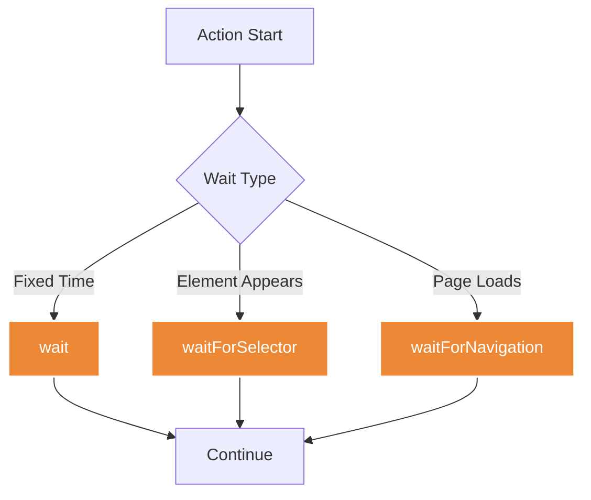
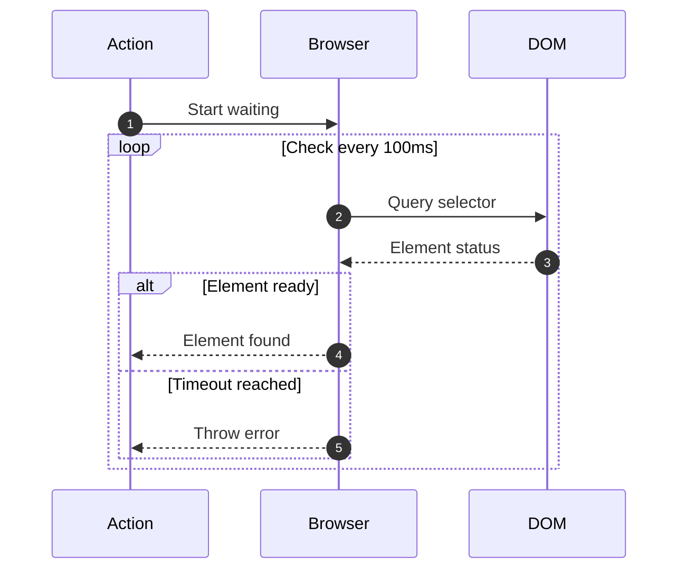
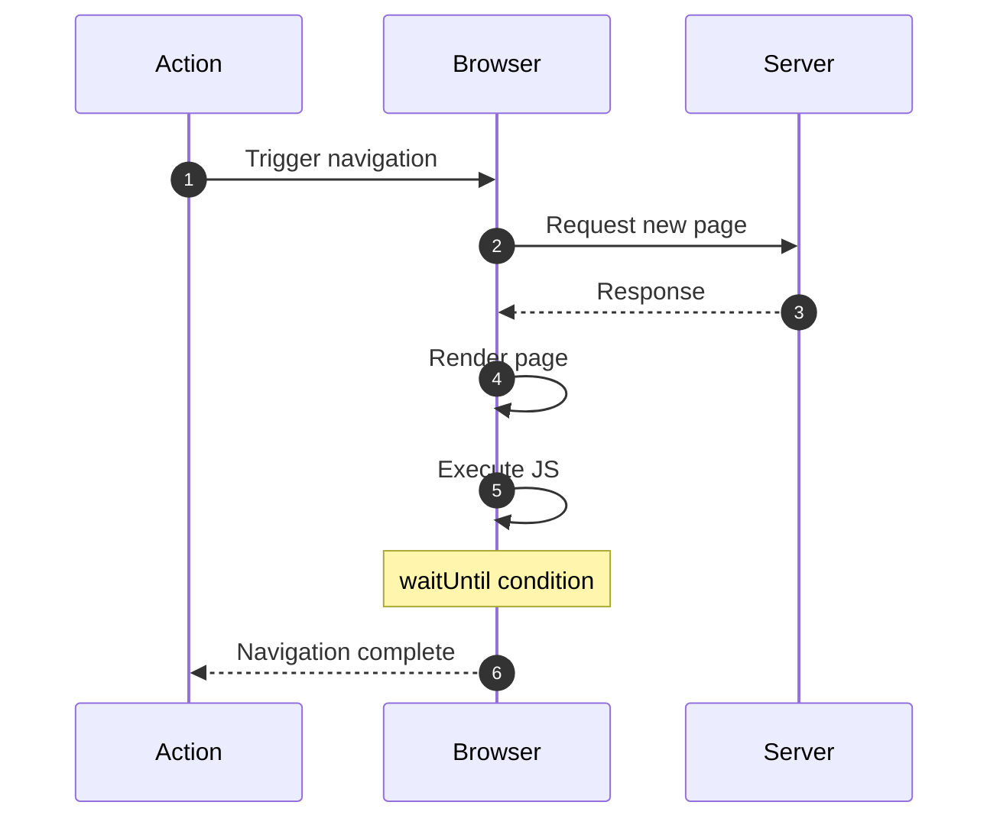
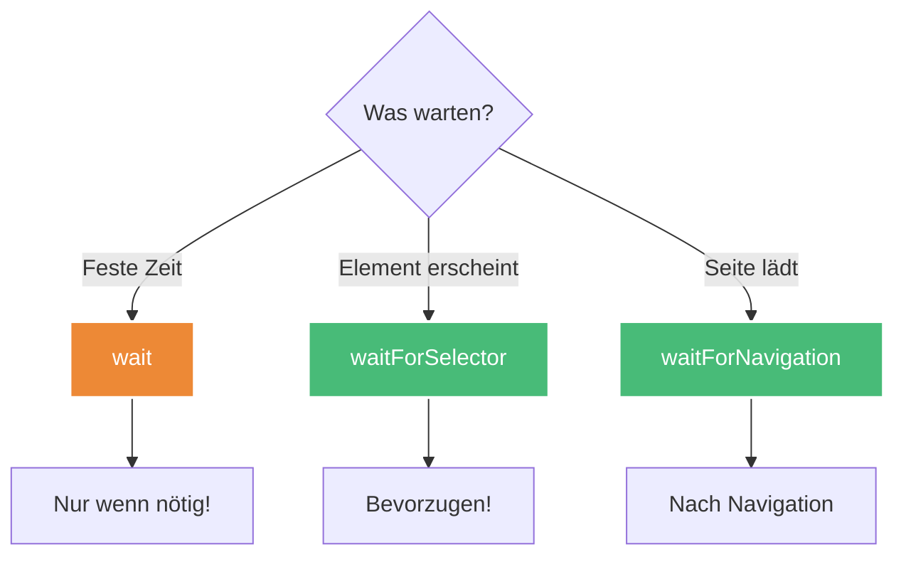

# Wartezeit-Actions

Wartezeit-Actions steuern das Timing und synchronisieren den Scrape mit dynamischen Seiteninhalten.

## Übersicht



---

## wait

Wartet eine festgelegte Zeit.


### Parameter

| Parameter | Typ | Required | Beschreibung |
|-----------|-----|----------|--------------|
| `type` | string | ✅ | `"wait"` |
| `timeout` | number | ✅ | Wartezeit in Millisekunden |

### Beispiele

**Kurze Pause:**
```jsonc
{
  "type": "wait",
  "description": "Kurze Pause",
  "timeout": 1000
}
```

**Auf Ajax warten:**
```jsonc
{
  "type": "wait",
  "description": "Warte auf Ajax-Call",
  "timeout": 3000
}
```

**Nach Click warten:**
```jsonc
[
  {
    "type": "click",
    "selector": ".load-more-button"
  },
  {
    "type": "wait",
    "timeout": 2000,
    "description": "Warte auf neue Inhalte"
  },
  {
    "type": "extract",
    "selector": ".new-items",
    "extractData": "innerText",
    "multiple": true
  }
]
```

### Anwendungsfälle

**Infinite Scroll:**
```jsonc
{
  "type": "loop",
  "loopData": "[1,2,3,4,5]",
  "actions": [
    {
      "type": "scroll",
      "y": 999999
    },
    {
      "type": "wait",
      "timeout": 2000,
      "description": "Warte auf Nachladen"
    }
  ]
}
```

**Animationen abwarten:**
```jsonc
[
  {
    "type": "click",
    "selector": ".modal-trigger"
  },
  {
    "type": "wait",
    "timeout": 500,
    "description": "Warte auf Modal-Animation"
  },
  {
    "type": "extract",
    "selector": ".modal-content",
    "extractData": "innerText"
  }
]
```

---

## waitForSelector

Wartet bis ein Element erscheint, sichtbar wird oder verschwindet.



### Parameter

| Parameter | Typ | Required | Beschreibung |
|-----------|-----|----------|--------------|
| `type` | string | ✅ | `"waitForSelector"` |
| `selector` | string | ✅ | CSS-Selektor |
| `timeout` | number | ❌ | Max. Wartezeit (ms, default: 30000) |
| `visible` | boolean | ❌ | Warte bis sichtbar (default: false) |
| `hidden` | boolean | ❌ | Warte bis versteckt (default: false) |

### Modi

| Modus | Beschreibung | Verwendung |
|-------|--------------|------------|
| Default | Element existiert im DOM | Für statische Elemente |
| `visible: true` | Element ist sichtbar | Für dynamische UI-Elemente |
| `hidden: true` | Element ist versteckt | Für Loading-Spinner |

### Beispiele

**Element erscheint:**
```jsonc
{
  "type": "waitForSelector",
  "description": "Warte auf Suchergebnisse",
  "selector": ".search-results",
  "timeout": 10000
}
```

**Element wird sichtbar:**
```jsonc
{
  "type": "waitForSelector",
  "selector": ".modal",
  "visible": true,
  "timeout": 5000
}
```

**Loading-Spinner verschwindet:**
```jsonc
{
  "type": "waitForSelector",
  "selector": ".loading-spinner",
  "hidden": true,
  "timeout": 30000
}
```

### Robuste Navigation

```jsonc
[
  {
    "type": "navigate",
    "url": "https://example.com/products"
  },
  {
    "type": "waitForSelector",
    "selector": ".product-list",
    "visible": true,
    "timeout": 15000,
    "description": "Warte auf Produktliste"
  },
  {
    "type": "extract",
    "selector": ".product-item",
    "extractData": "innerText",
    "multiple": true
  }
]
```

### Ajax-Request abwarten

```jsonc
[
  {
    "type": "click",
    "selector": ".filter-button"
  },
  {
    "type": "waitForSelector",
    "selector": ".loading-indicator",
    "visible": true,
    "timeout": 2000,
    "description": "Loading startet"
  },
  {
    "type": "waitForSelector",
    "selector": ".loading-indicator",
    "hidden": true,
    "timeout": 30000,
    "description": "Loading fertig"
  },
  {
    "type": "extract",
    "selector": ".filtered-results",
    "extractData": "innerText",
    "multiple": true
  }
]
```

### Modal-Interaktion

```jsonc
[
  {
    "type": "click",
    "selector": ".open-modal"
  },
  {
    "type": "waitForSelector",
    "selector": ".modal",
    "visible": true,
    "timeout": 3000
  },
  {
    "type": "extract",
    "selector": ".modal-content",
    "extractData": "innerText"
  },
  {
    "type": "click",
    "selector": ".modal-close"
  },
  {
    "type": "waitForSelector",
    "selector": ".modal",
    "hidden": true,
    "timeout": 3000
  }
]
```

---

## waitForNavigation

Wartet auf eine Seitennavigation (z.B. nach Form-Submit oder Click).



### Parameter

| Parameter | Typ | Required | Beschreibung |
|-----------|-----|----------|--------------|
| `type` | string | ✅ | `"waitForNavigation"` |
| `waitUntil` | string | ❌ | Siehe [navigate](/de/user-guide/actions/navigation/) |
| `timeout` | number | ❌ | Max. Wartezeit (ms, default: 30000) |

### waitUntil-Optionen

| Option | Beschreibung | Verwendung |
|--------|--------------|------------|
| `load` | Load-Event gefeuert | Standard-Seiten |
| `domcontentloaded` | DOM vollständig | SPAs |
| `networkidle0` | Keine Netzwerkaktivität | API-lastige Seiten |
| `networkidle2` | Max. 2 Verbindungen | Meiste Seiten |

### Beispiele

**Nach Form-Submit:**
```jsonc
[
  {
    "type": "type",
    "selector": "#search",
    "value": "laptop"
  },
  {
    "type": "click",
    "selector": "#search-button"
  },
  {
    "type": "waitForNavigation",
    "waitUntil": "networkidle0",
    "timeout": 10000
  },
  {
    "type": "extract",
    "selector": ".search-results",
    "extractData": "innerText",
    "multiple": true
  }
]
```

**Nach Login:**
```jsonc
[
  {
    "type": "type",
    "selector": "#email",
    "value": "{{secrets.email}}"
  },
  {
    "type": "type",
    "selector": "#password",
    "value": "{{secrets.password}}"
  },
  {
    "type": "click",
    "selector": "#login-button"
  },
  {
    "type": "waitForNavigation",
    "description": "Warte auf Redirect zum Dashboard",
    "waitUntil": "load",
    "timeout": 15000
  }
]
```

**Link-Click mit Navigation:**
```jsonc
[
  {
    "type": "click",
    "selector": "a.product-link"
  },
  {
    "type": "waitForNavigation",
    "waitUntil": "domcontentloaded"
  },
  {
    "type": "extract",
    "selector": ".product-details",
    "extractData": "innerText"
  }
]
```

---

## Best Practices

### 1. Richtige Action wählen



**✅ Bevorzugt - waitForSelector:**
```jsonc
{
  "type": "waitForSelector",
  "selector": ".results",
  "visible": true
}
```

**⚠️ Wenn nötig - wait:**
```jsonc
{
  "type": "wait",
  "timeout": 2000  // Nur wenn kein Selector verfügbar
}
```

### 2. Großzügige Timeouts

```jsonc
// ✅ Gut - Berücksichtigt langsame Verbindungen
{
  "type": "waitForSelector",
  "selector": ".dynamic-content",
  "timeout": 30000
}

// ❌ Schlecht - Zu kurz
{
  "type": "waitForSelector",
  "selector": ".dynamic-content",
  "timeout": 1000  // Kann oft fehlschlagen
}
```

### 3. Loading States abwarten

```jsonc
// ✅ Vollständiger Workflow
[
  {
    "type": "click",
    "selector": ".load-data"
  },
  {
    "type": "waitForSelector",
    "selector": ".loading",
    "visible": true,
    "description": "Warte bis Loading startet"
  },
  {
    "type": "waitForSelector",
    "selector": ".loading",
    "hidden": true,
    "description": "Warte bis Loading fertig"
  },
  {
    "type": "extract",
    "selector": ".data",
    "extractData": "innerText"
  }
]
```

### 4. Fallback mit Conditions

```jsonc
[
  {
    "type": "waitForSelector",
    "selector": ".content",
    "timeout": 10000
  },
  {
    "type": "condition",
    "condition": "$not($exists(previousData))",
    "then": [
      {
        "type": "wait",
        "timeout": 5000,
        "description": "Fallback: Weitere 5 Sekunden warten"
      }
    ]
  }
]
```

---

## Häufige Fehler vermeiden

### ❌ wait statt waitForSelector

```jsonc
// ❌ Schlecht - Feste Zeit
{
  "type": "wait",
  "timeout": 5000
}
{
  "type": "extract",
  "selector": ".results",
  "extractData": "innerText"
}
```

**✅ Besser:**
```jsonc
// ✅ Gut - Wartet genau richtig lang
{
  "type": "waitForSelector",
  "selector": ".results",
  "visible": true,
  "timeout": 10000
}
{
  "type": "extract",
  "selector": ".results",
  "extractData": "innerText"
}
```

### ❌ Zu kurze Timeouts

```jsonc
// ❌ Zu optimistisch
{
  "type": "waitForSelector",
  "selector": ".slow-loading-content",
  "timeout": 2000  // Oft zu kurz!
}
```

**✅ Besser:**
```jsonc
{
  "type": "waitForSelector",
  "selector": ".slow-loading-content",
  "timeout": 30000  // Großzügig
}
```

### ❌ visible vergessen bei dynamischen Elementen

```jsonc
// ❌ Element im DOM, aber nicht sichtbar
{
  "type": "waitForSelector",
  "selector": ".modal"  // Kann schon im DOM sein!
}
```

**✅ Besser:**
```jsonc
{
  "type": "waitForSelector",
  "selector": ".modal",
  "visible": true  // Warte bis wirklich sichtbar
}
```

### ❌ waitForNavigation ohne Trigger

```jsonc
// ❌ Navigation wird nicht ausgelöst
{
  "type": "waitForNavigation"  // Wartet endlos!
}
```

**✅ Besser:**
```jsonc
[
  {
    "type": "click",
    "selector": "a.link"  // Löst Navigation aus
  },
  {
    "type": "waitForNavigation",
    "waitUntil": "load"
  }
]
```

---

## Timing-Strategien

### Progressive Wartezeit

```jsonc
[
  {
    "type": "waitForSelector",
    "selector": ".quick-element",
    "timeout": 5000
  },
  {
    "type": "waitForSelector",
    "selector": ".medium-element",
    "timeout": 15000
  },
  {
    "type": "waitForSelector",
    "selector": ".slow-element",
    "timeout": 30000
  }
]
```

### Retry mit Loop

```jsonc
{
  "type": "loop",
  "loopData": "[1,2,3]",
  "actions": [
    {
      "type": "reload"
    },
    {
      "type": "waitForSelector",
      "selector": ".content",
      "timeout": 10000
    },
    {
      "type": "condition",
      "condition": "$exists(previousData)",
      "then": [
        {
          "type": "extract",
          "selector": ".content",
          "extractData": "innerText"
        }
      ]
    }
  ]
}
```

---

## Weiterführende Links

- [Navigation Actions](/de/user-guide/actions/navigation/) - Seiten navigieren
- [Interaktions-Actions](/de/user-guide/actions/interaction/) - Mit Elementen interagieren
- [Scrape Workflow](/de/architecture/scrape-workflow/) - Timing im Kontext
