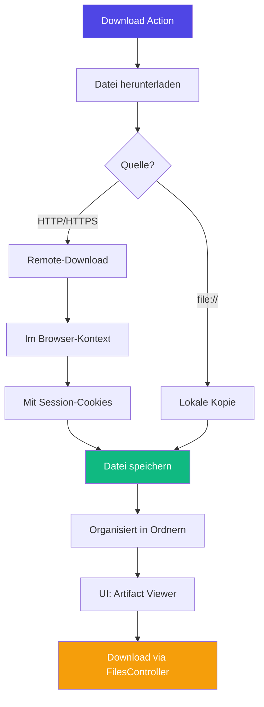
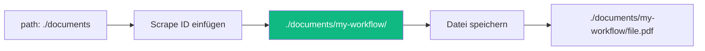

# File Management

Scrape Dojo bietet ein vollständiges File Management System zum Herunterladen, Speichern und Abrufen von Dateien wie PDFs, Bildern, Excel-Sheets etc.

## Übersicht



## Download Action

### Basis-Verwendung

```jsonc
{
  "name": "download-pdf",
  "action": "download",
  "params": {
    "url": "https://example.com/invoice.pdf",
    "path": "./documents",
    "filename": "invoice-{{currentData.orderNumber}}.pdf"
  }
}
```

### Parameter

| Parameter | Typ | Beschreibung | Pflicht |
|-----------|-----|--------------|---------|
| `url` | String | URL der herunterzuladenden Datei | ✅ |
| `path` | String | Zielpfad (relativ oder absolut) | ✅ |
| `filename` | String | Dateiname (mit Extension) | ✅ |

### Pfad-Organisation



**Automatische Organisation:**
- Scrape-ID wird als Unterordner hinzugefügt
- Verhindert Datei-Konflikte bei mehreren Workflows
- Beispiel: `./documents/amazon-orders/invoice-12345.pdf`

### URL-Auflösung

Die Download Action unterstützt verschiedene URL-Typen:

#### Absolute URLs

```jsonc
{
  "url": "https://example.com/downloads/file.pdf"
}
```

#### Relative URLs

```jsonc
{
  "url": "/api/download?id=12345"
  // Wird aufgelöst gegen die aktuelle Page-URL
}
```

#### Schema-relative URLs

```jsonc
{
  "url": "//cdn.example.com/assets/image.jpg"
  // Übernimmt Schema (http/https) von aktueller Seite
}
```

#### Lokale Dateien

```jsonc
{
  "url": "file:///C:/temp/local-file.pdf"
  // Kopiert lokale Datei
}
```

### Session-Cookies

Downloads erfolgen **im Browser-Kontext** und nutzen automatisch Session-Cookies:

```mermaid
sequenceDiagram
    participant A as Action
    participant P as Puppeteer Page
    participant S as Server
    
    A->>P: Hole Cookies
    P-->>A: session=abc123, auth=xyz
    A->>P: fetch(url, {credentials: 'include'})
    P->>S: GET /file.pdf<br/>Cookie: session=abc123
    S-->>P: PDF Stream
    P-->>A: File Buffer
    A->>A: Speichere Datei
    
    style A fill:#4f46e5,color:#fff
    style P fill:#10b981,color:#fff
```

**Wichtig:** Dadurch können geschützte Dateien heruntergeladen werden, für die du bereits eingeloggt bist!

## Praktische Beispiele

### PDF-Rechnung herunterladen

```jsonc
{
  "steps": [
    {
      "name": "login-and-navigate",
      "actions": [
        {
          "name": "login",
          "action": "navigate",
          "params": {
            "url": "https://portal.example.com/login"
          }
        },
        {
          "name": "enter-credentials",
          "action": "type",
          "params": {
            "selector": "#email",
            "text": "{{secrets.email}}"
          }
        },
        // ... Login fortsetzen ...
      ]
    },
    {
      "name": "download-invoices",
      "actions": [
        {
          "name": "extract-invoice-links",
          "action": "extractAll",
          "params": {
            "selector": "a.invoice-link",
            "attribute": "href"
          }
        },
        {
          "name": "loop-downloads",
          "action": "loop",
          "params": {
            "items": "{{previousData.extract-invoice-links}}",
            "nestedActions": [
              {
                "name": "download-invoice",
                "action": "download",
                "params": {
                  "url": "{{currentData.invoices.value}}",
                  "path": "./invoices",
                  "filename": "invoice-{{currentData.invoices.index}}.pdf"
                }
              }
            ]
          }
        }
      ]
    }
  ]
}
```

### Dateiname aus Daten generieren

```jsonc
{
  "name": "download-with-dynamic-name",
  "action": "download",
  "params": {
    "url": "{{currentData.downloadUrl}}",
    "path": "./downloads",
    "filename": "{{currentData.type}}-{{currentData.id}}-{{year}}.pdf"
  }
}
// Ergebnis: order-12345-2025.pdf
```

### Multiple Dateitypen

```jsonc
{
  "name": "download-assets",
  "action": "loop",
  "params": {
    "items": "{{previousData.assets}}",
    "nestedActions": [
      {
        "name": "download-asset",
        "action": "download",
        "params": {
          "url": "{{currentData.assets.value.url}}",
          "path": "./assets",
          "filename": "{{currentData.assets.value.name}}.{{currentData.assets.value.extension}}"
        }
      }
    ]
  }
}
```

**Unterstützte Formate:** PDF, PNG, JPG, XLSX, CSV, ZIP, JSON, XML, etc.

## Artifacts & UI-Integration

### Als Artifact anzeigen

```jsonc
{
  "name": "show-download",
  "action": "artifacts",
  "params": {
    "type": "file",
    "title": "Heruntergeladene Rechnung",
    "description": "Invoice #{{currentData.invoiceNumber}}",
    "data": "{{previousData.download-invoice}}"
  }
}
```


**UI-Features:**
- Dateityp-Icon (📄 PDF, 🖼️ Bild, etc.)
- Dateiname anzeigen
- Download-Button
- Dateigröße-Anzeige

### File Artifact Component

Der UI zeigt File-Artifacts automatisch mit:

```typescript
// Automatische Anzeige in Artifact Viewer
{
  type: 'file',
  title: 'Rechnung',
  data: './documents/my-workflow/invoice.pdf'
}
```

**Angezeigter Content:**
- Icon basierend auf Extension
- Dateiname: `invoice.pdf`
- Pfad: `./documents/my-workflow/`
- Download-Button → ruft FilesController auf

## Files API

### Download Endpoint

```bash
POST /api/files/download
Content-Type: application/json

{
  "path": "./documents/my-workflow/invoice.pdf"
}
```

**Response:** Binary file download mit `Content-Disposition` Header.

### Implementation

```mermaid
sequenceDiagram
    participant UI as UI (FilesService)
    participant API as FilesController
    participant FS as Filesystem
    
    UI->>API: POST /files/download<br/>{path: "./docs/file.pdf"}
    API->>FS: Prüfe Existenz
    FS-->>API: exists: true
    API->>FS: Lese Datei
    FS-->>API: File Stream
    API->>UI: HTTP 200<br/>Content-Disposition: attachment<br/>Binary Data
    UI->>UI: Trigger Browser Download
    
    style API fill:#4f46e5,color:#fff
    style UI fill:#10b981,color:#fff
```

### Sicherheit

**Path Validation:**
```typescript
// Konvertiere zu absolutem Pfad
const absolutePath = path.isAbsolute(filePath) 
    ? filePath 
    : path.resolve(process.cwd(), filePath);

// Prüfe Existenz
if (!fs.existsSync(absolutePath)) {
    return 404;
}

// Prüfe, dass es eine Datei ist (kein Verzeichnis)
if (!fs.statSync(absolutePath).isFile()) {
    return 400;
}
```

**Filename Extraction:**
```typescript
// Nur Dateiname, kein Pfad
const fileName = path.basename(absolutePath);

// Content-Disposition Header
res.download(absolutePath, fileName);
```

## Best Practices

### 1. Dateinamen validieren

```jsonc
{
  "name": "validate-filename",
  "action": "logger",
  "params": {
    "message": "Downloading: {{currentData.filename}}"
  }
}
// Prüfe in Logs, ob Template korrekt aufgelöst wurde
```

**Häufiger Fehler:**
```jsonc
// ❌ Template nicht aufgelöst
{
  "filename": "{{currentData.missingField}}.pdf"
}
// Ergebnis: ".pdf" (leerer Filename!)
```

**Lösung:**
```jsonc
// ✅ Mit Fallback
{
  "filename": "{{#if currentData.orderId}}order-{{currentData.orderId}}{{else}}order-unknown{{/if}}.pdf"
}
```

### 2. Pfad-Struktur planen

```plaintext
./downloads/
  ├── workflow-1/
  │   ├── 2025-01-11/
  │   │   ├── file-1.pdf
  │   │   └── file-2.pdf
  │   └── 2025-01-12/
  └── workflow-2/
      └── data.csv
```

```jsonc
{
  "path": "./downloads/{{scrapeId}}/{{year}}-{{month}}-{{day}}",
  "filename": "order-{{currentData.id}}.pdf"
}
```

### 3. Error Handling

```jsonc
{
  "name": "safe-download",
  "action": "download",
  "params": {
    "url": "{{#if (isDefined currentData.pdfUrl)}}{{currentData.pdfUrl}}{{else}}https://fallback.com/empty.pdf{{/if}}",
    "path": "./downloads",
    "filename": "document.pdf"
  }
}
```

### 4. File Existence Check

```jsonc
{
  "name": "check-file",
  "action": "fileExists",
  "params": {
    "path": "./downloads/my-workflow/important.pdf"
  }
},
{
  "name": "conditional-download",
  "action": "skipIf",
  "params": {
    "condition": "{{previousData.check-file}}"
  }
},
{
  "name": "download-if-missing",
  "action": "download",
  "params": {
    "url": "https://example.com/important.pdf",
    "path": "./downloads/my-workflow",
    "filename": "important.pdf"
  }
}
```

### 5. Batch Downloads

```jsonc
{
  "name": "batch-download",
  "action": "loop",
  "params": {
    "items": "{{previousData.fileList}}",
    "nestedActions": [
      {
        "name": "log-progress",
        "action": "logger",
        "params": {
          "message": "Downloading {{currentData.files.index}} of {{currentData.files.total}}"
        }
      },
      {
        "name": "download-file",
        "action": "download",
        "params": {
          "url": "{{currentData.files.value.url}}",
          "path": "./batch",
          "filename": "{{currentData.files.index}}-{{currentData.files.value.name}}"
        }
      },
      {
        "name": "delay-between-downloads",
        "action": "wait",
        "params": {
          "ms": 1000
        }
      }
    ]
  }
}
```

## Troubleshooting

### Download schlägt fehl

**Problem:** `Error: Filename is empty`

**Ursache:** Template nicht aufgelöst

**Debug:**
```bash
GET /api/runs/{runId}/debug
```

Prüfe `previousData`:
```json
{
  "extract-url": "https://example.com/file.pdf",
  "extract-filename": ""  // ❌ Leer!
}
```

**Lösung:** Selector oder Attribute prüfen.

### Datei nicht in UI sichtbar

**Problem:** Artifact wird nicht angezeigt

**Prüfe:**
1. Wurde `previousData` gespeichert?
2. Ist Pfad korrekt in Artifact-Data?
3. Existiert Datei auf Server?

```bash
# Server-seitig prüfen
ls ./documents/my-workflow/
```

### Download-Button funktioniert nicht

**Problem:** 404 beim Klick

**Ursache:** Pfad relativ vs. absolut

**Debug:**
```typescript
// FilesController logs
📥 Downloading file: ./documents/file.pdf
Resolved absolute path: /app/documents/file.pdf
❌ File not found: /app/documents/file.pdf
```

**Lösung:** Verwende konsistente Pfade.

### Session-Cookies fehlen

**Problem:** 401/403 bei geschützten Dateien

**Lösung:**
1. Stelle sicher, dass Login **vor** Download erfolgt
2. Nutze **dieselbe Page** (kein `navigate` zu anderer Domain)
3. Prüfe Cookie-Ablauf

## Performance

### Parallel Downloads

```jsonc
// ❌ Sequentiell (langsam)
{
  "action": "loop",
  "params": {
    "items": "{{files}}",
    "nestedActions": [
      {"action": "download", /* ... */}
    ]
  }
}

// ✅ Batch-Verarbeitung
{
  "action": "transform",
  "params": {
    "expression": "$files.{url: url, name: name}"
  }
}
// Dann mehrere Download-Actions parallel
```

**Tipp:** Für 10+ Dateien, erwäge Chunking (z.B. 5 parallel).

### Dateigrößen-Limit

Keine hardcodierte Limits, aber beachte:
- **Festplattenplatz** auf Server
- **Download-Zeit** (große Dateien blockieren Workflow)
- **Memory** (Dateien werden in Buffer geladen)

**Empfehlung:** Für Dateien >100MB, verwende direkten Download ohne Puppeteer.

---

**Verwandte Themen:**
- [Download Action](/de/user-guide/actions/utility/)
- [Artifacts](/de/user-guide/actions/artifacts/)
- [Loop Action](/de/user-guide/actions/flow/)
