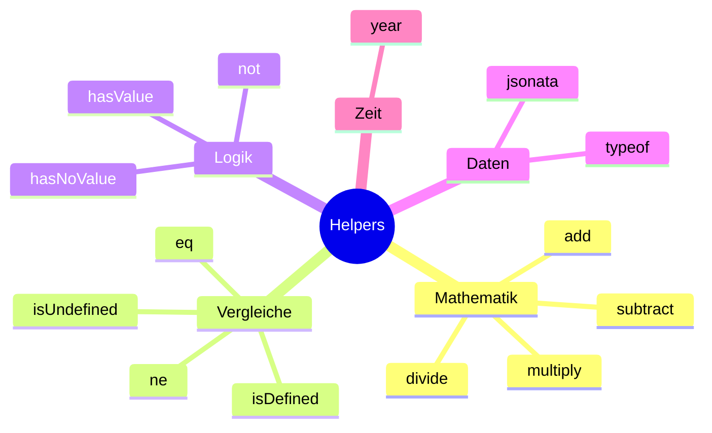

# Handlebars Helpers

Scrape Dojo erweitert Handlebars um nützliche Custom Helpers für Berechnungen, Vergleiche und Datenverarbeitung.

## Übersicht



## Mathematische Helpers

### add

Addiert zwei Zahlen.

```handlebars
{{add 5 3}}
<!-- Output: 8 -->

{{add currentData.price 10}}
<!-- Erhöht Preis um 10 -->

{{add variables.basePrice variables.tax}}
<!-- Addiert zwei Variablen -->
```

**Parameter:**
- `value` (Number): Erste Zahl
- `number` (Number): Zweite Zahl

**Rückgabe:** Number

### subtract

Subtrahiert zwei Zahlen.

```handlebars
{{subtract 10 3}}
<!-- Output: 7 -->

{{subtract 2025 1}}
<!-- Output: 2024 -->

{{subtract currentData.total currentData.discount}}
<!-- Zieht Rabatt vom Gesamtbetrag ab -->
```

**Parameter:**
- `value` (Number): Minuend
- `number` (Number): Subtrahend

**Rückgabe:** Number

### multiply

Multipliziert zwei Zahlen.

```handlebars
{{multiply 5 3}}
<!-- Output: 15 -->

{{multiply currentData.price 1.19}}
<!-- Berechnet Bruttopreis (19% MwSt) -->

{{multiply variables.quantity variables.unitPrice}}
<!-- Gesamtpreis berechnen -->
```

**Parameter:**
- `value` (Number): Multiplikand
- `number` (Number): Multiplikator

**Rückgabe:** Number

### divide

Dividiert zwei Zahlen.

```handlebars
{{divide 10 2}}
<!-- Output: 5 -->

{{divide currentData.total 100}}
<!-- Konvertiert Cent zu Euro -->
```

**Parameter:**
- `value` (Number): Dividend
- `number` (Number): Divisor

**Rückgabe:** Number

**Hinweis:** Division durch 0 sollte vermieden werden!

## Vergleichs-Helpers

### eq (equals)

Prüft auf Gleichheit.

```handlebars
{{#if (eq currentData.status "completed")}}
  Auftrag abgeschlossen
{{/if}}

{{#if (eq variables.mode "production")}}
  Production Mode
{{/if}}

{{eq "hello" "hello"}}
<!-- Output: true -->
```

**Parameter:**
- `a` (any): Erster Wert
- `b` (any): Zweiter Wert

**Rückgabe:** Boolean

### ne (not equals)

Prüft auf Ungleichheit.

```handlebars
{{#if (ne currentData.error null)}}
  Fehler aufgetreten: {{currentData.error}}
{{/if}}

{{ne 5 3}}
<!-- Output: true -->
```

**Parameter:**
- `a` (any): Erster Wert
- `b` (any): Zweiter Wert

**Rückgabe:** Boolean

### isUndefined

Prüft, ob ein Wert `undefined` ist.

```handlebars
{{#if (isUndefined currentData.optionalField)}}
  Feld nicht vorhanden
{{/if}}

{{isUndefined someVar}}
<!-- Output: true/false -->
```

**Parameter:**
- `value` (any): Zu prüfender Wert

**Rückgabe:** Boolean

### isDefined

Prüft, ob ein Wert definiert ist (nicht `undefined`).

```handlebars
{{#if (isDefined previousData.userId)}}
  User ID: {{previousData.userId}}
{{/if}}

{{isDefined someVar}}
<!-- Output: true/false -->
```

**Parameter:**
- `value` (any): Zu prüfender Wert

**Rückgabe:** Boolean

## Logik-Helpers

### not

Negiert einen Boolean-Wert.

```handlebars
{{#if (not variables.isDisabled)}}
  Feature ist aktiviert
{{/if}}

{{not true}}
<!-- Output: false -->

{{not false}}
<!-- Output: true -->
```

**Parameter:**
- `value` (Boolean): Zu negierender Wert

**Rückgabe:** Boolean

### hasValue

Prüft, ob ein Wert weder `null` noch `undefined` ist.

```handlebars
{{#if (hasValue currentData.email)}}
  Email: {{currentData.email}}
{{/if}}

{{hasValue "text"}}
<!-- Output: true -->

{{hasValue null}}
<!-- Output: false -->
```

**Parameter:**
- `value` (any): Zu prüfender Wert

**Rückgabe:** Boolean

### hasNoValue

Prüft, ob ein Wert `null` oder `undefined` ist.

```handlebars
{{#if (hasNoValue currentData.description)}}
  Keine Beschreibung verfügbar
{{/if}}

{{hasNoValue null}}
<!-- Output: true -->

{{hasNoValue undefined}}
<!-- Output: true -->
```

**Parameter:**
- `value` (any): Zu prüfender Wert

**Rückgabe:** Boolean

## Daten-Helpers

### typeof

Gibt den Datentyp eines Wertes zurück.

```handlebars
{{typeof currentData.value}}
<!-- Output: "string", "number", "object", "boolean", etc. -->

{{#if (eq (typeof currentData.items) "object")}}
  Items ist ein Objekt/Array
{{/if}}
```

**Parameter:**
- `value` (any): Wert, dessen Typ ermittelt werden soll

**Rückgabe:** String ("string", "number", "object", "boolean", "undefined", "function")

### jsonata

Wendet einen JSONata-Ausdruck auf Daten an.

```handlebars
<!-- Einfache Transformation -->
{{jsonata currentData "$uppercase(name)"}}

<!-- Array filtern -->
{{jsonata previousData.orders "$[price > 100]"}}

<!-- Aggregation -->
{{jsonata currentData.items "$sum(price)"}}
```

**Parameter:**
- `data` (any): Daten, auf die der Ausdruck angewendet wird
- `expression` (String): JSONata-Ausdruck

**Rückgabe:** String (JSON)

**Mehr zu JSONata:** [JSONata Documentation](https://jsonata.org/)

## Zeit-Helpers

### year

Gibt das aktuelle Jahr zurück.

```handlebars
© {{year}} Meine Firma
<!-- Output: © 2025 Meine Firma -->

{{subtract (year) 1}}
<!-- Output: 2024 -->
```

**Parameter:** Keine

**Rückgabe:** Number (aktuelles Jahr)

## Praktische Beispiele

### Preisberechnung mit MwSt

```handlebars
{
  "name": "calculate-price",
  "action": "logger",
  "params": {
    "message": "Nettopreis: {{currentData.price}}€, Brutto: {{multiply currentData.price 1.19}}€"
  }
}
```

### Bedingte Logik

```handlebars
{
  "name": "conditional-action",
  "action": "click",
  "params": {
    "selector": "{{#if (eq variables.mode 'premium')}}button.premium{{else}}button.standard{{/if}}"
  }
}
```

### Komplexe Berechnungen

```handlebars
{
  "name": "calculate-total",
  "action": "logger",
  "params": {
    "message": "Gesamtpreis: {{multiply (add currentData.base currentData.extras) 1.19}}€"
  }
}
```

**Rechnung:** `(base + extras) * 1.19`

### Datenvalidierung

```handlebars
{
  "name": "validate-email",
  "action": "skipIf",
  "params": {
    "condition": "{{hasNoValue previousData.email}}"
  }
}
```

### JSONata Integration

```handlebars
{
  "name": "extract-high-value-orders",
  "action": "logger",
  "params": {
    "message": "High-Value Orders: {{jsonata previousData.orders '$[total > 1000].{id: orderId, total: total}'}}"
  }
}
```

## Best Practices

### 1. Type Safety

```handlebars
<!-- ❌ Unsicher: Könnte undefined sein -->
{{add currentData.price 10}}

<!-- ✅ Sicher: Mit Fallback -->
{{#if (isDefined currentData.price)}}
  {{add currentData.price 10}}
{{else}}
  0
{{/if}}
```

### 2. Lesbarkeit

```handlebars
<!-- ❌ Schwer lesbar -->
{{multiply (add (multiply 5 3) 2) 1.19}}

<!-- ✅ Besser lesbar -->
{{multiply basePrice taxRate}}
```

Nutze sprechende Variablennamen!

### 3. Fehlerbehandlung

```handlebars
<!-- ❌ Könnte fehlschlagen -->
{{divide total count}}

<!-- ✅ Mit Nullcheck -->
{{#if (ne count 0)}}
  {{divide total count}}
{{else}}
  0
{{/if}}
```

### 4. Performance

```handlebars
<!-- ❌ Helper wird mehrfach aufgerufen -->
<div>{{year}}</div>
<div>{{year}}</div>
<div>{{year}}</div>

<!-- ✅ Einmal in Variable speichern -->
{
  "name": "store-year",
  "action": "storeData",
  "params": {
    "key": "currentYear",
    "value": "{{year}}"
  }
}
<!-- Dann nutzen: {{previousData.currentYear}} -->
```

## Kombinationen

Helpers können beliebig kombiniert werden:

```handlebars
<!-- Mathematik + Vergleich -->
{{#if (eq (add 5 3) 8)}}
  Berechnung korrekt!
{{/if}}

<!-- Logik + Datenprüfung -->
{{#if (not (hasNoValue currentData.email))}}
  Email vorhanden
{{/if}}

<!-- Verschachtelte Berechnungen -->
{{multiply (subtract (add 100 50) 10) 1.19}}
<!-- = (100 + 50 - 10) * 1.19 = 166.6 -->
```

## Fehlerbehandlung

Bei Typ-Inkompatibilität geben Helpers `undefined` oder `NaN` zurück:

```handlebars
{{add "text" 5}}
<!-- Output: NaN -->

{{multiply null 10}}
<!-- Output: 0 -->

{{jsonata invalidData "invalid[expression"}}
<!-- Output: "Error: ..." -->
```

**Tipp:** Nutze `isDefined` und `typeof` zur Validierung!

---

**Verwandte Themen:**
- [JSONata Transformationen](/de/user-guide/transform/)
- [Variables & Secrets](/de/user-guide/secrets-variables/)
- [Actions Reference](/de/user-guide/actions/)
