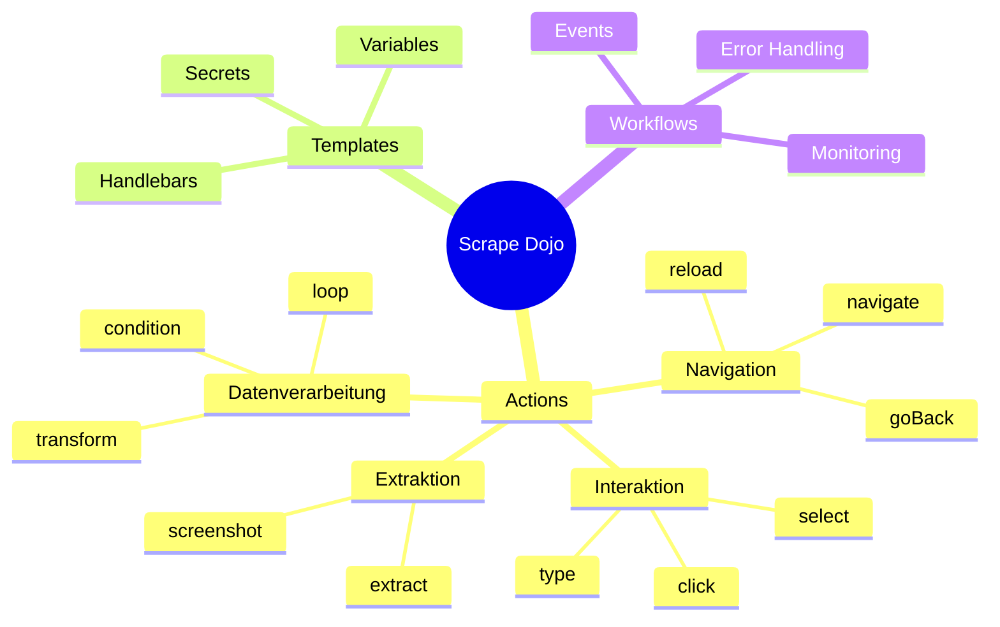

# User Guide

Dieser Bereich enthält Anleitungen und Referenzen für die tägliche Arbeit mit Scrape Dojo.

## Inhaltsverzeichnis

### Grundlagen
- [Actions Reference](/de/user-guide/actions/) - Vollständige Referenz aller verfügbaren Actions

### Erweitert
- Template-Syntax - Handlebars und Variablen (Coming Soon)
- JSONata Transformationen - Daten transformieren (Coming Soon)
- Workflows - Komplexe Scrape-Workflows (Coming Soon)

## Quick Reference



## Schnellzugriff

### Häufigste Actions

| Action | Verwendung | Beispiel |
|--------|-----------|----------|
| `navigate` | Seite öffnen | `{"type": "navigate", "url": "..."}` |
| `click` | Element klicken | `{"type": "click", "selector": "..."}` |
| `extract` | Daten extrahieren | `{"type": "extract", "selector": "..."}` |
| `type` | Text eingeben | `{"type": "type", "value": "..."}` |
| `wait` | Pause | `{"type": "wait", "timeout": 1000}` |

### Template-Syntax

```handlebars
{{variables.myVar}}     - Variable
{{secrets.mySecret}}    - Secret
{{previousData.field}}  - Vorheriges Ergebnis
{{currentData}}         - Loop-Element
```

### JSONata Basics

```javascript
previousData[price > 100]        // Filtern
previousData^(>price)            // Sortieren
previousData.{                   // Transformieren
  "name": title,
  "cost": price
}
```

## Weiterführende Links

Für detaillierte Informationen besuche die entsprechenden Unterseiten.
