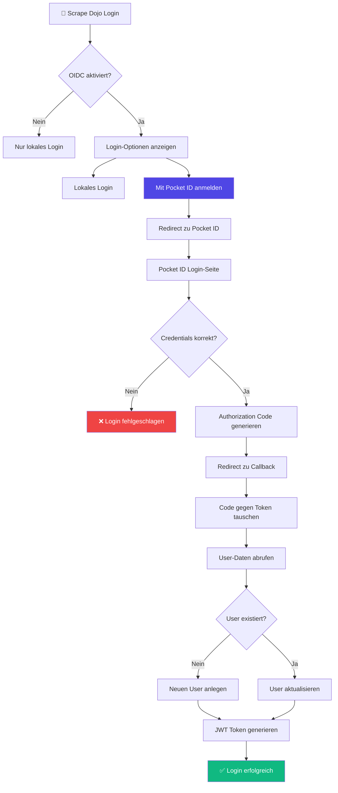

# OIDC/SSO Einrichtung

Scrape Dojo unterstützt Single Sign-On (SSO) über OpenID Connect (OIDC). Diese Anleitung zeigt die Einrichtung am Beispiel von **Pocket ID** – einem einfachen, selbst-gehosteten OIDC-Provider.

## Übersicht

```mermaid
sequenceDiagram
    autonumber
    participant User as 👤 User
    participant Dojo as 🥋 Scrape Dojo
    participant OIDC as 🔐 OIDC Provider<br/>(Pocket ID)
    
    User->>Dojo: Klick "Mit OIDC anmelden"
    Dojo->>OIDC: Redirect zu Login<br/>(Authorization Request)
    
    Note over OIDC: User authentifiziert sich
    
    OIDC->>User: Login-Formular anzeigen
    User->>OIDC: Username & Password
    OIDC->>OIDC: Validierung
    
    OIDC->>Dojo: Redirect mit Code<br/>(Authorization Code)
    Dojo->>OIDC: Code gegen Token tauschen<br/>(Token Request)
    OIDC->>Dojo: Access Token + ID Token
    
    Dojo->>OIDC: UserInfo Request
    OIDC->>Dojo: User-Daten (email, name)
    
    Dojo->>Dojo: User anlegen/aktualisieren
    Dojo->>User: Login erfolgreich ✅
    
    style OIDC fill:#4f46e5,color:#fff
    style Dojo fill:#10b981,color:#fff
```

## Voraussetzungen

- Zugriff auf einen OIDC-Provider (z.B. Pocket ID, Keycloak, Auth0)
- Admin-Rechte zum Erstellen von OAuth-Clients
- Scrape Dojo mit aktivierter Authentifizierung

## Teil 1: OIDC-Provider (Pocket ID) konfigurieren

### Schritt 1: Neuen Client erstellen

Melden Sie sich bei Pocket ID an und erstellen Sie einen neuen OAuth 2.0 Client:


### Schritt 2: Client-Einstellungen

Konfigurieren Sie den Client mit folgenden Einstellungen:

#### Name
```
ScrapeDojo
```
Der Name wird dem Benutzer beim Login angezeigt.

#### Client-ID
```
<automatisch generiert>
```
Wird von Pocket ID automatisch erstellt. **Notieren Sie diese ID!**

#### Client-Geheimnis
```
<generiert beim Speichern>
```
Das Secret wird nur **einmal** beim Erstellen angezeigt. **Sichern Sie es sofort!**

#### Client-Start-URL
```
http://localhost:4200
```
Für lokale Entwicklung. In Produktion:
```
https://scrape-dojo.yourdomain.com
```

Die URL, die geöffnet wird, wenn der Benutzer die App startet.

#### Callback-URLs (Redirect URIs)

```
http://localhost:3000/auth/oidc/callback
```

Für Produktion mit reverse proxy:
```
https://scrape-dojo.yourdomain.com/auth/oidc/callback
```

:::caution[Wichtig]
Die Callback-URL **muss exakt** mit der konfigurierten `SCRAPE_DOJO_AUTH_OIDC_REDIRECT_URI` übereinstimmen!
:::

#### Abmelde-Callback-URLs (Optional)

```
http://localhost:4200/auth/login
```

Wohin der Benutzer nach dem Logout weitergeleitet wird.

### Schritt 3: Erweiterte Optionen

#### Öffentlicher Client
```
❌ Deaktiviert
```
Scrape Dojo ist ein **vertraulicher Client** (verwendet Client-Secret).

#### PKCE erforderlich
```
✅ Aktiviert
```
**Proof Key for Code Exchange** erhöht die Sicherheit. Scrape Dojo unterstützt PKCE vollständig.

:::tip[Best Practice]
Aktivieren Sie PKCE immer, wenn der Provider es unterstützt!
:::

### Schritt 4: Client-Informationen speichern

Nach dem Speichern erhalten Sie:

| Parameter | Beispiel-Wert | Verwendung |
|-----------|---------------|------------|
| **Client-ID** | `a1b2c3d4-e5f6-7890-abcd-ef1234567890` | `SCRAPE_DOJO_AUTH_OIDC_CLIENT_ID` |
| **Client-Geheimnis** | `super-secret-string-only-shown-once` | `SCRAPE_DOJO_AUTH_OIDC_CLIENT_SECRET` |
| **Issuer URL** | `http://localhost:8080` | `SCRAPE_DOJO_AUTH_OIDC_ISSUER_URL` |

:::danger[Client-Geheimnis sichern]
Das Client-Geheimnis wird nur **einmal** angezeigt. Speichern Sie es sofort in einem Passwort-Manager!
:::

## Teil 2: Scrape Dojo konfigurieren

### Schritt 1: Environment-Variablen setzen

Erstellen Sie eine `.env` Datei oder ergänzen Sie die bestehende:

```bash
# ========================================
# Authentication
# ========================================
SCRAPE_DOJO_AUTH_ENABLED=true
SCRAPE_DOJO_AUTH_JWT_SECRET=your-super-secret-jwt-key-min-32-chars

# ========================================
# OIDC Configuration
# ========================================
SCRAPE_DOJO_AUTH_OIDC_ENABLED=true

# Pocket ID Issuer URL
SCRAPE_DOJO_AUTH_OIDC_ISSUER_URL=http://localhost:8080

# Client-Credentials von Pocket ID
SCRAPE_DOJO_AUTH_OIDC_CLIENT_ID=a1b2c3d4-e5f6-7890-abcd-ef1234567890
SCRAPE_DOJO_AUTH_OIDC_CLIENT_SECRET=super-secret-string-only-shown-once

# Callback URL (muss mit Pocket ID übereinstimmen!)
SCRAPE_DOJO_AUTH_OIDC_REDIRECT_URI=http://localhost:3000/auth/oidc/callback

# Optional: Scopes anpassen
SCRAPE_DOJO_AUTH_OIDC_SCOPES=openid profile email

# Optional: Provider-Name für UI
SCRAPE_DOJO_AUTH_OIDC_PROVIDER_NAME=Pocket ID
```

### Schritt 2: Docker Compose (optional)

Wenn Sie Docker Compose verwenden:

```yaml
# docker-compose.yml
version: '3.8'

services:
  api:
    image: scrape-dojo-api
    environment:
      # Authentication
      SCRAPE_DOJO_AUTH_ENABLED: "true"
      SCRAPE_DOJO_AUTH_JWT_SECRET: "${JWT_SECRET}"
      
      # OIDC
      SCRAPE_DOJO_AUTH_OIDC_ENABLED: "true"
      SCRAPE_DOJO_AUTH_OIDC_ISSUER_URL: "http://pocket-id:8080"
      SCRAPE_DOJO_AUTH_OIDC_CLIENT_ID: "${OIDC_CLIENT_ID}"
      SCRAPE_DOJO_AUTH_OIDC_CLIENT_SECRET: "${OIDC_CLIENT_SECRET}"
      SCRAPE_DOJO_AUTH_OIDC_REDIRECT_URI: "http://localhost:3000/auth/oidc/callback"
      SCRAPE_DOJO_AUTH_OIDC_PROVIDER_NAME: "Pocket ID"
    depends_on:
      - pocket-id
  
  # Optional: Pocket ID als Service
  pocket-id:
    image: stonith404/pocket-id:latest
    ports:
      - "8080:8080"
    volumes:
      - pocket-id-data:/app/backend/data
    environment:
      PUBLIC_APP_URL: "http://localhost:8080"

volumes:
  pocket-id-data:
```

### Schritt 3: Konfiguration validieren

Starten Sie Scrape Dojo und prüfen Sie die Logs:

```bash
pnpm nx serve api
```

**Erfolgreiche Logs:**
```
🔐 Discovering OIDC provider: http://localhost:8080
✅ OIDC provider discovered: Pocket ID
```

**Fehler-Logs:**
```
⚠️ OIDC enabled but missing configuration (issuer URL or client ID)
❌ Failed to discover OIDC provider: <error>
```

## Teil 3: OIDC-Login testen

### Login-Flow



### Schritt 1: Login-Seite öffnen

Navigieren Sie zu:
```
http://localhost:4200/auth/login
```

Sie sollten zwei Login-Optionen sehen:
- ✉️ **Lokales Login** (Username & Password)
- 🔐 **Mit Pocket ID anmelden**

### Schritt 2: OIDC-Login durchführen

1. Klicken Sie auf **"Mit Pocket ID anmelden"**
2. Sie werden zu Pocket ID weitergeleitet
3. Melden Sie sich mit Ihren Pocket ID Credentials an
4. Pocket ID fragt nach Berechtigung (Consent Screen)
5. Nach Zustimmung: Redirect zurück zu Scrape Dojo
6. Automatischer Login ✅

### Schritt 3: User-Mapping prüfen

Nach erfolgreichem Login wird der User automatisch angelegt:

```typescript
// Backend User-Entity
{
  id: 1,
  email: "user@example.com",          // von OIDC
  username: "user@example.com",        // fallback auf email
  displayName: "John Doe",             // von OIDC (name claim)
  authProvider: "oidc",                // Provider-Typ
  oidcSub: "pocket-id-user-123",       // OIDC subject ID
  oidcIssuer: "http://localhost:8080", // Issuer
  role: "user",                        // Standard-Rolle
  mfaEnabled: false,                   // OIDC umgeht lokale MFA
  password: null                       // Kein lokales Passwort!
}
```

:::tip[User-Verknüpfung]
Benutzer werden über `oidcSub` + `oidcIssuer` identifiziert. Bei erneutem Login wird der bestehende User aktualisiert.
:::

## Fortgeschrittene Konfiguration

### Mehrere OIDC-Provider

Aktuell unterstützt Scrape Dojo **einen** OIDC-Provider. Für mehrere Provider:

```bash
# Haupt-Provider
SCRAPE_DOJO_AUTH_OIDC_ENABLED=true
SCRAPE_DOJO_AUTH_OIDC_ISSUER_URL=https://primary-idp.com
SCRAPE_DOJO_AUTH_OIDC_CLIENT_ID=client-1
SCRAPE_DOJO_AUTH_OIDC_CLIENT_SECRET=secret-1
```

:::note[Roadmap]
Multi-Provider-Support ist für zukünftige Versionen geplant.
:::

### Custom Scopes

Standard-Scopes:
```bash
SCRAPE_DOJO_AUTH_OIDC_SCOPES=openid profile email
```

Erweiterte Scopes (falls Provider unterstützt):
```bash
SCRAPE_DOJO_AUTH_OIDC_SCOPES=openid profile email phone address groups
```

### Claims Mapping

Scrape Dojo verwendet folgende Claims aus dem ID Token:

| Claim | Verwendung | Fallback |
|-------|------------|----------|
| `sub` | Eindeutige User-ID | - (required) |
| `email` | Email-Adresse | - (required) |
| `name` | Display-Name | `preferred_username` oder `email` |
| `preferred_username` | Username | `email` |
| `picture` | Avatar-URL | - (optional) |

### Provider-spezifische Konfiguration

#### Pocket ID
```bash
SCRAPE_DOJO_AUTH_OIDC_ISSUER_URL=http://pocket-id:8080
SCRAPE_DOJO_AUTH_OIDC_PROVIDER_NAME=Pocket ID
```

#### Keycloak
```bash
SCRAPE_DOJO_AUTH_OIDC_ISSUER_URL=https://keycloak.example.com/realms/master
SCRAPE_DOJO_AUTH_OIDC_PROVIDER_NAME=Keycloak
```

#### Auth0
```bash
SCRAPE_DOJO_AUTH_OIDC_ISSUER_URL=https://your-tenant.auth0.com
SCRAPE_DOJO_AUTH_OIDC_PROVIDER_NAME=Auth0
```

#### Google
```bash
SCRAPE_DOJO_AUTH_OIDC_ISSUER_URL=https://accounts.google.com
SCRAPE_DOJO_AUTH_OIDC_PROVIDER_NAME=Google
```

:::caution[Google-Spezifika]
Google erfordert zusätzlich eine Verifizierung der Domain und OAuth-Consent-Screen-Konfiguration in der Google Cloud Console.
:::

#### Microsoft Entra ID (Azure AD)
```bash
SCRAPE_DOJO_AUTH_OIDC_ISSUER_URL=https://login.microsoftonline.com/{tenant-id}/v2.0
SCRAPE_DOJO_AUTH_OIDC_PROVIDER_NAME=Microsoft
```

## Reverse Proxy Setup

### Nginx

```nginx
server {
    listen 443 ssl;
    server_name scrape-dojo.example.com;
    
    ssl_certificate /etc/ssl/certs/scrape-dojo.crt;
    ssl_certificate_key /etc/ssl/private/scrape-dojo.key;
    
    # UI
    location / {
        proxy_pass http://localhost:4200;
        proxy_http_version 1.1;
        proxy_set_header Upgrade $http_upgrade;
        proxy_set_header Connection 'upgrade';
        proxy_set_header Host $host;
        proxy_cache_bypass $http_upgrade;
    }
    
    # API
    location /api/ {
        proxy_pass http://localhost:3000/api/;
        proxy_http_version 1.1;
        proxy_set_header Host $host;
        proxy_set_header X-Real-IP $remote_addr;
        proxy_set_header X-Forwarded-For $proxy_add_x_forwarded_for;
        proxy_set_header X-Forwarded-Proto $scheme;
    }
    
    # OIDC Callback (direkter Zugriff ohne /api Prefix)
    location /auth/oidc/ {
        proxy_pass http://localhost:3000/auth/oidc/;
        proxy_http_version 1.1;
        proxy_set_header Host $host;
        proxy_set_header X-Real-IP $remote_addr;
        proxy_set_header X-Forwarded-For $proxy_add_x_forwarded_for;
        proxy_set_header X-Forwarded-Proto $scheme;
    }
}
```

**Wichtig:** Redirect URI anpassen:
```bash
SCRAPE_DOJO_AUTH_OIDC_REDIRECT_URI=https://scrape-dojo.example.com/auth/oidc/callback
```

### Traefik

```yaml
# docker-compose.yml
services:
  api:
    labels:
      - "traefik.enable=true"
      - "traefik.http.routers.scrape-dojo-api.rule=Host(`scrape-dojo.example.com`) && PathPrefix(`/api`)"
      - "traefik.http.routers.scrape-dojo-api.entrypoints=websecure"
      - "traefik.http.routers.scrape-dojo-api.tls=true"
      
      # OIDC Callback Route
      - "traefik.http.routers.scrape-dojo-oidc.rule=Host(`scrape-dojo.example.com`) && PathPrefix(`/auth/oidc`)"
      - "traefik.http.routers.scrape-dojo-oidc.entrypoints=websecure"
      - "traefik.http.routers.scrape-dojo-oidc.tls=true"
```

## Troubleshooting

### Problem: "OIDC is not configured"

**Symptom:**
```
🔐 OIDC authentication is disabled
```

**Lösung:**
1. Prüfen Sie `SCRAPE_DOJO_AUTH_OIDC_ENABLED=true`
2. Prüfen Sie Issuer URL und Client ID
3. Logs nach Fehlern durchsuchen

### Problem: "Invalid redirect_uri"

**Symptom:**
```
Error: redirect_uri mismatch
```

**Lösung:**
1. Vergleichen Sie `.env` Datei mit OIDC-Provider-Konfiguration
2. Achten Sie auf `http` vs. `https`
3. Achten Sie auf Trailing Slashes
4. Port-Nummern müssen identisch sein

**Beispiel:**
```bash
# ❌ Falsch
SCRAPE_DOJO_AUTH_OIDC_REDIRECT_URI=http://localhost:3000/auth/oidc/callback/
Pocket ID: http://localhost:3333/auth/oidc/callback

# ✅ Korrekt
SCRAPE_DOJO_AUTH_OIDC_REDIRECT_URI=http://localhost:3000/auth/oidc/callback
Pocket ID: http://localhost:3000/auth/oidc/callback
```

### Problem: "Discovery failed"

**Symptom:**
```
❌ Failed to discover OIDC provider: ECONNREFUSED
```

**Lösung:**
1. Prüfen Sie, ob OIDC-Provider erreichbar ist:
   ```bash
   curl http://localhost:8080/.well-known/openid-configuration
   ```
2. Network-Konnektivität prüfen (Docker-Netzwerk?)
3. Firewall-Regeln prüfen

### Problem: "Email not provided by OIDC provider"

**Symptom:**
```
BadRequestException: Email not provided by OIDC provider
```

**Lösung:**
1. Prüfen Sie Scopes: `email` muss enthalten sein
2. Prüfen Sie Provider-Konfiguration: Email-Claim aktiviert?
3. Testen Sie mit UserInfo Endpoint:
   ```bash
   curl -H "Authorization: Bearer <token>" \
     http://localhost:8080/userinfo
   ```

### Problem: Button "Mit OIDC anmelden" wird nicht angezeigt

**Symptom:**
Login-Seite zeigt nur lokales Login-Formular.

**Lösung:**
1. Browser-Console öffnen (F12)
2. Network-Tab → Request zu `/api/auth/oidc/config`
3. Response prüfen:
   ```json
   {
     "enabled": true,
     "name": "Pocket ID",
     "loginUrl": "/auth/oidc/login"
   }
   ```
4. Falls `enabled: false`: Backend-Logs prüfen
5. Cache leeren und Seite neu laden

### Problem: PKCE-Fehler

**Symptom:**
```
Error: code_verifier is missing or invalid
```

**Lösung:**
1. State-Parameter wird falsch übertragen
2. In-Memory-Cache des Backends wurde geleert (Restart?)
3. PKCE-Timeout (10 Minuten) überschritten

**Workaround:**
Login-Flow erneut starten.

## Sicherheits-Best-Practices

### ✅ Do's

1. **Verwenden Sie HTTPS in Produktion**
   ```bash
   SCRAPE_DOJO_AUTH_OIDC_REDIRECT_URI=https://scrape-dojo.example.com/auth/oidc/callback
   ```

2. **Aktivieren Sie PKCE**
   - Schützt vor Authorization Code Interception

3. **Sichere Secrets**
   ```bash
   # ❌ Nie in Git committen!
   SCRAPE_DOJO_AUTH_OIDC_CLIENT_SECRET=super-secret
   
   # ✅ Nutze Secret-Management
   # - Docker Secrets
   # - Kubernetes Secrets
   # - Vault
   ```

4. **Minimal-Scopes verwenden**
   ```bash
   # Nur was wirklich benötigt wird
   SCRAPE_DOJO_AUTH_OIDC_SCOPES=openid email profile
   ```

5. **Token-Ablaufzeiten konfigurieren**
   ```bash
   SCRAPE_DOJO_AUTH_ACCESS_TOKEN_EXPIRY=15m
   SCRAPE_DOJO_AUTH_REFRESH_TOKEN_EXPIRY=7d
   ```

### ❌ Don'ts

1. **Keine unsicheren Redirect-URIs**
   ```bash
   # ❌ Wildcard
   http://*:3000/callback
   
   # ❌ HTTP in Produktion
   http://scrape-dojo.example.com/callback
   ```

2. **Secrets nicht loggen**
   ```typescript
   // ❌ Niemals!
   console.log('Client Secret:', clientSecret);
   ```

3. **Keine State-Parameter wiederverwenden**
   - Wird von Scrape Dojo automatisch verhindert

4. **Keine ID-Tokens im Frontend speichern**
   - Scrape Dojo speichert nur JWT Access-Token

## Migration von lokalem Login

### Szenario: Bestehende Benutzer zu OIDC migrieren

**Problem:** Lokale Benutzer haben `authProvider: 'local'`, OIDC-Login erstellt neue Benutzer.

**Lösung:** Email-basiertes Matching aktivieren (zukünftiges Feature).

**Workaround:**
1. Admin-Account über OIDC erstellen
2. Alte lokale Accounts deaktivieren
3. User auffordern, sich neu mit OIDC anzumelden

### Gleichzeitiger Betrieb: Lokal + OIDC

```bash
# Beide Methoden aktiviert
SCRAPE_DOJO_AUTH_ENABLED=true          # Lokales Login
SCRAPE_DOJO_AUTH_OIDC_ENABLED=true     # OIDC Login
```

**Verhalten:**
- Login-Seite zeigt **beide** Optionen
- User können frei wählen
- Gleiche Email-Adresse = verschiedene Accounts (wenn unterschiedlicher Provider)

:::tip[Best Practice]
In Unternehmens-Umgebungen: Nur OIDC aktivieren, lokales Login deaktivieren.
:::

---

**Verwandte Themen:**
- [Authentication Flow](/de/architecture/authentication/)
- [Environment Variables](/de/developer/environment-variables/)
- [API Modules](/de/architecture/api-modules/)
- [Security Best Practices](#sicherheits-best-practices)
