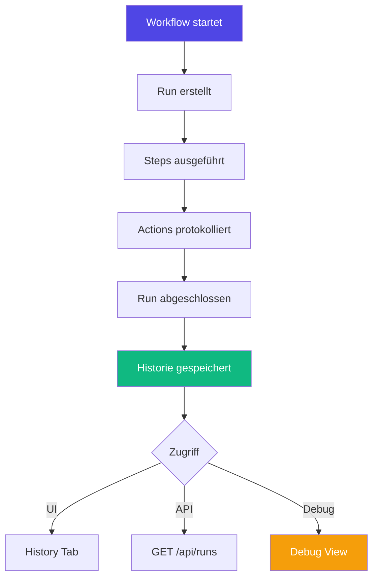
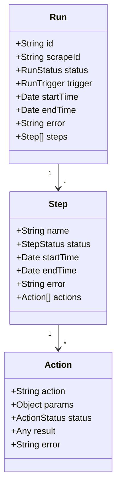
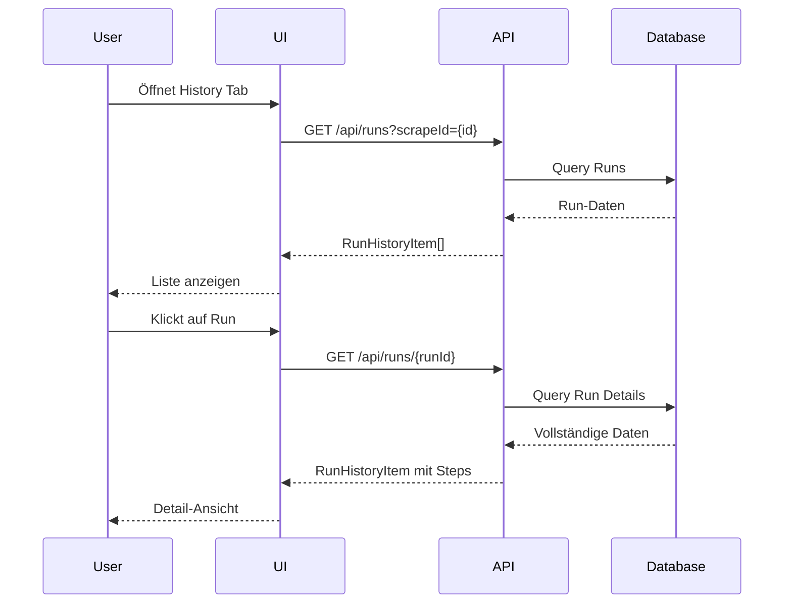
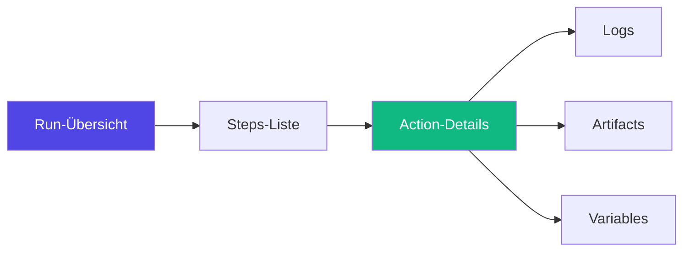
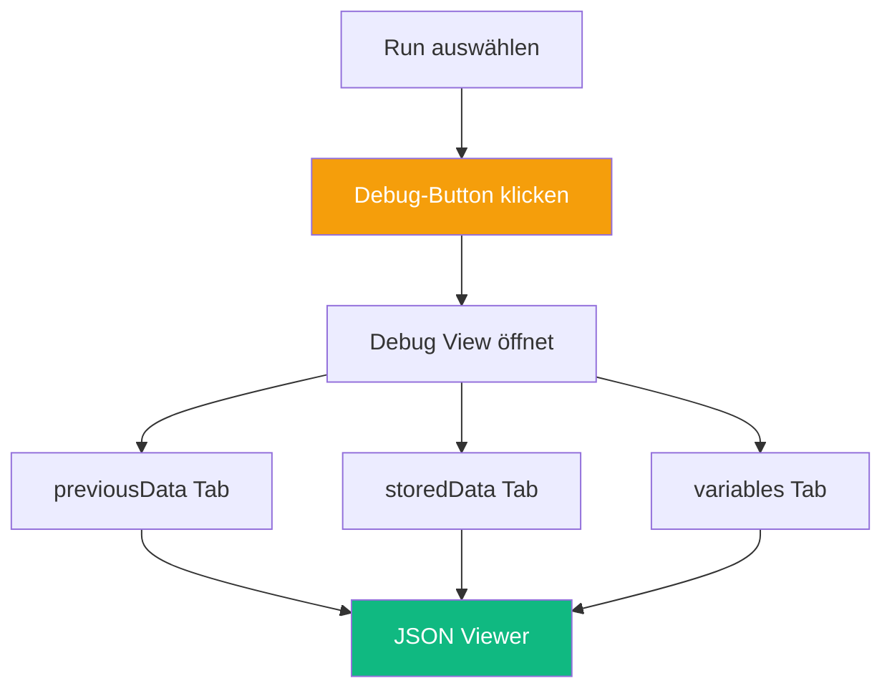
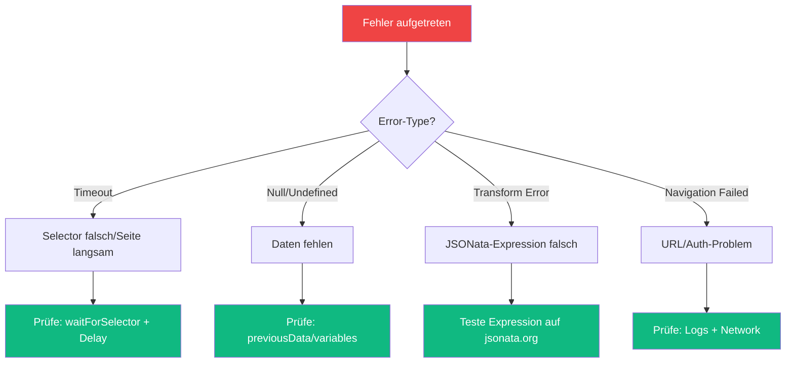

# Run History & Debugging

Jede Workflow-Ausführung wird vollständig protokolliert und kann nachvollzogen werden. Die Run History ist essentiell für Monitoring, Debugging und Optimierung.

## Übersicht



## Run-Struktur

Jeder Run enthält:



### Run-Status

| Status | Bedeutung | Icon |
|--------|-----------|------|
| `running` | Läuft aktuell | 🔄 |
| `completed` | Erfolgreich abgeschlossen | ✅ |
| `error` | Mit Fehler beendet | ❌ |
| `aborted` | Manuell abgebrochen | ⏹️ |

### Trigger-Typen

| Trigger | Beschreibung |
|---------|--------------|
| `manual` | Manuell über UI gestartet |
| `scheduled` | Via Cron-Schedule ausgeführt |
| `api` | Per Webhook/API ausgelöst |

## Run History in der UI

### History Tab



### Run auswählen

Im History Tab siehst du:

- **Run ID**: Eindeutige Kennung (z.B. `run-1704067200000-abc123`)
- **Status**: Visueller Indikator (grün/rot/gelb)
- **Trigger**: Wie wurde gestartet
- **Dauer**: Gesamtlaufzeit
- **Zeitpunkt**: Start- und Endzeit
- **Schritte**: Anzahl erfolgreicher/fehlgeschlagener Steps

### Detail-Ansicht

Klicke auf einen Run für Details:



**Enthält:**
- Vollständige Step-Hierarchie (inkl. verschachtelte Loops)
- Action-Parameter und Resultate
- Error-Messages mit Stack Traces
- Artifacts (Screenshots, Dateien, Daten)
- Runtime-Variablen

## Run-Management via API

### Alle Runs abrufen

```bash
# Alle Runs (limitiert)
GET /api/runs?limit=50

# Runs für bestimmten Scrape
GET /api/runs?scrapeId=my-workflow&limit=100
```

**Response:**
```json
[
  {
    "id": "run-1704067200000-abc123",
    "scrapeId": "my-workflow",
    "status": "completed",
    "trigger": "manual",
    "startTime": "2025-01-11T10:00:00.000Z",
    "endTime": "2025-01-11T10:05:30.000Z",
    "duration": 330000,
    "error": null,
    "stepCount": 5,
    "actionCount": 23
  }
]
```

### Einzelnen Run abrufen

```bash
GET /api/runs/{runId}
```

**Response:**
```json
{
  "id": "run-1704067200000-abc123",
  "scrapeId": "my-workflow",
  "status": "completed",
  "trigger": "manual",
  "startTime": "2025-01-11T10:00:00.000Z",
  "endTime": "2025-01-11T10:05:30.000Z",
  "error": null,
  "steps": [
    {
      "name": "step-1",
      "status": "completed",
      "startTime": "2025-01-11T10:00:00.000Z",
      "endTime": "2025-01-11T10:01:00.000Z",
      "actions": [
        {
          "name": "navigate",
          "action": "navigate",
          "status": "completed",
          "params": {
            "url": "https://example.com"
          },
          "result": null
        }
      ]
    }
  ]
}
```

### Debug-Daten abrufen

Detaillierte Debug-Informationen mit vollständigen Daten:

```bash
GET /api/runs/{runId}/debug
```

**Response:**
```json
{
  "run": { /* Run-Daten */ },
  "previousData": {
    "step-1-navigate": null,
    "step-2-extract": {
      "title": "Example Page",
      "price": "99.99"
    }
  },
  "storedData": {
    "lastUpdate": "2025-01-10",
    "cache": { /* ... */ }
  },
  "variables": {
    "mode": "production",
    "apiKey": "***"
  }
}
```

### Run löschen

```bash
# Einzelnen Run löschen
DELETE /api/runs/{runId}

# Alle Runs eines Scrapes löschen
DELETE /api/scrapes/{scrapeId}/runs

# Alte Runs aufräumen (älter als X Tage)
POST /api/runs/cleanup
{
  "days": 30
}
```

## Debugging

### Debug View in der UI

Die Debug-Ansicht zeigt:

1. **previousData**: Alle Zwischenergebnisse der Actions
2. **storedData**: Persistent gespeicherte Daten
3. **variables**: Runtime-Variablen
4. **secrets**: Referenzen (keine Werte!)



### Häufige Debug-Szenarien

#### 1. Action gibt falsches Ergebnis

```bash
# Prüfe previousData nach der Action
GET /api/runs/{runId}/debug

# Schaue in: previousData["action-name"]
```

**Beispiel:**
```json
{
  "previousData": {
    "extract-price": "€99,99"  // ❌ String statt Number
  }
}
```

**Lösung:** Füge Transform-Action hinzu:
```jsonc
{
  "name": "clean-price",
  "action": "transform",
  "params": {
    "previousDataKey": "extract-price",
    "expression": "$number($replace($, '€', '') ~> $replace(',', '.'))"
  }
}
```

#### 2. Variable nicht verfügbar

```bash
GET /api/runs/{runId}/debug
```

Prüfe in `variables`:
```json
{
  "variables": {
    "mode": "development"
    // ❌ "apiKey" fehlt!
  }
}
```

**Lösung:** Setze Variable in Environment oder UI.

#### 3. Loop iteration fehlgeschlagen

```json
{
  "steps": [
    {
      "name": "process-items",
      "actions": [
        {
          "name": "loop-action",
          "loopPath": [
            { "name": "orders", "index": 0 },
            { "name": "items", "index": 3 }  // ❌ Hier failed
          ],
          "status": "error",
          "error": "Cannot read property 'price' of undefined"
        }
      ]
    }
  ]
}
```

**Debug:** Prüfe `currentData.items[3]` im vorherigen Loop.

### Error-Analyse



## Run Cleanup

### Automatisches Cleanup

```jsonc
// .env
SCRAPE_DOJO_RUN_RETENTION_DAYS=30
```

Alte Runs werden automatisch gelöscht.

### Manuelles Cleanup

```bash
# Via API
POST /api/runs/cleanup
{
  "days": 60,
  "status": "completed"  // Optional: nur erfolgreiche
}

# Response
{
  "deleted": 142,
  "message": "Deleted 142 runs older than 60 days"
}
```

### Selective Deletion

```bash
# Nur fehlerhafte Runs löschen
POST /api/runs/cleanup
{
  "days": 7,
  "status": "error"
}

# Alle Runs eines bestimmten Scrapes
DELETE /api/scrapes/old-workflow/runs
```

## Performance-Monitoring

### Run-Statistiken

```bash
# Letzte Runs für jeden Scrape
GET /api/scrapes/stats
```

**Response:**
```json
{
  "workflow-1": {
    "lastRun": "2025-01-11T10:00:00.000Z",
    "lastStatus": "completed",
    "avgDuration": 45000,
    "successRate": 0.98
  }
}
```

### Slow Runs identifizieren

```bash
# Runs sortiert nach Dauer
GET /api/runs?limit=50&sort=duration&order=desc
```

**Analyse:**
- Welche Steps dauern am längsten?
- Gibt es Timeouts?
- Können Actions parallelisiert werden?

## Best Practices

### 1. Retention Policy

```bash
# Production: 90 Tage
SCRAPE_DOJO_RUN_RETENTION_DAYS=90

# Development: 7 Tage
SCRAPE_DOJO_RUN_RETENTION_DAYS=7
```

**Regel:** Erfolgreichekürzer, Fehler länger behalten.

### 2. Logging

Nutze `logger` Actions für wichtige Checkpoints:

```jsonc
{
  "name": "log-progress",
  "action": "logger",
  "params": {
    "message": "Checkpoint: {{currentData.items.length}} Items verarbeitet"
  }
}
```

### 3. Artifacts speichern

Bei komplexen Workflows:

```jsonc
{
  "name": "save-intermediate-result",
  "action": "artifacts",
  "params": {
    "type": "json",
    "title": "Zwischenergebnis Step {{currentStep}}",
    "data": "{{previousData.extractedData}}"
  }
}
```

### 4. Error-Handling

```jsonc
{
  "name": "safe-extract",
  "action": "extract",
  "params": {
    "selector": "div.price",
    "attribute": "textContent",
    "required": false  // Kein Fehler bei fehlendem Element
  }
}
```

### 5. Debug-Mode

Während Entwicklung:

```jsonc
{
  "metadata": {
    "debug": true  // Speichert mehr Details
  }
}
```

## Troubleshooting

### Run erscheint nicht in Historie

**Ursachen:**
1. Run noch nicht abgeschlossen (Status: `running`)
2. Datenbankfehler beim Speichern
3. UI-Cache nicht aktualisiert

**Lösung:**
```bash
# Prüfe direkt via API
GET /api/runs?scrapeId={id}&limit=100

# Force-Reload in UI (Strg+Shift+R)
```

### Debug-Daten unvollständig

**Ursache:** `previousData` wird bei sehr großen Runs gekürzt.

**Lösung:**
```bash
# Erhöhe Limit
SCRAPE_DOJO_MAX_PREVIOUS_DATA_SIZE=10485760  # 10MB
```

### Runs verschwinden zu schnell

**Prüfe Retention:**
```bash
# .env
SCRAPE_DOJO_RUN_RETENTION_DAYS=90
```

---

**Verwandte Themen:**
- [Scheduling](/de/user-guide/scheduling/)
- [Actions Reference](/de/user-guide/actions/)
- [API Reference](/de/api/reference/)
