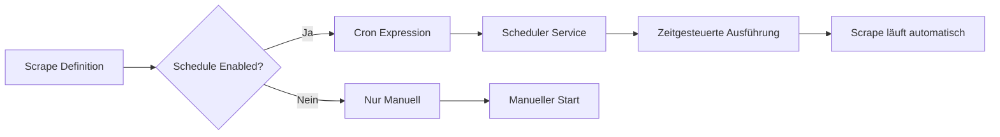
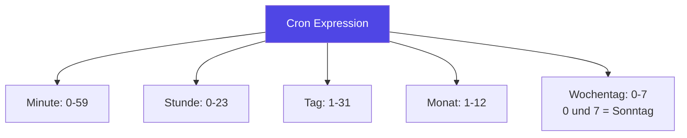
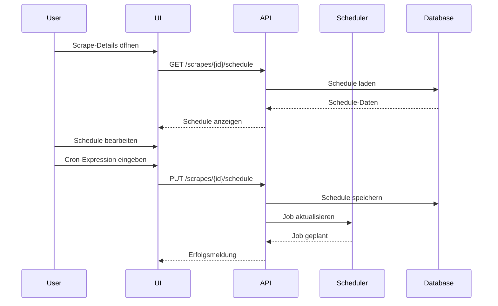
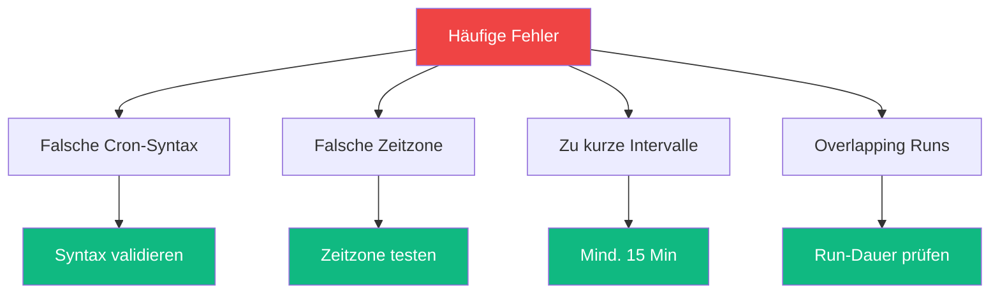
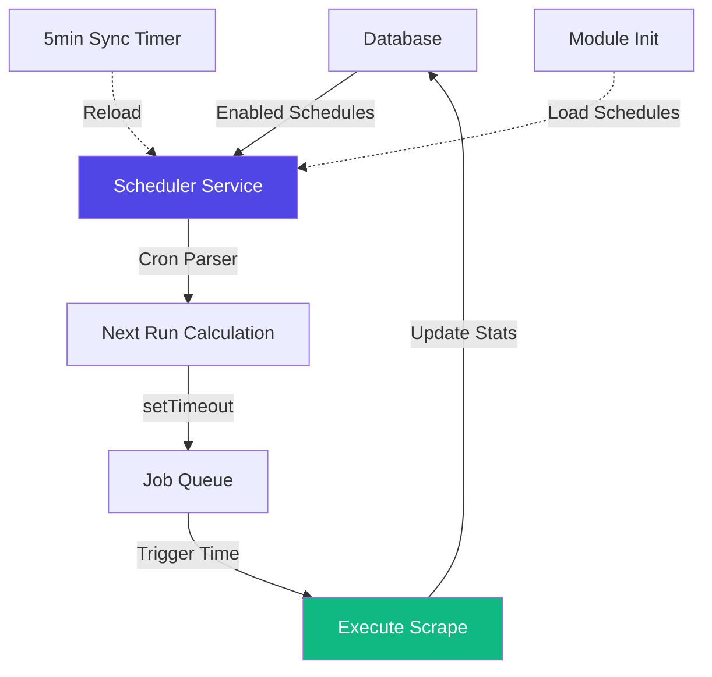
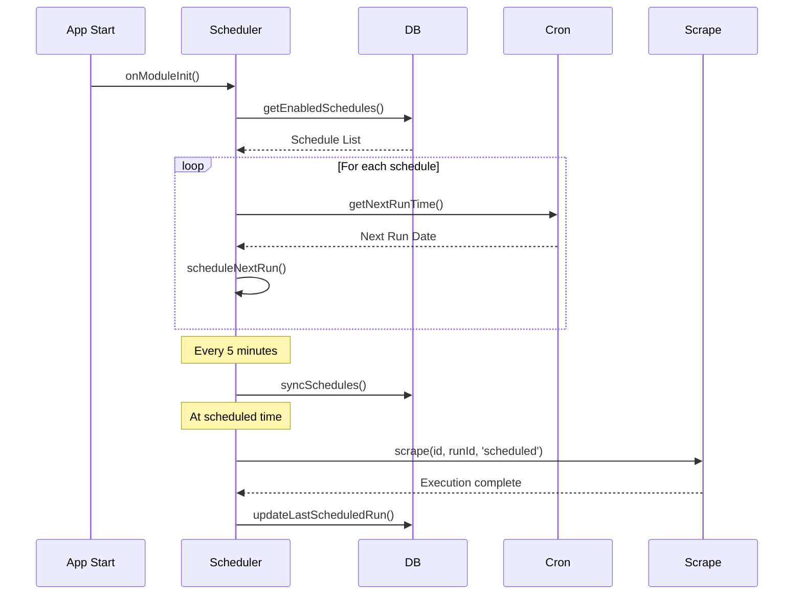
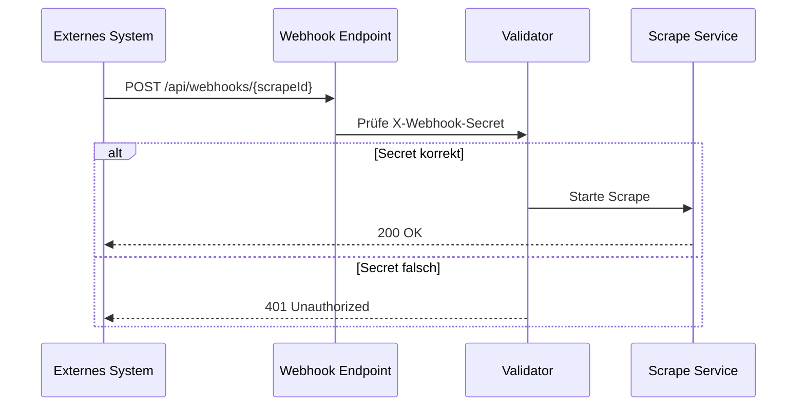
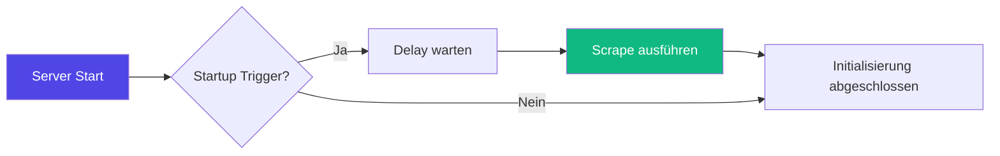

# Automatisierte Scrapes mit dem Scheduler

Der Scheduler ermöglicht es, Scrapes automatisch zu festgelegten Zeiten auszuführen. Dies ist ideal für:

- **Regelmäßige Datenaktualisierungen** (täglich, wöchentlich, monatlich)
- **Monitoring** (stündliche Prüfungen)
- **Berichte** (monatliche Zusammenfassungen)

## Übersicht



## Schedule-Einstellungen

Jeder Scrape kann individuell konfiguriert werden:

### Eigenschaften

| Eigenschaft | Typ | Beschreibung |
|-------------|-----|--------------|
| `manualEnabled` | Boolean | Erlaubt manuelle Ausführung über UI/API |
| `scheduleEnabled` | Boolean | Aktiviert automatische Ausführung |
| `cronExpression` | String | Cron-Ausdruck für Zeitplan |
| `timezone` | String | Zeitzone (default: `Europe/Berlin`) |

### Schedule-Status

Der Scheduler zeigt für jeden aktiven Schedule:
- **Last Run**: Zeitpunkt der letzten automatischen Ausführung
- **Next Run**: Zeitpunkt der nächsten geplanten Ausführung
- **Status**: Aktiv oder Deaktiviert

## Cron-Expressions

Cron-Expressions definieren den Zeitplan. Format: `Minute Stunde Tag Monat Wochentag`

### Beispiele

```bash
# Täglich um 9:00 Uhr
0 9 * * *

# Jeden Montag um 8:00 Uhr
0 8 * * 1

# Stündlich (zur vollen Stunde)
0 * * * *

# Alle 15 Minuten
*/15 * * * *

# Monatlich am 1. um 0:00 Uhr
0 0 1 * *

# Werktags um 6:00 Uhr (Mo-Fr)
0 6 * * 1-5

# Alle 2 Stunden zwischen 8-18 Uhr
0 8-18/2 * * *
```

### Syntax-Übersicht



### Spezielle Zeichen

| Zeichen | Bedeutung | Beispiel |
|---------|-----------|----------|
| `*` | Jeder Wert | `* * * * *` = Jede Minute |
| `*/n` | Alle n Einheiten | `*/15 * * * *` = Alle 15 Min |
| `n-m` | Bereich | `8-18 * * *` = 8-18 Uhr |
| `n,m` | Liste | `0,30 * * * *` = :00 und :30 |
| `n-m/x` | Bereich mit Schritten | `0-23/2 * * *` = Alle 2h |

## Schedule über UI konfigurieren



### Schritte

1. **Scrape auswählen**: In der Scrape-Liste einen Scrape anklicken
2. **Schedule-Tab öffnen**: Zum "Schedule" Reiter navigieren
3. **Einstellungen konfigurieren**:
   - `Schedule Enabled` aktivieren
   - Cron-Expression eingeben
   - Zeitzone auswählen (optional)
4. **Speichern**: Änderungen übernehmen

## Schedule über API konfigurieren

### Schedule abrufen

```bash
GET /api/scrapes/{scrapeId}/schedule
```

**Response:**
```json
{
  "scrapeId": "amazon",
  "manualEnabled": true,
  "scheduleEnabled": true,
  "cronExpression": "0 9 * * *",
  "timezone": "Europe/Berlin",
  "lastScheduledRun": 1705824000000,
  "nextScheduledRun": 1705910400000
}
```

### Schedule aktualisieren

```bash
PUT /api/scrapes/{scrapeId}/schedule
Content-Type: application/json

{
  "scheduleEnabled": true,
  "cronExpression": "0 */6 * * *",
  "timezone": "Europe/Berlin"
}
```

### Alle Schedules abrufen

```bash
GET /api/schedules
```

### Scheduler-Status prüfen

```bash
GET /api/scheduler/status
```

**Response:**
```json
[
  {
    "scrapeId": "amazon",
    "cronExpression": "0 9 * * *",
    "nextRun": "2025-01-22T09:00:00.000Z"
  },
  {
    "scrapeId": "newsletter",
    "cronExpression": "0 8 * * 1",
    "nextRun": "2025-01-27T08:00:00.000Z"
  }
]
```

## Workflow-Definition

Schedules können auch direkt in der Scrape-Konfiguration definiert werden:

```jsonc
{
  "id": "daily-report",
  "metadata": {
    "name": "Daily Report Generator",
    "description": "Generates daily reports",
    "trigger": {
      "type": "cron",
      "config": {
        "cron": "0 6 * * *",
        "timezone": "Europe/Berlin"
      }
    }
  },
  "steps": [
    // ... actions
  ]
}
```

### Trigger-Typen

| Typ | Beschreibung |
|-----|--------------|
| `manual` | Nur manuelle Ausführung |
| `cron` | Zeitgesteuert mit Cron-Expression |
| `webhook` | Ausgelöst durch HTTP-Request |
| `startup` | Beim Anwendungsstart |

## Best Practices

### ✅ Empfehlungen

1. **Zeitzone beachten**: Immer explizit setzen bei internationalen Teams
2. **Ressourcen schonen**: Nicht zu häufig ausführen (min. 15 Minuten)
3. **Overlap vermeiden**: Wenn Scrapes länger dauern als Intervall
4. **Monitoring**: Logs regelmäßig prüfen
5. **Testing**: Erst manuell testen, dann Schedule aktivieren

### ⚠️ Häufige Fehler



#### 1. Invalide Cron-Expression
```bash
# ❌ Falsch
"0 25 * * *"  # Stunde > 23

# ✅ Richtig
"0 9 * * *"   # 09:00 Uhr
```

#### 2. Timezone-Probleme
```json
{
  "cronExpression": "0 9 * * *",
  "timezone": "America/New_York"  // ⚠️ 15:00 MEZ!
}
```

#### 3. Zu häufige Ausführung
```bash
# ❌ Jede Minute (überfordert System)
"* * * * *"

# ✅ Alle 15 Minuten
"*/15 * * * *"
```

## Scheduler-Architektur



### Komponenten

1. **SchedulerService**: Verwaltet alle geplanten Jobs
2. **DatabaseService**: Speichert Schedule-Konfigurationen
3. **CronExpressionParser**: Berechnet Next Run Times
4. **ScrapeService**: Führt Scrapes aus

### Lifecycle



## Monitoring & Debugging

### Logs prüfen

Der Scheduler schreibt ausführliche Logs:

```log
🕐 Scheduler service initializing...
📅 Found 2 enabled schedule(s)
✅ Scheduled amazon: 0 9 * * * (next: 22.01.2025, 09:00:00)
✅ Scheduled newsletter: 0 8 * * 1 (next: 27.01.2025, 08:00:00)
```

### Fehlerbehandlung

Bei Fehlern wird automatisch:
1. **Fehler geloggt** mit vollständigem Stack-Trace
2. **Nächster Run geplant** (Job läuft weiter)
3. **Database aktualisiert** mit Fehler-Status

```log
🚀 Executing scheduled run for amazon
❌ Scheduled run failed for amazon: Timeout after 300000ms
📅 Next run: 23.01.2025, 09:00:00
```

### Health-Check

```bash
GET /health

Response:
{
  "status": "ok",
  "scheduler": {
    "active": true,
    "jobCount": 2
  }
}
```

## Beispiele

### Täglicher Report

```jsonc
{
  "id": "daily-sales",
  "metadata": {
    "name": "Daily Sales Report",
    "trigger": {
      "type": "cron",
      "config": {
        "cron": "0 7 * * *",  // Täglich 7:00 Uhr
        "timezone": "Europe/Berlin"
      }
    }
  },
  "steps": [
    {
      "name": "Extract Sales",
      "actions": [
        {
          "action": "navigate",
          "params": { "url": "{{secrets.salesUrl}}" }
        },
        {
          "action": "extract",
          "params": {
            "selector": ".sales-data",
            "storeAs": "dailySales"
          }
        }
      ]
    }
  ]
}
```

### Monitoring alle 30 Minuten

```jsonc
{
  "id": "website-monitor",
  "metadata": {
    "name": "Website Uptime Monitor",
    "trigger": {
      "type": "cron",
      "config": {
        "cron": "*/30 * * * *",  // Alle 30 Min
        "timezone": "UTC"
      }
    }
  },
  "steps": [
    {
      "name": "Check Status",
      "actions": [
        {
          "action": "navigate",
          "params": { "url": "{{variables.monitorUrl}}" }
        },
        {
          "action": "screenshot",
          "params": { "fullPage": false }
        },
        {
          "action": "notify",
          "params": {
            "message": "Website check completed",
            "type": "success"
          }
        }
      ]
    }
  ]
}
```

### Wöchentlicher Newsletter

```jsonc
{
  "id": "weekly-newsletter",
  "metadata": {
    "name": "Weekly Newsletter Data",
    "trigger": {
      "type": "cron",
      "config": {
        "cron": "0 8 * * 1",  // Montags 8:00 Uhr
        "timezone": "Europe/Berlin"
      }
    }
  },
  "steps": [
    {
      "name": "Collect Articles",
      "actions": [
        {
          "action": "navigate",
          "params": { "url": "https://blog.example.com" }
        },
        {
          "action": "extractAll",
          "params": {
            "selector": "article.post",
            "fields": {
              "title": "h2",
              "url": "a@href",
              "date": "time@datetime"
            },
            "storeAs": "articles"
          }
        }
      ]
    }
  ]
}
```

## Troubleshooting

### Schedule läuft nicht

1. **Schedule überprüfen**:
   ```bash
   GET /api/scrapes/{id}/schedule
   ```
   - Ist `scheduleEnabled: true`?
   - Ist `cronExpression` gültig?

2. **Scheduler-Status prüfen**:
   ```bash
   GET /api/scheduler/status
   ```
   - Erscheint der Scrape in der Liste?
   - Ist `nextRun` korrekt berechnet?

3. **Logs analysieren**:
   - Suche nach `Scheduler service initializing`
   - Suche nach `Scheduled {scrapeId}`
   - Prüfe auf Fehler

### Falsche Ausführungszeit

1. **Timezone prüfen**: 
   ```json
   { "timezone": "Europe/Berlin" }  // Nicht UTC!
   ```

2. **Cron-Expression validieren**:
   - Online-Tool: [crontab.guru](https://crontab.guru/)
   - Format: Minute Stunde Tag Monat Wochentag

3. **Serverzeit prüfen**:
   ```bash
   GET /health
   ```
   Zeigt Systemzeit und Timezone

### Schedule wird nicht gespeichert

1. **API-Response prüfen**: Status 200?
2. **Datenbank prüfen**: Sind Schreibrechte vorhanden?
3. **Logs prüfen**: Fehler beim Speichern?

## Sicherheit

### Best Practices

1. **Keine sensitiven Daten in Cron**: Nur in `secrets` speichern
2. **Rate Limiting beachten**: Zu häufige Requests vermeiden
3. **Notifications**: Bei Fehlern benachrichtigen lassen
4. **Backup**: Schedule-Konfigurationen sichern

### Zugriffskontrolle

Schedules erfordern:
- **Authentication**: JWT oder API-Key
- **Authorization**: Admin-Rolle oder Scrape-Owner
- **Audit-Log**: Alle Änderungen werden geloggt

## Weitere Trigger-Typen

Neben dem Cron-Trigger gibt es zwei weitere Möglichkeiten, Scrapes automatisch zu starten:

### Webhook Trigger

Der Webhook Trigger ermöglicht es, Scrapes per HTTP-Request von externen Systemen zu starten.

#### Konfiguration

```jsonc
{
  "id": "webhook-example",
  "metadata": {
    "name": "Webhook Example",
    "description": "Scrape via Webhook auslösen",
    "triggers": [
      {
        "type": "webhook",
        "config": {
          "webhookSecret": "my-secret-token-123"
        }
      }
    ]
  },
  "steps": [
    // ... deine Actions
  ]
}
```

#### Webhook aufrufen

```bash
# POST Request an den Webhook-Endpoint
curl -X POST http://localhost:3333/api/webhooks/webhook-example \
  -H "Content-Type: application/json" \
  -H "X-Webhook-Secret: my-secret-token-123" \
  -d '{
    "variables": {
      "orderId": "12345",
      "priority": "high"
    }
  }'
```

#### Eigenschaften

| Eigenschaft | Typ | Beschreibung |
|-------------|-----|--------------|
| `type` | String | Immer `"webhook"` |
| `config.webhookSecret` | String | Optional: Secret-Token zur Authentifizierung |

#### Sicherheit



**Best Practices:**
- Verwende immer ein `webhookSecret`
- Nutze HTTPS in Production
- Speichere Secret in ENV: `SCRAPE_DOJO_SECRET_WEBHOOK_TOKEN`
- Rate-Limiting beachten (max 100 Requests/Minute)

#### Webhook mit Variablen

```bash
# Variablen im Request-Body übergeben
curl -X POST http://localhost:3333/api/webhooks/order-processor \
  -H "X-Webhook-Secret: ${WEBHOOK_SECRET}" \
  -d '{
    "variables": {
      "orderId": "ORD-2025-001",
      "customerEmail": "customer@example.com",
      "amount": 99.99
    }
  }'
```

Diese Variablen sind dann über `{{variables.orderId}}` in allen Actions verfügbar.

### Startup Trigger

Der Startup Trigger führt einen Scrape automatisch beim Start der Anwendung aus.

#### Konfiguration

```jsonc
{
  "id": "startup-init",
  "metadata": {
    "name": "Startup Initialization",
    "description": "Läuft beim Server-Start",
    "triggers": [
      {
        "type": "startup",
        "config": {
          "delay": 5000  // Warte 5 Sekunden nach Start
        }
      }
    ]
  },
  "steps": [
    {
      "name": "init-data",
      "action": "logger",
      "params": {
        "message": "🚀 Server gestartet - initialisiere Daten..."
      }
    }
  ]
}
```

#### Eigenschaften

| Eigenschaft | Typ | Beschreibung |
|-------------|-----|--------------|
| `type` | String | Immer `"startup"` |
| `config.delay` | Number | Optional: Verzögerung in ms (default: 0) |

#### Use Cases



**Typische Anwendungsfälle:**
- **Daten-Cache**: Initiale Daten laden
- **Health-Check**: Externe Services prüfen
- **Warmup**: Browser-Pool vorbereiten
- **Notifications**: "Server gestartet"-Benachrichtigung

#### Beispiel: Cache Warmup

```jsonc
{
  "id": "cache-warmup",
  "metadata": {
    "name": "Cache Warmup",
    "triggers": [
      {
        "type": "startup",
        "config": {
          "delay": 10000  // 10 Sekunden nach Start
        }
      }
    ]
  },
  "steps": [
    {
      "name": "load-categories",
      "action": "navigate",
      "params": {
        "url": "https://example.com/api/categories"
      }
    },
    {
      "name": "extract-cache-data",
      "action": "extract",
      "params": {
        "selector": "body",
        "attribute": "textContent"
      }
    },
    {
      "name": "store-cache",
      "action": "storeData",
      "params": {
        "key": "categories_cache"
      }
    },
    {
      "name": "log-success",
      "action": "logger",
      "params": {
        "message": "✅ Cache warmup abgeschlossen"
      }
    }
  ]
}
```

### Trigger kombinieren

Du kannst mehrere Trigger für denselben Scrape definieren:

```jsonc
{
  "metadata": {
    "triggers": [
      {
        "type": "manual"  // Manueller Start über UI
      },
      {
        "type": "cron",
        "config": {
          "cron": "0 */6 * * *",  // Alle 6 Stunden
          "timezone": "Europe/Berlin"
        }
      },
      {
        "type": "webhook",
        "config": {
          "webhookSecret": "my-webhook-secret"
        }
      }
    ]
  }
}
```

**Hinweis:** Der Scrape kann über jeden konfigurierten Trigger gestartet werden. Die Run-Historie zeigt, welcher Trigger verwendet wurde (`manual`, `scheduled`, `api`).

---

**Verwandte Themen:**
- [Variables & Secrets](/de/user-guide/secrets-variables/)
- [Notify Action](/de/user-guide/actions/utility/)
- [API Reference](/de/api/reference/)
