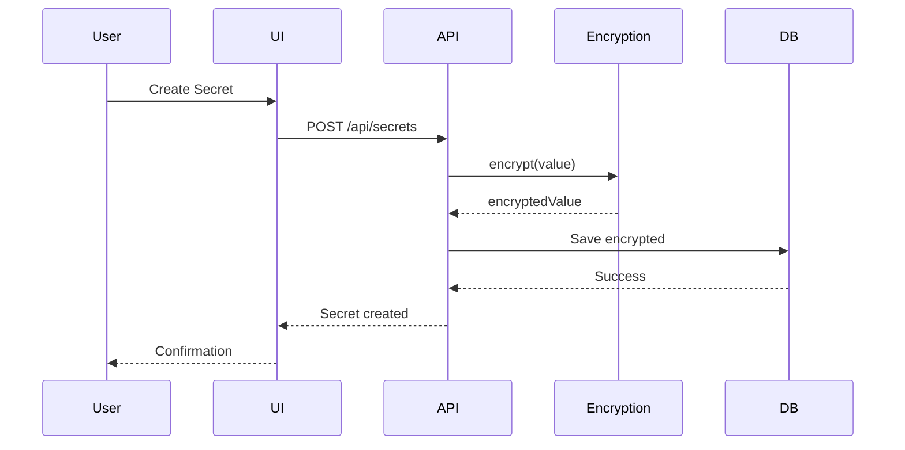
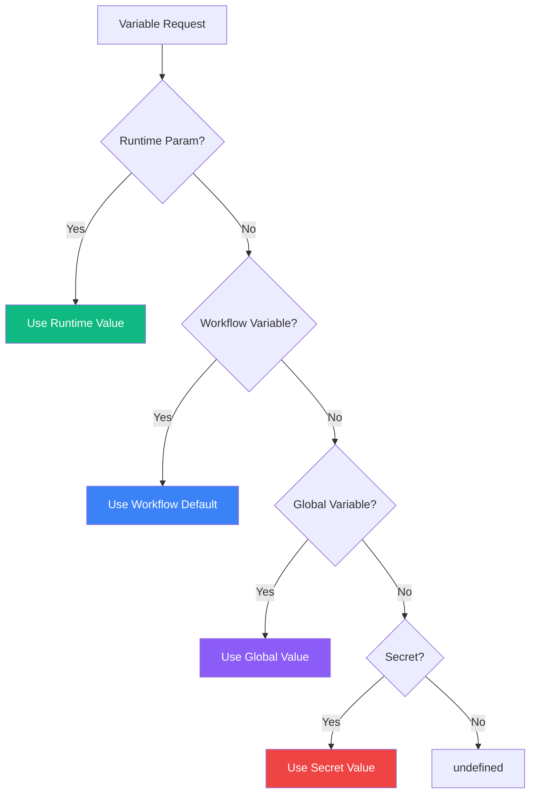
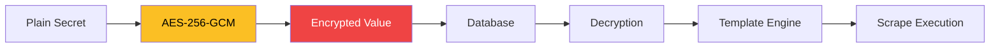
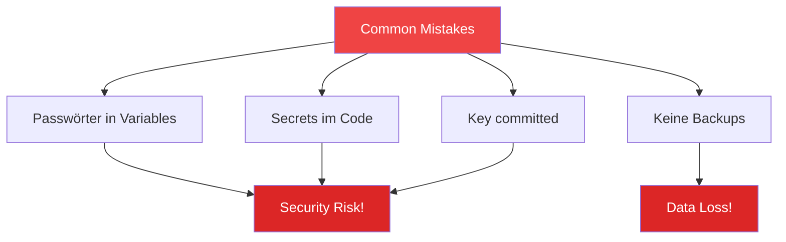
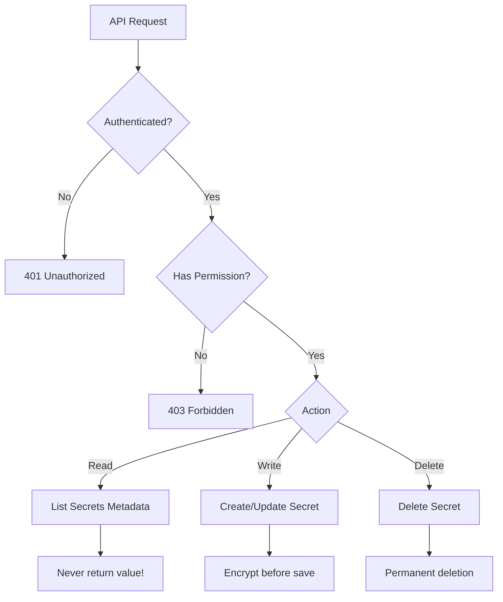

# Secrets & Variables Management

Scrape Dojo bietet ein mehrschichtiges System zur Verwaltung von sensiblen Daten (Secrets) und Konfigurationswerten (Variables).

## Übersicht

```mermaid
graph TD
    A[Konfiguration] --> B{Type}
    B -->|Sensitiv| C[Secrets]
    B -->|Öffentlich| D[Variables]
    
    C --> E[AES-256 Encrypted]
    C --> F[Database]
    
    D --> G[Plaintext]
    D --> H[Database / ENV]
    
    E --> I[{{secrets.key}}]
    G --> J[{{variables.key}}]
    
    style C fill:#ef4444,color:#fff
    style D fill:#10b981,color:#fff
    style E fill:#fbbf24,color:#000
```

## Unterschied: Secrets vs. Variables

| Feature | Secrets 🔐 | Variables ⚙️ |
|---------|-----------|-------------|
| **Verschlüsselung** | ✅ AES-256 | ❌ Plaintext |
| **Use Case** | Passwörter, API-Keys, Tokens | URLs, Konfiguration, Flags |
| **Sichtbarkeit** | Nie im UI angezeigt | Vollständig sichtbar |
| **ENV Prefix** | `SCRAPE_DOJO_SECRET_*` | `SCRAPE_DOJO_VAR_*` |
| **Template** | `{{secrets.name}}` | `{{variables.name}}` |
| **API Access** | Nur Metadata | Vollständiger Wert |

## Secrets

### Verwendung

Secrets sollten verwendet werden für:
- ✅ Passwörter
- ✅ API-Keys und Tokens
- ✅ OAuth Client Secrets
- ✅ Datenbank-Credentials
- ✅ Verschlüsselungs-Keys

### Erstellung

#### Über UI

1. **Settings öffnen**: Klick auf ⚙️ Icon
2. **Secrets Tab**: Navigate to "Secrets"
3. **New Secret**: Klick auf "+ New Secret"
4. **Ausfüllen**:
   - **Name**: Eindeutiger Identifier (z.B. `amazonPassword`)
   - **Value**: Der geheime Wert
   - **Description**: Optional, z.B. "Amazon Login Password"
5. **Save**: Secret wird verschlüsselt gespeichert



#### Über API

```bash
POST /api/secrets
Content-Type: application/json

{
  "name": "amazonPassword",
  "value": "super-secret-password",
  "description": "Amazon Login Password"
}
```

**Response:**
```json
{
  "id": "secret_123abc",
  "name": "amazonPassword",
  "description": "Amazon Login Password",
  "createdAt": "2025-01-11T10:00:00Z",
  "updatedAt": "2025-01-11T10:00:00Z"
}
```

⚠️ **Wichtig**: Der Wert wird NIE in Responses zurückgegeben!

#### Über Environment Variables

```bash
# .env oder docker-compose.yml
SCRAPE_DOJO_SECRET_AMAZON_PASSWORD=super-secret-password
SCRAPE_DOJO_SECRET_API_TOKEN=abc123xyz
```

Beim Start synchronisiert Scrape Dojo automatisch:
- **ENV Name**: `SCRAPE_DOJO_SECRET_AMAZON_PASSWORD`
- **Secret Name**: `amazonPassword` (camelCase konvertiert)
- **Source**: ENV markiert

```log
🔐 Found 2 SCRAPE_DOJO_SECRET_* variable(s): 
   SCRAPE_DOJO_SECRET_AMAZON_PASSWORD, 
   SCRAPE_DOJO_SECRET_API_TOKEN
📝 Synced secret: amazonPassword (from ENV: SCRAPE_DOJO_SECRET_AMAZON_PASSWORD)
📝 Synced secret: apiToken (from ENV: SCRAPE_DOJO_SECRET_API_TOKEN)
```

### Verwendung in Scrapes

```jsonc
{
  "steps": [
    {
      "name": "Login",
      "actions": [
        {
          "action": "navigate",
          "params": {
            "url": "https://example.com/login"
          }
        },
        {
          "action": "type",
          "params": {
            "selector": "#email",
            "text": "{{secrets.email}}"
          }
        },
        {
          "action": "type",
          "params": {
            "selector": "#password",
            "text": "{{secrets.password}}"
          }
        },
        {
          "action": "click",
          "params": {
            "selector": "button[type=submit]"
          }
        }
      ]
    }
  ]
}
```

### Verwaltung

#### Auflisten

```bash
GET /api/secrets

Response:
[
  {
    "id": "secret_123",
    "name": "amazonPassword",
    "description": "Amazon Login",
    "source": "env",
    "createdAt": "2025-01-11T10:00:00Z"
  },
  {
    "id": "secret_456",
    "name": "apiToken",
    "description": "API Access Token",
    "source": "manual",
    "createdAt": "2025-01-11T11:00:00Z"
  }
]
```

#### Einzelnes Secret

```bash
GET /api/secrets/{id}
```

⚠️ Der Wert wird NIE zurückgegeben!

#### Aktualisieren

```bash
PUT /api/secrets/{id}
Content-Type: application/json

{
  "value": "new-secret-value",
  "description": "Updated description"
}
```

#### Löschen

```bash
DELETE /api/secrets/{id}
```

## Variables

### Verwendung

Variables sind ideal für:
- ✅ API-Endpunkte / URLs
- ✅ Feature-Flags
- ✅ Default-Werte
- ✅ Konfigurationsparameter
- ❌ Keine sensitiven Daten!

### Typen

#### Global Variables

Verfügbar in **allen** Scrapes:

```bash
# ENV
SCRAPE_DOJO_VAR_DEFAULT_YEAR=2025
SCRAPE_DOJO_VAR_API_ENDPOINT=https://api.example.com
SCRAPE_DOJO_VAR_DEBUG_MODE=true
```

#### Workflow Variables

Definiert in Scrape-Metadata:

```jsonc
{
  "id": "amazon-scraper",
  "metadata": {
    "name": "Amazon Order Scraper",
    "variables": [
      {
        "name": "targetYear",
        "label": "Year to scrape",
        "type": "number",
        "default": 2025,
        "required": true,
        "description": "Which year's orders to download"
      },
      {
        "name": "maxPages",
        "label": "Maximum pages",
        "type": "number",
        "default": 10,
        "description": "Stop after X pages"
      },
      {
        "name": "downloadPdfs",
        "label": "Download PDFs",
        "type": "boolean",
        "default": false
      }
    ]
  },
  "steps": [
    {
      "name": "Process Orders",
      "actions": [
        {
          "action": "navigate",
          "params": {
            "url": "https://amazon.de/orders?year={{variables.targetYear}}"
          }
        }
      ]
    }
  ]
}
```

### Variable Types

```typescript
type VariableType = 
  | 'string'    // Text-Eingabe
  | 'number'    // Zahlen-Eingabe
  | 'boolean'   // Checkbox
  | 'select'    // Dropdown
  | 'password'; // Passwort-Feld (für nicht-sensitive Daten)
```

### Select mit Optionen

```jsonc
{
  "name": "region",
  "type": "select",
  "default": "de",
  "options": [
    { "value": "de", "label": "Germany" },
    { "value": "us", "label": "United States" },
    { "value": "uk", "label": "United Kingdom" }
  ]
}
```

### Dynamische Optionen

```jsonc
{
  "name": "year",
  "type": "select",
  "optionsExpression": "$[2020..2025]"  // JSONata
}
```

### Secret-Referenz

```jsonc
{
  "name": "email",
  "type": "string",
  "secretRef": "amazonEmail",  // Verweist auf Secret
  "description": "Email for login"
}
```

## Resolution Order (Priorität)



**Priorität (höchste zuerst):**
1. 🎯 **Runtime Parameters** (beim Scrape-Start übergeben)
2. 📋 **Workflow Variables** (definiert in `metadata.variables`)
3. 🌍 **Global Variables** (`SCRAPE_DOJO_VAR_*`)
4. 🔐 **Secrets** (`SCRAPE_DOJO_SECRET_*`)

### Beispiel

```bash
# ENV
SCRAPE_DOJO_VAR_DEFAULT_YEAR=2024
SCRAPE_DOJO_SECRET_EMAIL=user@example.com
```

```jsonc
// Workflow
{
  "metadata": {
    "variables": [
      { "name": "targetYear", "default": 2025 }
    ]
  }
}
```

```bash
# Runtime
POST /scrape/amazon
{
  "variables": {
    "targetYear": 2023
  }
}
```

**Ergebnis:**
- `{{variables.targetYear}}` = `2023` (Runtime wins)
- `{{secrets.email}}` = `user@example.com` (from ENV)

## API Reference

### Secrets

```bash
# List all secrets (without values)
GET /api/secrets

# Get secret by ID (without value)
GET /api/secrets/{id}

# Create secret
POST /api/secrets
{
  "name": "mySecret",
  "value": "secret-value",
  "description": "Optional description"
}

# Update secret
PUT /api/secrets/{id}
{
  "value": "new-value",
  "description": "Updated description"
}

# Delete secret
DELETE /api/secrets/{id}
```

### Variables

```bash
# List all variables
GET /api/variables

# Get global variables only
GET /api/variables/global

# Get workflow variables
GET /api/variables/workflow/{workflowId}

# Get variable definitions from workflows
GET /api/variables/definitions

# Create variable
POST /api/variables
{
  "name": "myVar",
  "value": "some-value",
  "scope": "global",
  "description": "Optional"
}

# Update variable
PUT /api/variables/{id}
{
  "value": "new-value"
}

# Delete variable
DELETE /api/variables/{id}
```

## Verschlüsselung

### Secrets Encryption



### Encryption Key

**REQUIRED** in Production:

```bash
# Generate a 256-bit key (64 hex characters)
node -e "console.log(require('crypto').randomBytes(32).toString('hex'))"

# .env
SCRAPE_DOJO_ENCRYPTION_KEY=a1b2c3d4e5f6...  # 64 hex chars
```

⚠️ **Wichtig**:
- **Niemals committen!**
- **Sicher sichern!** (Backup in Password Manager)
- **Bei Verlust**: Alle Secrets sind unbrauchbar

### Key Rotation

```bash
# 1. Alte Secrets exportieren (manuell notieren)
GET /api/secrets  # Liste aller Namen

# 2. Neuen Key generieren
NEW_KEY=$(node -e "console.log(require('crypto').randomBytes(32).toString('hex'))")

# 3. Anwendung stoppen
docker-compose down

# 4. Key in ENV aktualisieren
echo "SCRAPE_DOJO_ENCRYPTION_KEY=$NEW_KEY" >> .env

# 5. Datenbank bereinigen
# DELETE FROM secrets;  # Vorsicht!

# 6. Anwendung starten
docker-compose up -d

# 7. Secrets neu erstellen
POST /api/secrets { "name": "...", "value": "..." }
```

## Best Practices

### ✅ Empfehlungen

1. **Secrets für Credentials**: Passwörter, Tokens, API-Keys
2. **Variables für Config**: URLs, Flags, Default-Werte
3. **Descriptive Names**: `amazonPassword` statt `pw1`
4. **Descriptions nutzen**: Dokumentiert Verwendung
5. **ENV für Production**: `SCRAPE_DOJO_SECRET_*` / `SCRAPE_DOJO_VAR_*`
6. **Regelmäßige Rotation**: Secrets periodisch ändern
7. **Least Privilege**: Nur benötigte Secrets teilen

### ⚠️ Häufige Fehler



#### ❌ NICHT so:

```jsonc
// ❌ Passwort in Variable (plaintext!)
{
  "metadata": {
    "variables": [
      { "name": "password", "default": "super-secret" }
    ]
  }
}

// ❌ Secret hardcoded
{
  "action": "type",
  "params": {
    "text": "my-hardcoded-password"  // ❌
  }
}
```

#### ✅ SO ist es richtig:

```bash
# .env
SCRAPE_DOJO_SECRET_PASSWORD=super-secret
```

```jsonc
{
  "action": "type",
  "params": {
    "text": "{{secrets.password}}"  // ✅
  }
}
```

## Troubleshooting

### Secret nicht gefunden

```log
Error: Secret "mySecret" not found
```

**Lösung:**
1. Secret existiert? `GET /api/secrets`
2. Name korrekt? (case-sensitive: `mySecret` ≠ `mysecret`)
3. Template-Syntax: `{{secrets.mySecret}}`

### Decryption failed

```log
Error: Unable to decrypt secret
```

**Ursachen:**
- Falscher `SCRAPE_DOJO_ENCRYPTION_KEY`
- Key wurde geändert nach Secret-Erstellung
- Korrupte Datenbank

**Lösung:**
- Korrekten Key wiederherstellen
- Oder: Secrets löschen und neu erstellen

### Variable undefined

```log
Warning: Variable "targetYear" is undefined
```

**Prüfen:**
1. Variable definiert? `GET /api/variables`
2. Scope korrekt? (global vs. workflow)
3. Runtime-Parameter übergeben?

## Sicherheit

### Encryption Details

- **Algorithm**: AES-256-GCM
- **Key Length**: 256 bits (32 bytes)
- **IV**: Unique per secret
- **Auth Tag**: Integrity verification

### Zugriffskontrolle



### Compliance

- **GDPR**: Verschlüsselte Speicherung
- **Audit Trail**: Alle Änderungen geloggt
- **Access Control**: JWT/API-Key required
- **No Plaintext**: Niemals im Log/Response

---

**Verwandte Themen:**
- [Environment Variables](/de/developer/environment-variables/)
- [Authentication](/de/architecture/authentication/)
- [Deployment Security](/de/architecture/deployment/)
